# 演習2: Microsoft Fabricでパイプラインを使用してデータを取り込む

### 推定所要時間: 90分

データレイクハウスは、クラウド規模の分析ソリューションのための一般的な分析データストアです。データエンジニアの主要なタスクの一つは、複数の運用データソースからレイクハウスへのデータ取り込みを実装および管理することです。Microsoft Fabricでは、*抽出、変換、ロード* (ETL) または *抽出、ロード、変換* (ELT) ソリューションをパイプラインの作成を通じてデータ取り込みに実装できます。

FabricはApache Sparkもサポートしており、大規模なデータ処理のためのコードを記述して実行することができます。FabricのパイプラインとSparkの機能を組み合わせることで、外部ソースからレイクハウスのベースとなっているOneLakeストレージにデータをコピーし、その後Sparkコードを使用してカスタムデータ変換を実行し、分析用のテーブルにロードするという複雑なデータ取り込みロジックを実装できます。

## ラボの目的

次のタスクを完了できるようになります:

- タスク1: レイクハウスを作成する
- タスク2: ショートカットを探索する
- タスク3: パイプラインを作成する
- タスク4: ノートブックを作成する
- タスク5: SQLを使用してテーブルをクエリする
- タスク6: ビジュアルクエリを作成する
- タスク7: レポートを作成する

### タスク1: レイクハウスを作成する

大規模なデータ分析ソリューションは伝統的に、データがリレーショナルテーブルに格納され、SQLを使用してクエリされる*データウェアハウス*を中心に構築されてきました。「ビッグデータ」（ 新しいデータ資産の高度な *Volume* 、*Variety* 、および *Velocity* から特徴付けられる）の成長と、低コストのストレージおよびクラウド規模の分散コンピューティング技術の利用可能性により、分析データストレージへの代替アプローチが生まれました。それが*データレイク*です。データレイクでは、固定されたスキーマを課さずにファイルとしてデータが保存されます。データエンジニアやアナリストは、これらのアプローチの最良の特徴を組み合わせた*データレイクハウス*を利用することが増えています。データレイクハウスでは、データレイクにファイルとしてデータが保存され、メタデータレイヤーとしてリレーショナルスキーマが適用されるため、従来のSQLセマンティクスを使用してクエリできます。

Microsoft Fabricでは、レイクハウスは*OneLake*ストア（Azure Data Lake Store Gen2上に構築）における非常にスケーラブルなファイルストレージを提供し、オープンソースの*Delta Lake*テーブル形式に基づくテーブルやビューなどのリレーショナルオブジェクトのメタストアを提供します。Delta Lakeを使用すると、SQLを使用してクエリできるレイクハウス内のテーブルのスキーマを定義できます。

前のステップでワークスペースを作成したので、ポータルで*データエンジニアリング*エクスペリエンスに切り替え、データを取り込むためのデータレイクハウスを作成します。

1. Power BIポータルの左下にある**Power BI **アイコンを選択し、**データエンジニアリング **エクスペリエンスに切り替えます。

   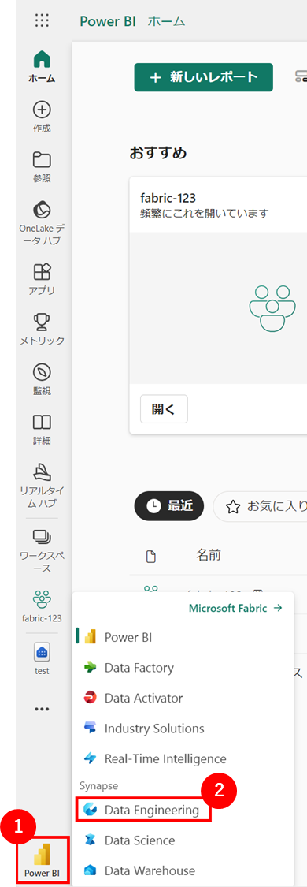

2. **データエンジニアリング**のホームページで、**Lakehouse** をクリックしてから **名前:** **Lakehouse_<inject key="DeploymentID" enableCopy="false"/>**と入力して **作成** をクリックします。
   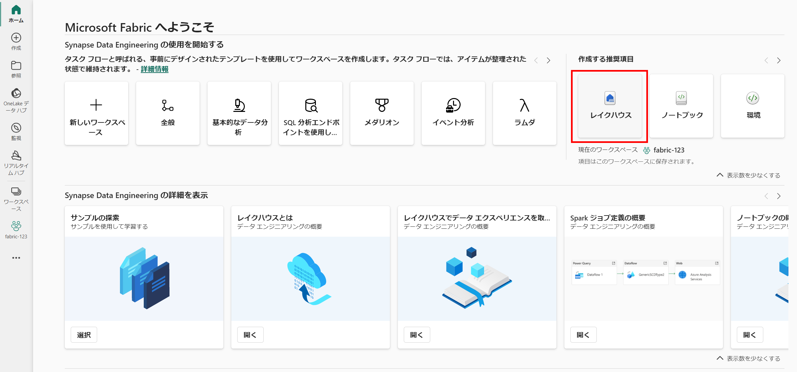

   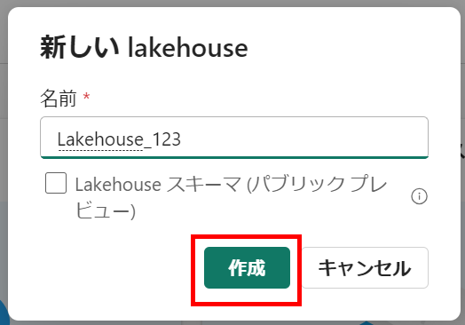

    1分ほど待つと、**テーブル**や**ファイル**がない新しいレイクハウスが作成されます。
3. 左側のペインにある**エクスプローラー**で、**ファイル**ノードの **...** メニューをクリックし、**新しいサブフォルダー**を選択します。

   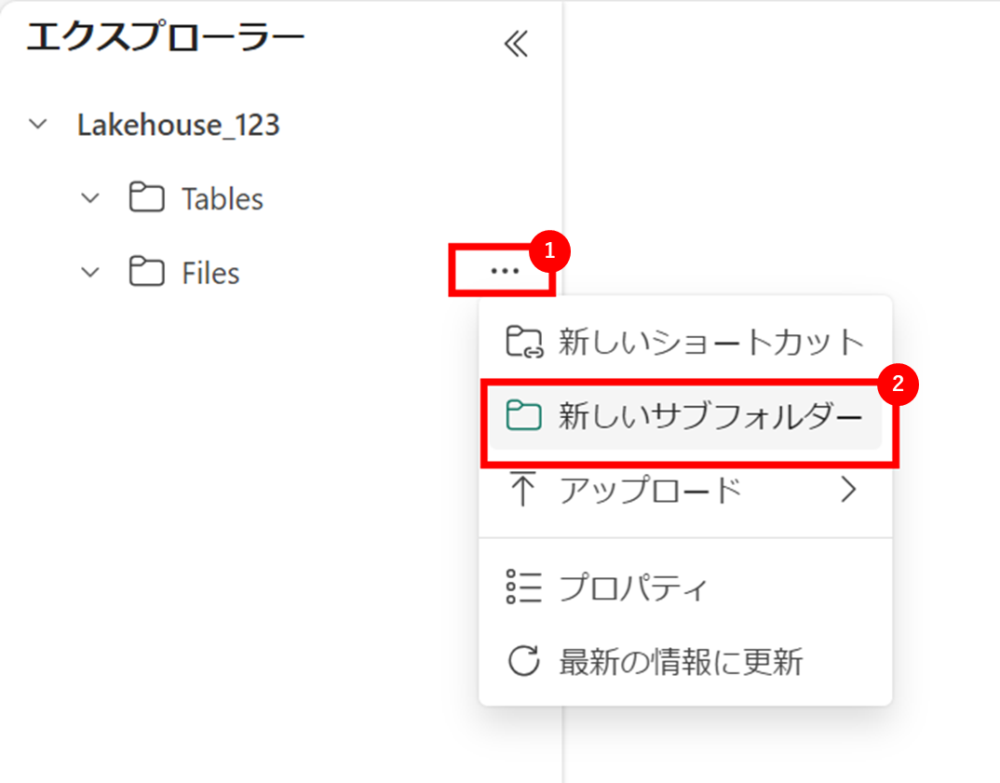

4. **new_data**という名前のサブフォルダーを作成します。
   
   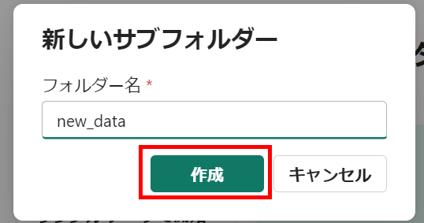

### Task 2: Explore shortcuts

多くのシナリオでは、レイクハウスで作業するために必要なデータが他の場所に保存されている場合があります。自分のレイクハウスのOneLakeストレージにデータを取り込む方法は多数ありますが、別のオプションとして*ショートカット*を作成することもできます。ショートカットを使用すると、データをコピーする際のオーバーヘッドやデータの不整合のリスクを伴わずに、外部のデータを分析ソリューションに含めることができます。

1. **ファイル**フォルダーの **...** メニューで、**新しいショートカット**を選択します。
   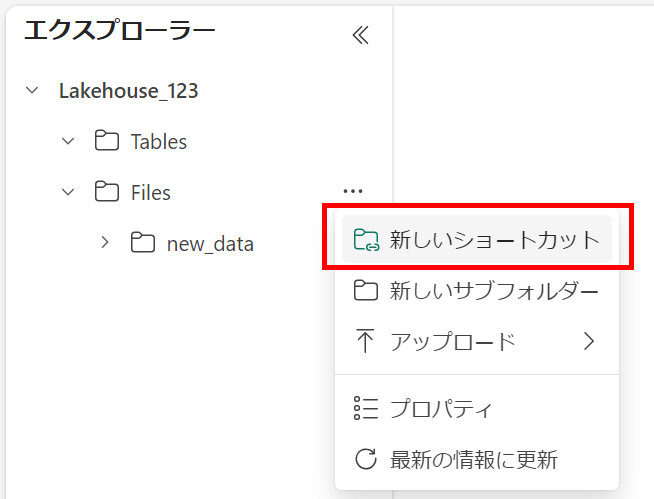
   
2. ショートカットの利用可能なデータソースの種類を確認します。その後、**新しいショートカット**ダイアログボックスを閉じて、ショートカットを作成せずに終了します。
   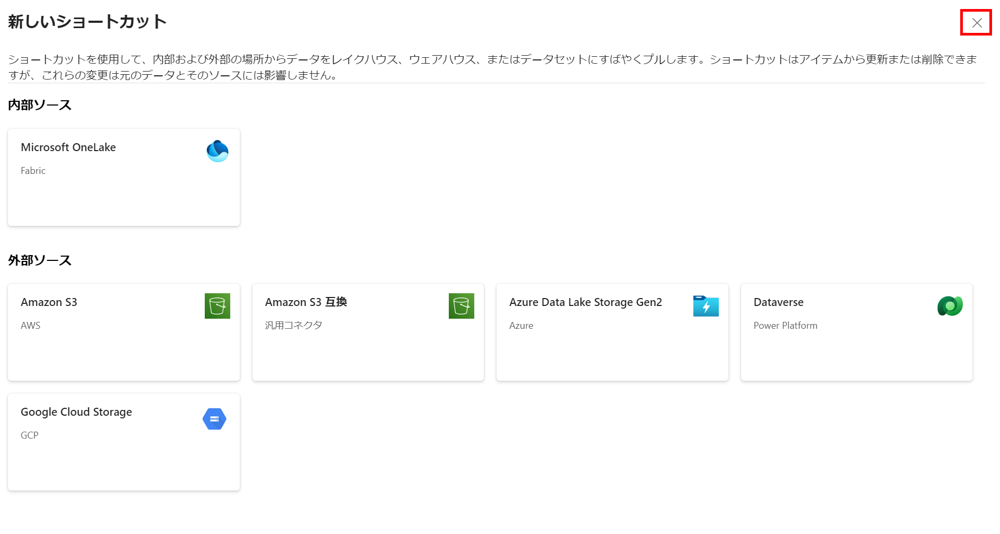

### タスク3: パイプラインを作成する

データを取り込む簡単な方法は、パイプライン内で **データのコピー** アクティビティを使用して、ソースからデータを抽出し、レイクハウス内のファイルにコピーすることです。

1. レイクハウスの **ホーム** ページで、 **新しいデータパイプライン** を選択します。

    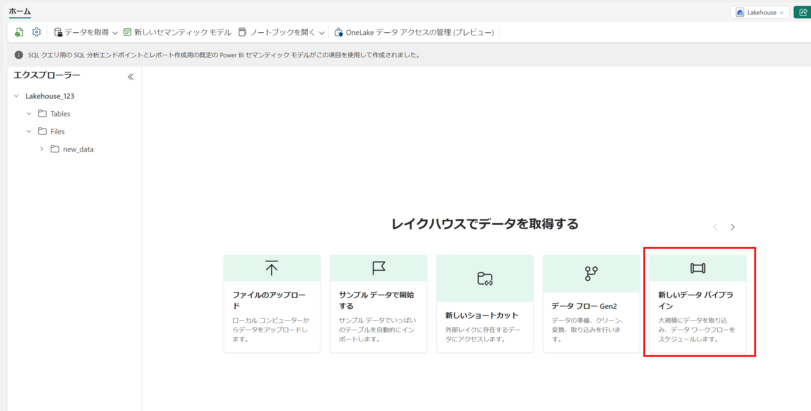

2. **Ingest Sales Data Pipeline**という名前 (1)を付け、**作成 (2)** をクリックします。 
   
   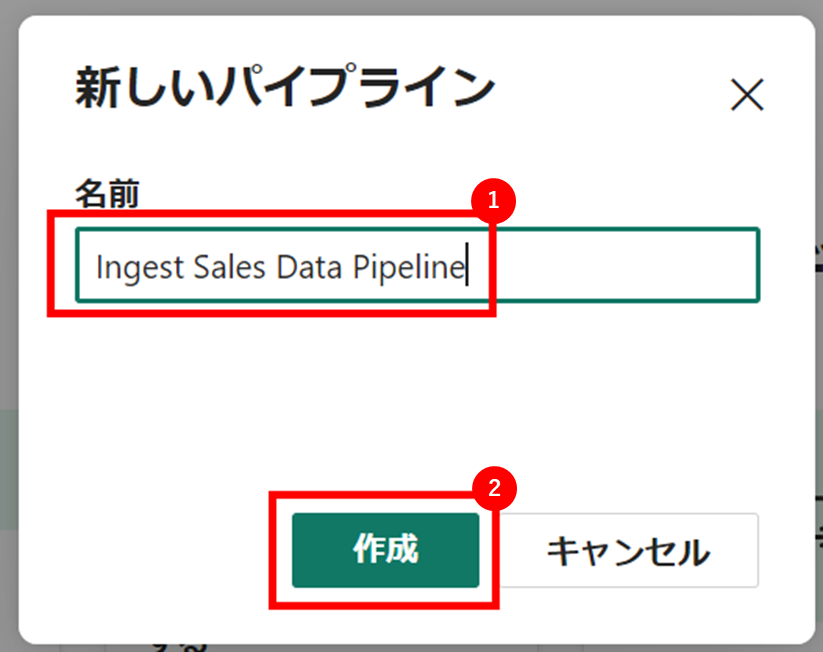

3. **データのコピー**ウィザードの**データソースの選択**ページで、**HTTPを検索 (1)**し、**HTTP (2)** をクリックします。

   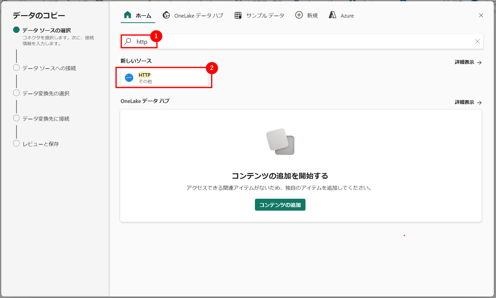
   
    > **補足**：
    > データのコピーウィザードが自動的に開かない場合は、パイプラインエディターページで**コピーアシスタントを使用する**を選択します。
    > 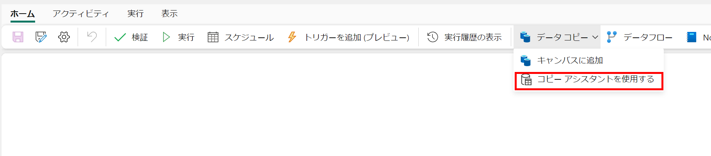

4. **接続設定**ペインで、データソースへの接続のために次の設定を入力します:
    - **URL (1)**: `https://raw.githubusercontent.com/MicrosoftLearning/dp-data/main/sales.csv`
    - **接続 (2)**: 新しい接続を作成
    - **接続名 (3)**: *一意の名前が指定されます。*
    - **データゲートウェイ (4)**: なし
    - **認証の種類 (5)**: 匿名
    - **次へ (6)** をクリックします。
  
        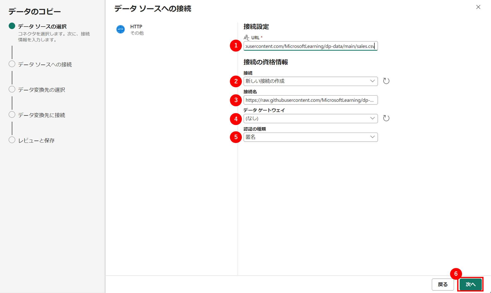

5. **次へ**を選択します。次の設定が選択されていることを確認し、次に進みます:
    - **相対URL**: *空白のまま*
    - **リクエストメソッド**: GET
    - **追加ヘッダー**: *空白のまま*
    - **バイナリコピー**: 未選択
    - **リクエストタイムアウト**: *空白のまま*
    - **最大同時接続数**: *空白のまま*
  
        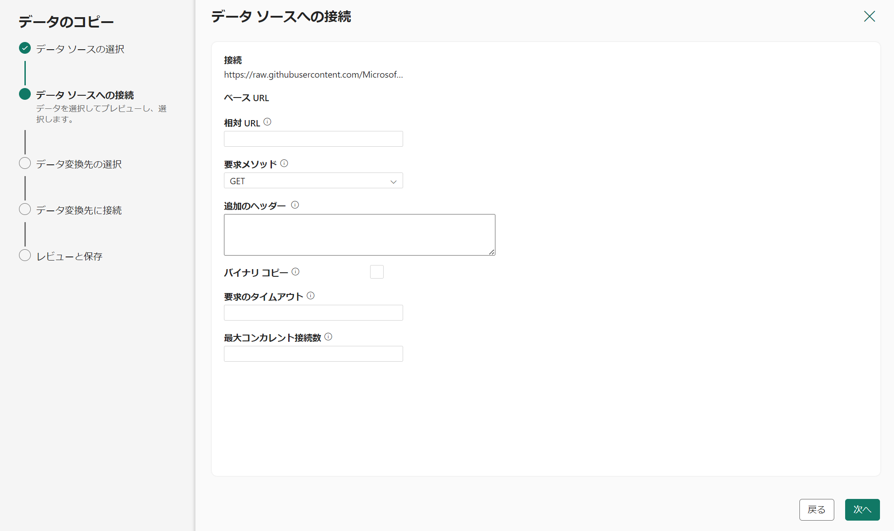
   
6. データのサンプリング後、画面が有効化されたら次の設定が選択されていることを確認します:
    - **ファイル形式 (1)**: DelimitedText
    - **列区切り記号 (2)**: Comma (,)
    - **行区切り記号 (3)**: Line feed (\n)
    - **データのプレビュー (4)**を選択して、取り込まれるデータのサンプルを確認します。

      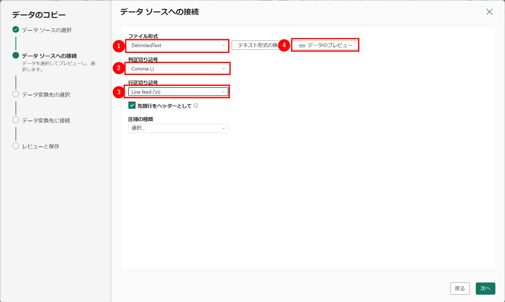

7. データプレビューを閉じて**次へ**を選択します。

     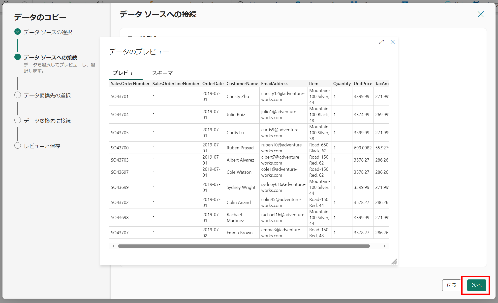


8.  **データ変換先に接続** ページでオプションを設定し、**次へ (4)** を選択します:
    - **ルートフォルダー (1)**: ファイル
    - **フォルダーパス (2)**: new_data
    - **ファイル名 (3)**: sales.csv
   
        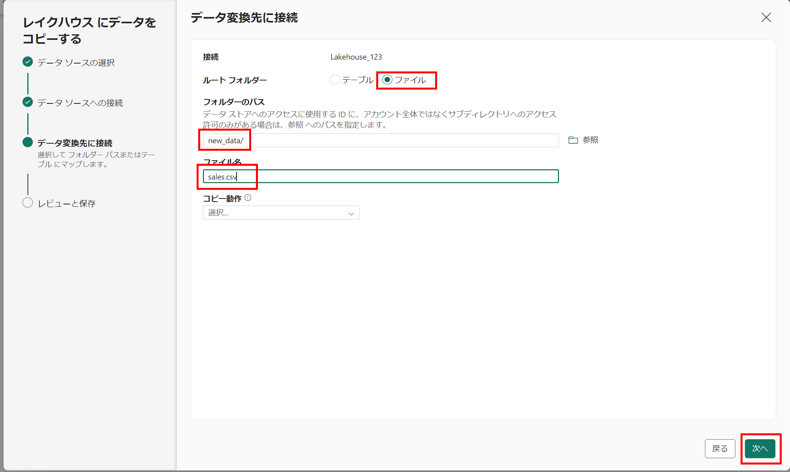


    > **補足**: 
    >
    > **データ変換先に接続** ページに直接移動しない場合、 **データ変換先の選択**ページで、**Lakehouse<inject key="DeploymentID" enableCopy="false"/> ** を選択します。
    >
    > 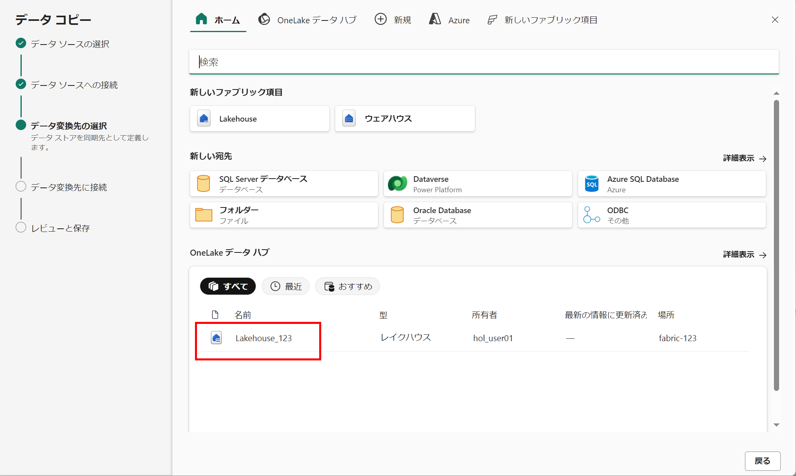
    >
    > サインインして接続します
    >
    > 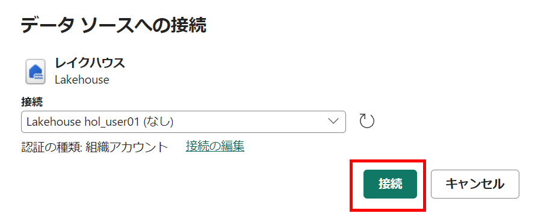

9.  変換先のファイル形式オプションを設定し、**次へ (4)** を選択します:
    - **ファイル形式 (1)**: DelimitedText
    - **列区切り記号 (2)**: Comma (,)
    - **行区切り記号 (3)**: Line feed (\n)
   
      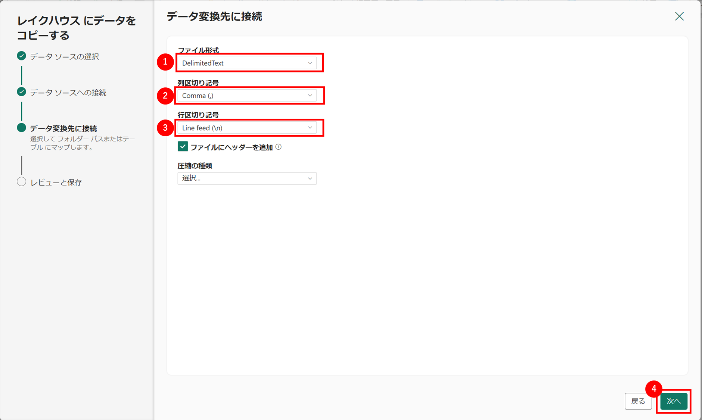

10.  **レビューと保存**ページで、コピー操作の概要を確認し、**保存と実行**を選択します。

      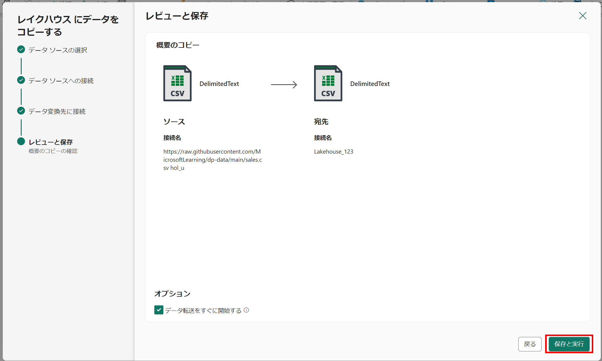
    **データのコピー** アクティビティを含む新しいパイプラインが作成されます。

     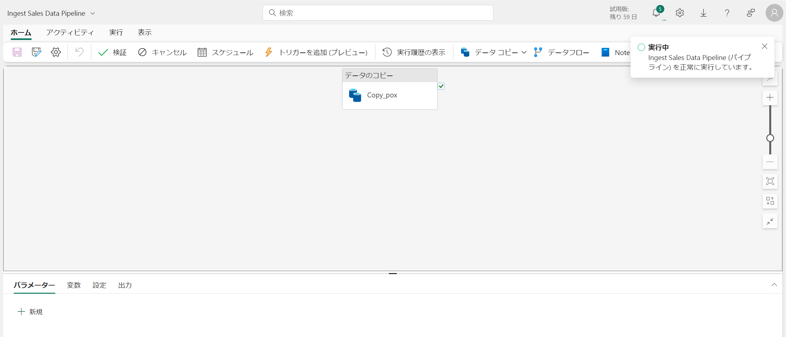

11.  パイプラインが実行を開始すると、パイプラインデザイナーの**出力**ペインでそのステータスを監視できます。**&#8635;** (*更新*)アイコンを使用してステータスを更新し、成功するまで待ちます。

     

12.  左側のメニューバーで、レイクハウス、つまり**Lakehouse_<inject key="DeploymentID" enableCopy="false"/> (1)** からペインの**ファイル**を展開し、 **new_data (2)** フォルダーを選択して、**sales.csv (3)** ファイルがコピーされたことを確認します。

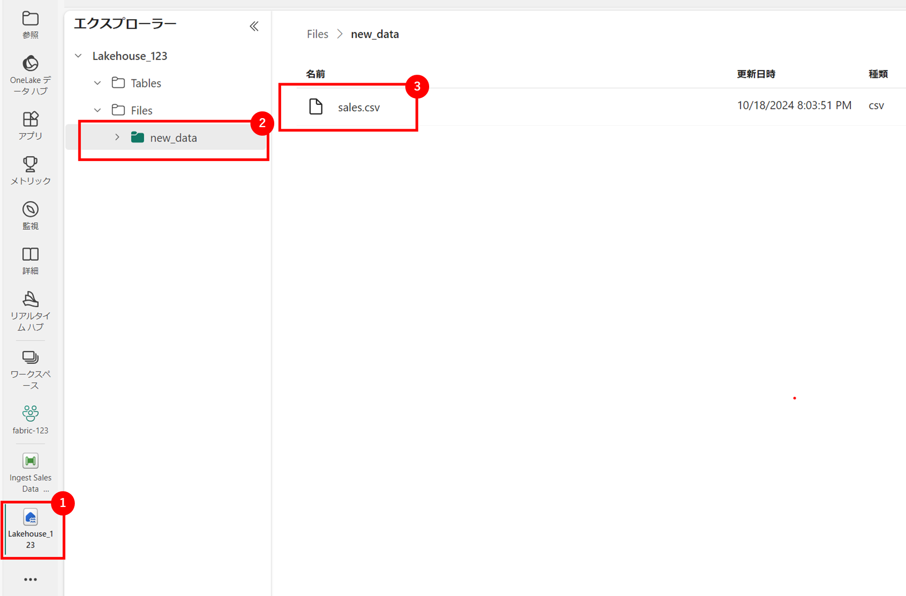

### タスク4: ノートブックを作成する

1. レイクハウスの**ホーム**ページで、**ノートブックを開く (1)**メニューから**新しいノートブック (2)**を選択します。

    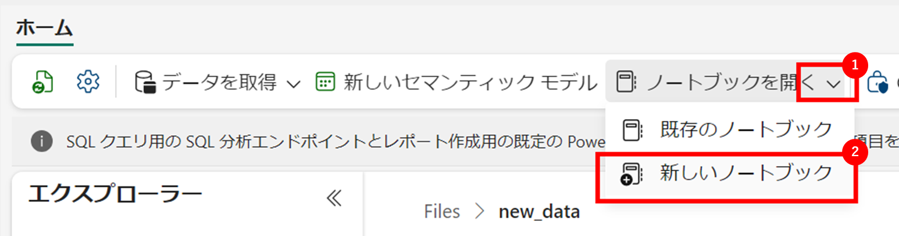

    数秒後、新しいノートブックが1つの*セル*を含む状態で開きます。ノートブックは、*コード*または*マークダウン*（フォーマットされたテキスト）を含む1つ以上のセルで構成されます。

2. ノートブック内の既存のセルを選択し、デフォルトのコードを次の**変数宣言 (1)** に置き換え、**&#9655;セル実行ボタン (2)** をクリックします。

    ```python
    table_name = "sales"
    ```

    
    > **注:** このセッションで初めてSparkコードを実行するため、Sparkプールを起動する必要があります。最初のセルの実行には1分ほどかかることがあります。
3. セルの右上にある**...**メニューで**Toggle parameter cell**を選択します。これにより、セル内で宣言された変数がパイプラインからノートブックを実行する際にパラメータとして扱われるように設定されます。

    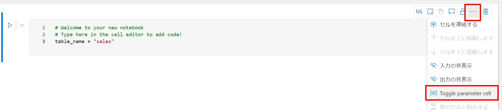

4. パラメータセルの下にある**+ Code**ボタンを使用して新しいコードセルを追加します。その後、次のコードを追加します：

    >**注:** 前のコードの実行が完了するまで待ちます

    ```Python
    from pyspark.sql.functions import *

    # 新しい売上データを読み込む
    df = spark.read.format("csv").option("header","true").option("inferSchema","true").load("Files/new_data/*.csv")

    # 月と年の列を追加
    df = df.withColumn("Year", year(col("OrderDate"))).withColumn("Month", month(col("OrderDate")))

    # FirstNameとLastNameの列を派生
    df = df.withColumn("FirstName", split(col("CustomerName"), " ").getItem(0)).withColumn("LastName", split(col("CustomerName"), " ").getItem(1))

    # 列をフィルタリングして並べ替え
    df = df["SalesOrderNumber", "SalesOrderLineNumber", "OrderDate", "Year", "Month", "FirstName", "LastName", "EmailAddress", "Item", "Quantity", "UnitPrice", "TaxAmount"]

    # データをマネージドテーブルにロード
    # マネージドテーブルは、スキーマメタデータとデータファイルの両方がFabricによって管理されるテーブルです。テーブルのデータファイルはTablesフォルダーに作成されます。
    df.write.format("delta").mode("append").saveAsTable(table_name)
    ```

    このコードは、**Copy Data**アクティビティによって取り込まれたsales.csvファイルからデータを読み込み、いくつかの変換ロジックを適用し、変換されたデータを**マネージドテーブル**として保存します（テーブルが既に存在する場合はデータを追加します）。

5. ノートブックが次のように記載されていることを確認し、ツールバーの **&#9655; すべて実行** ボタンを使用してすべてのセルを実行します。

    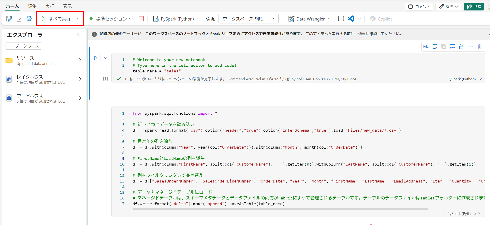


6. （オプション）外部の場所にデータファイルが保存されている**外部テーブル** を作成することもできます。

    ```Python
    df.write.format("delta").saveAsTable("external_sales", path="<abfs_path>/external_sales")

    # Lakehouseエクスプローラーペインで、Filesフォルダーの...メニューからCopy ABFS pathを選択します。

    # ABFSパスは、レイクハウスのOneLakeストレージ内のFilesフォルダーへの完全修飾パスです。次のようになります：

    # abfss://workspace@tenant-onelake.dfs.fabric.microsoft.com/lakehousename.Lakehouse/Files
    ```
    > **注:** 上記のコードを実行するには、<abfs_path>を自分のabfsパスに置き換える必要があります。

7. ノートブックの実行が完了したら、左側の**エクスプローラー** ペインで **レイクハウス** をクリックします。
    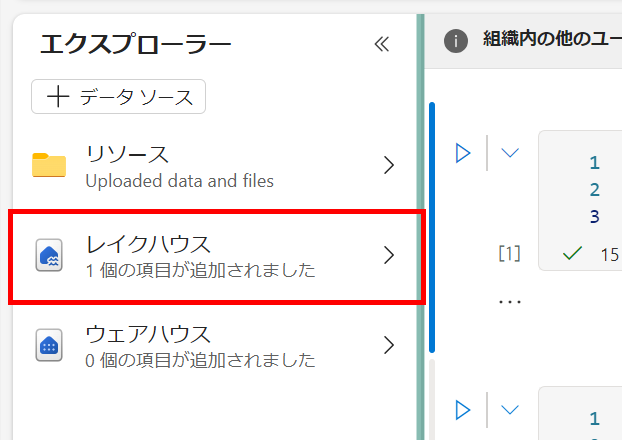


8. **sales**テーブルが作成されたことを確認します。表示されていない場合はノートブックの実行が完了していることを確認して **最新の情報に更新** をクリックします
    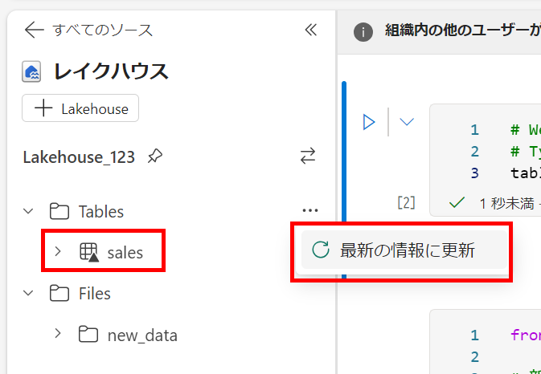

9. ノートブックメニューバーで⚙️**Settings (1)** アイコンを使用してノートブックの設定を表示します。その後、ノートブックの **名前** を**Load Sales Notebook (2)** に設定し、設定ペインを閉じます。

    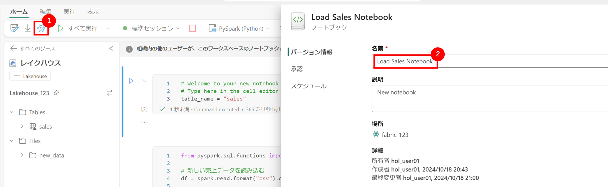

10. 左側のハブメニューバーで　**Lakehouse_<inject key="DeploymentID" enableCopy="false"/> ** を選択します。
    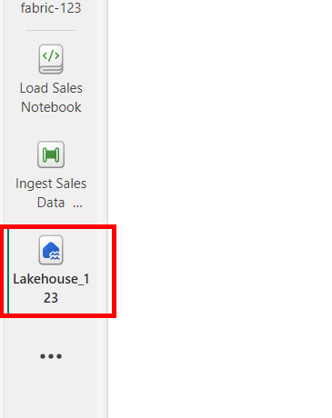
    
11. **エクスプローラー** ペインでビューを**更新 (1)** します。その後、**Tables (2)** を展開し、**sales (3)** テーブルを選択して、その中に含まれるデータのプレビューを確認します。
    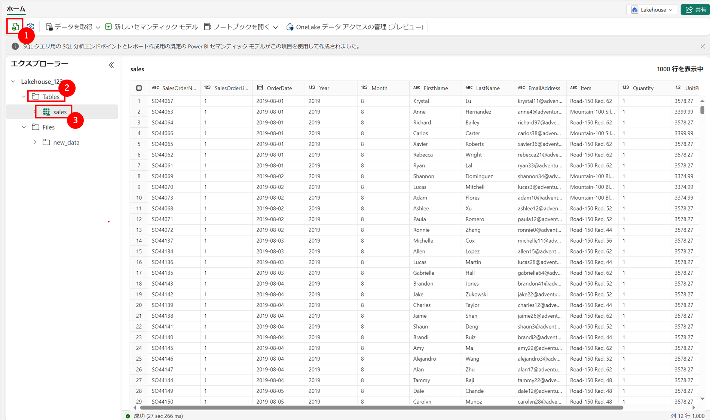

### タスク5: SQLを使用してテーブルをクエリする

レイクハウスを作成し、テーブルを定義すると、`SELECT` SQL 文を使用してテーブルをクエリできるSQL分析エンドポイントが自動的に作成されます。

1. レイクハウスページの右上で、**Lakehouse**から**SQL 分析エンドポイント**に切り替えます。その後、レイクハウスのSQL 分析エンドポイントが表示されるまで少し待ちます。

    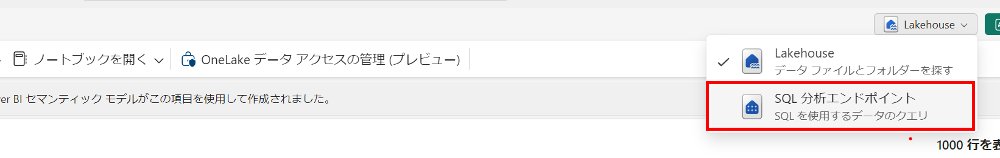


2. **新規 SQL クエリ**ボタンを使用して新しいクエリエディタを開き、次のSQLクエリを入力します：

    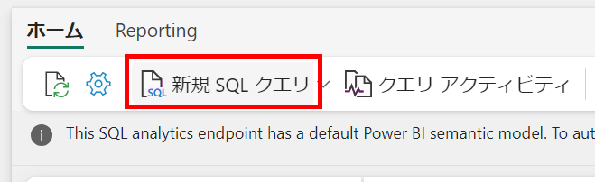

    ```SQL
    SELECT Item, SUM(Quantity * UnitPrice) AS Revenue
    FROM sales
    GROUP BY Item
    ORDER BY Revenue DESC;
    ```

3. **&#9655; 実行**ボタンを使用してクエリを実行し、結果を表示します。結果には各商品の総収益が表示されます。

    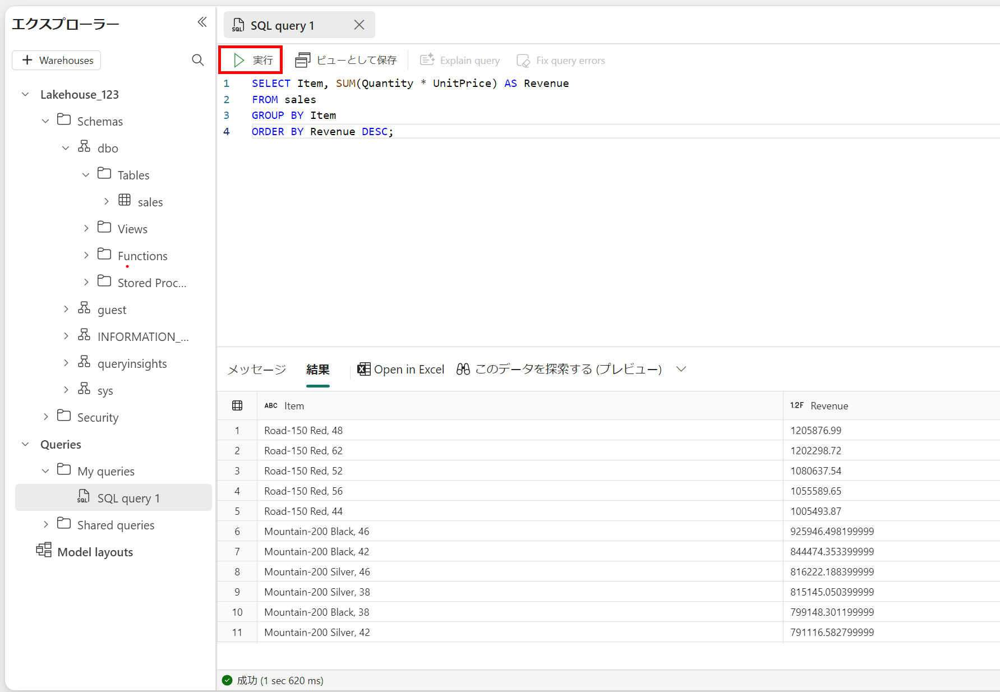

### タスク6: ビジュアルクエリを作成する

多くのデータプロフェッショナルはSQLに精通していますが、Power BIの経験を持つデータアナリストはPower Queryのスキルを活かしてビジュアルクエリを作成できます。

1. ツールバーで**New visual query**を選択します。
    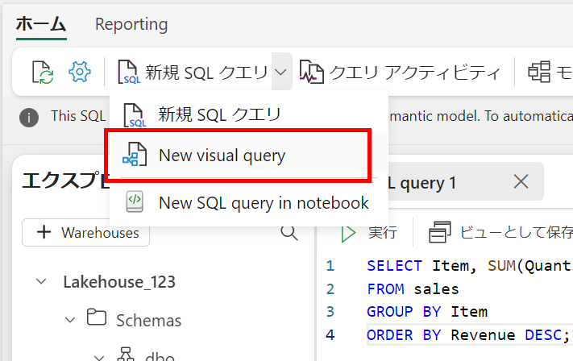

2. 新しいビジュアルクエリエディタペインに**sales**テーブルをドラッグしてPower Queryを作成します。

    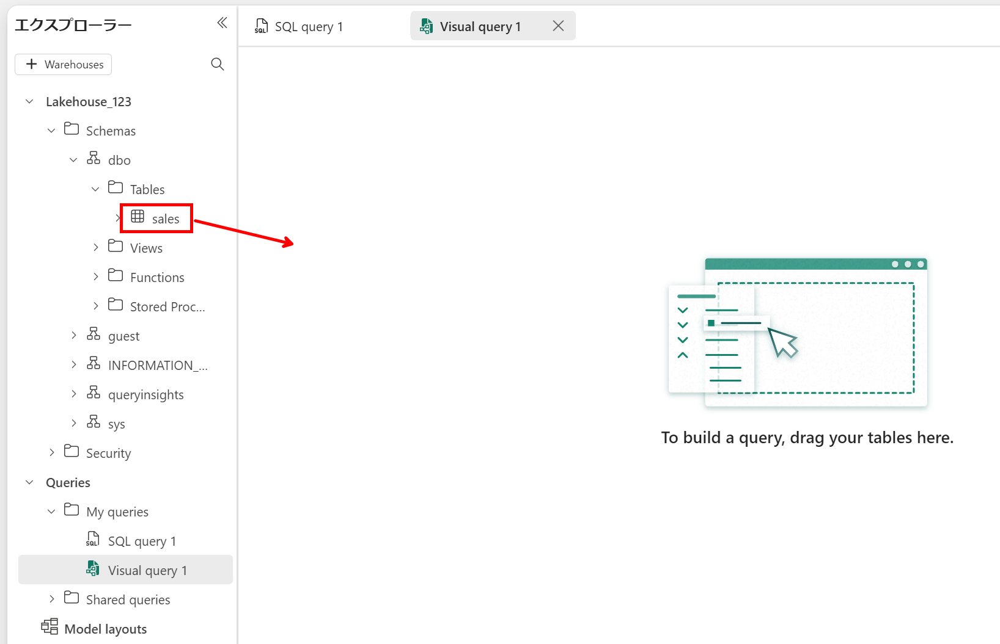

3. **列の管理**メニューで**列の選択**を選択します。その後、**SalesOrderNumber**と**SalesOrderLineNumber**の列のみを選択し、**OK**をクリックします。

    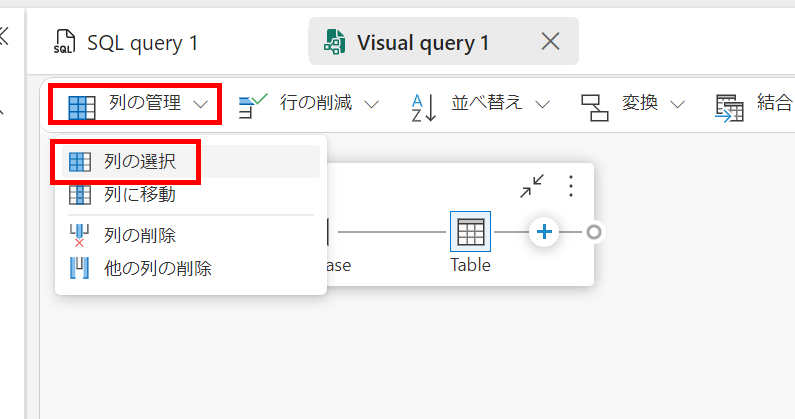
    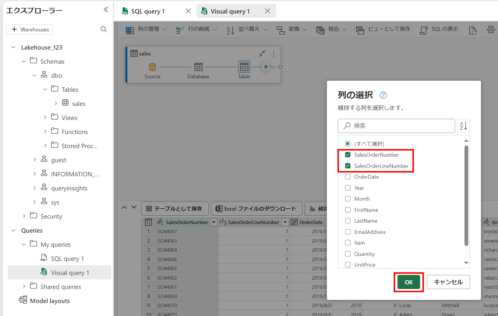

4. **+ (1)** をクリックし、メニューから**グループ化 (2)** を選択します。

    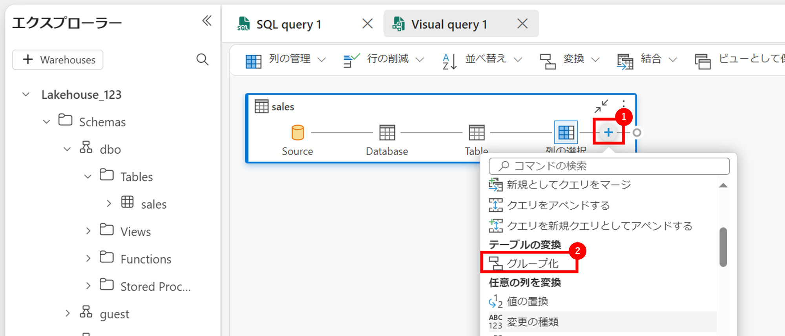

5. 次の**Basic**設定を使用してデータをグループ化し、**OK**をクリックします：

    - **グループ化**: SalesOrderNumber
    - **新しい列名**: LineItems
    - **操作**: 個別の値のカウント
    - **列**: SalesOrderLineNumber

    

6. 完了すると、ビジュアルクエリの結果ペインに各販売注文のラインアイテム数が表示されます。

    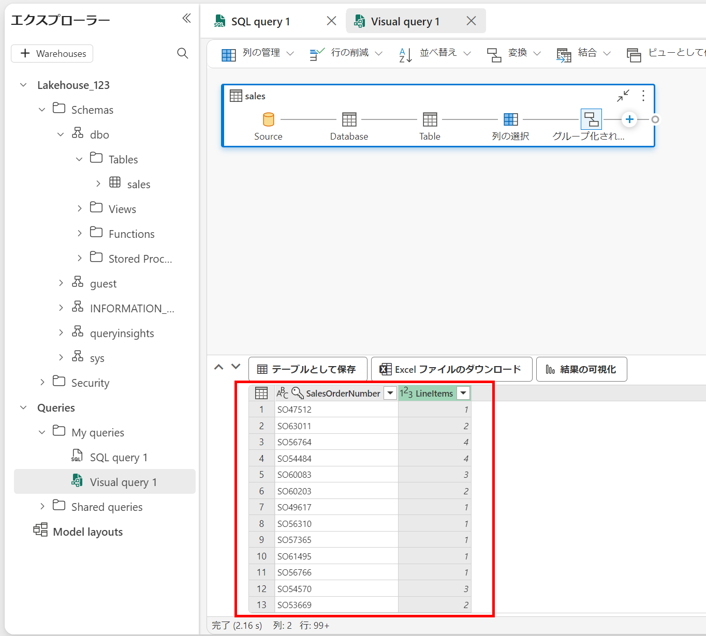

### タスク7: レポートを作成する

レイクハウス内のテーブルをデフォルトのセマンティックモデルに追加すると、Power BIを使用したレポート作成のためのデータモデルが定義されます。
>**注:** 自動的にテーブルを追加する場合は設定アイコンから同期設定をオンにします。

1. SQLエンドポイントページの下部で**Model**タブを選択します。

    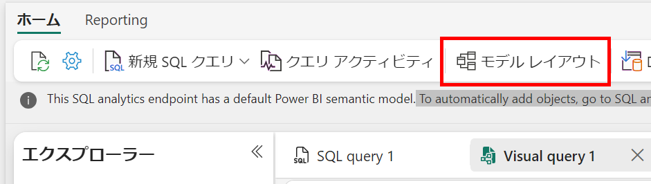
    
2. **sales** を含むセマンティックモデルのデータモデルスキーマが表示されます。

    

    > **注:** この演習では、データモデルは Sales テーブルのみが対象になります。実際のシナリオでは、レイクハウスに複数のテーブルを作成し、それぞれがモデルに含まれることが一般的です。その後、モデル内でこれらのテーブル間の関係を定義できます。

3. メニューリボンで**Reporting**タブを選択します。その後、**New report**を選択します。

    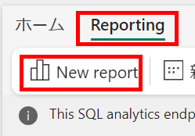
4. データの追加確認画面で、**続行** をクリックすると、レポートをデザインするための新しいブラウザタブが開きます。
    >**注:** 自動的にテーブルを追加する場合はウェアハウスの設定アイコンから同期設定をオンにします。
    
    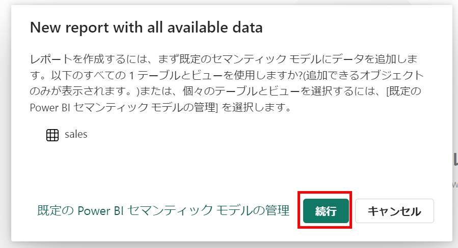
    
    >**注:** 次のポップアップが表示された場合は、**無料で試す** をクリックします。
    >

5. 右側の**データ**ペインで**sales**テーブルを展開します。その後、次のフィールドをチェックします：
    - **Item**
    - **Quantity**

    レポートにテーブルによるビジュアルが追加されます：

    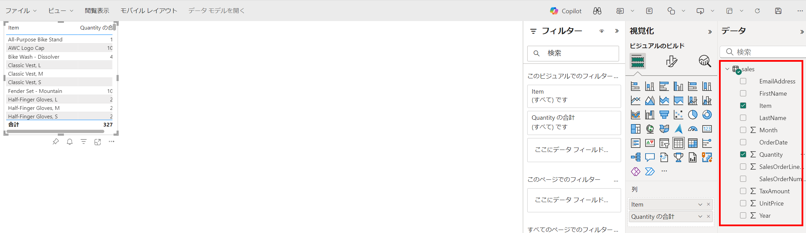

6. **データ**および**フィルター**ペインを非表示にしてスペースを確保します。その後、テーブルビジュアライゼーションが選択されていることを確認し、**視覚化**ペインでビジュアルを **集合横棒グラフ**に変更し、次のようにサイズを調整します。

    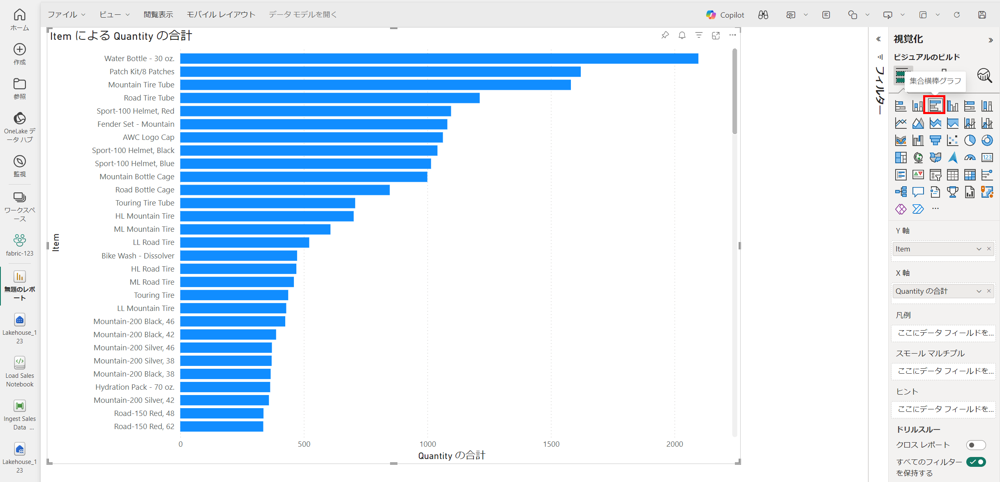

7. **ファイル**メニューで**保存**を選択します。その後、レポートを**Item Sales Report**として以前に作成したワークスペースに保存します。
    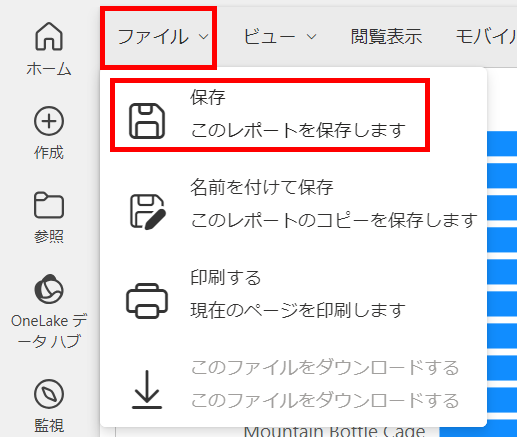
    
    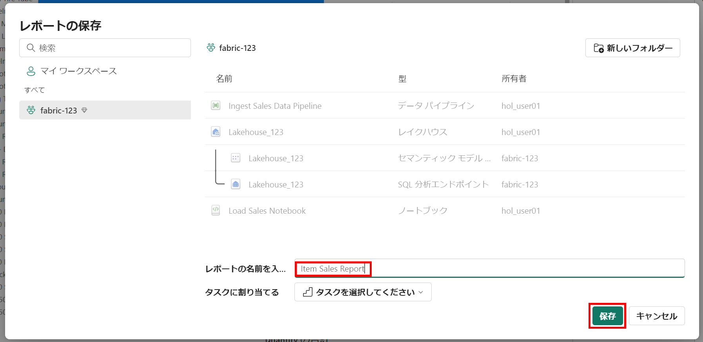

8. レポートを含むブラウザタブを閉じてレイクハウスのSQLエンドポイントに戻ります。その後、左側のハブメニューバーでワークスペースを選択し、次の項目が含まれていることを確認します：
    - **Ingest Sales Data Pipeline** データパイプライン
    - **Item Sales Report** レポート
    - **レイクハウス**
    - **レイクハウス** のSQLエンドポイント
    - **レイクハウス** 内のテーブルのデフォルトデータセット
    - **Load Sales Notebook** ノートブック

    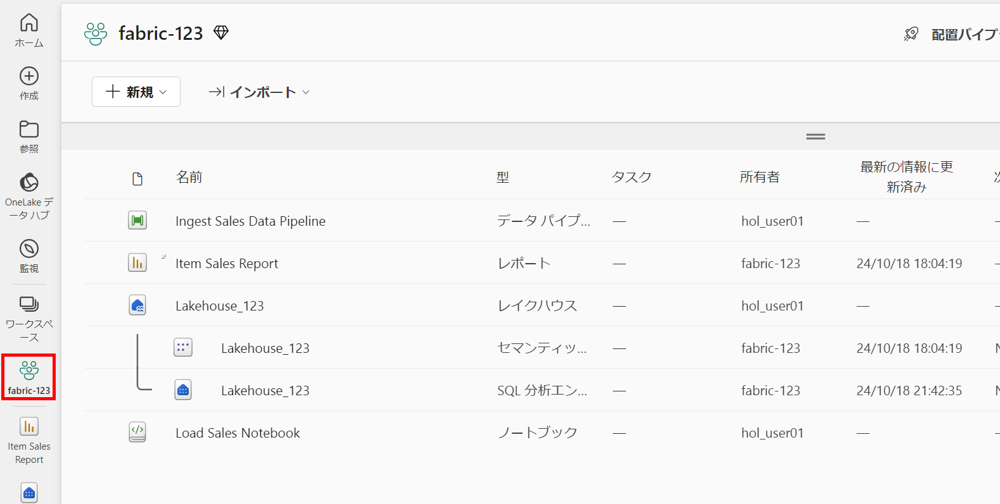

    <validation step="b28817e6-75d8-40fd-9c33-0a408a962f8e" />

    > **おめでとうございます** タスクを完了しました！次は検証です。以下の手順に従ってください：
    > - 対応するタスクの検証ボタンを押します。
    > - 成功メッセージが表示されたら、次のタスクに進むことができます。表示されない場合は、エラーメッセージをよく読み、ラボガイドの指示に従ってステップを再試行してください。
    > - サポートが必要な場合は、labs-support@spektrasystems.comまでご連絡ください。24時間365日対応しています。

## まとめ

このラボでは、レイクハウスを作成し、データをインポートしました。レイクハウスがOneLakeデータストアに保存されたファイルとテーブルで構成されていることを確認しました。管理テーブルはSQLを使用してクエリでき、データの視覚化をサポートするデフォルトセマンティックモデルに追加できます。

### ラボを正常に完了しました

