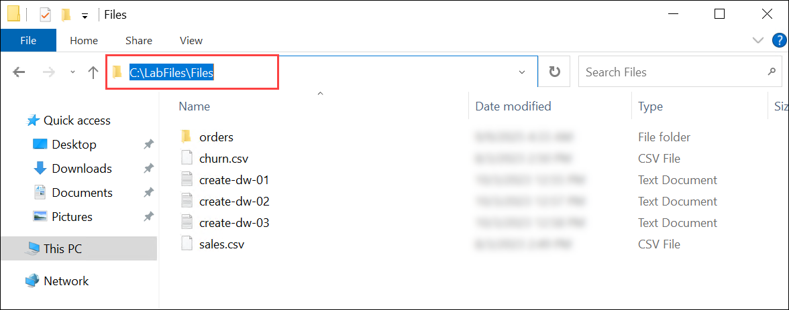
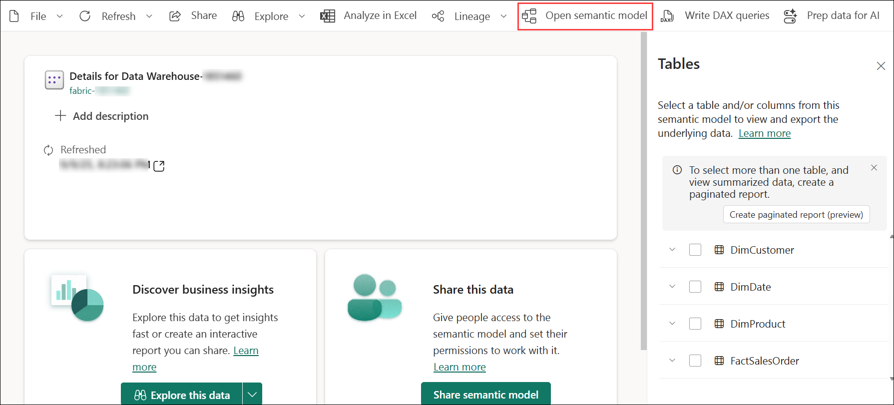
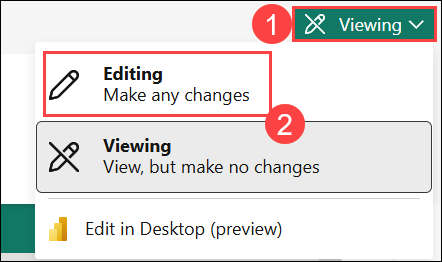
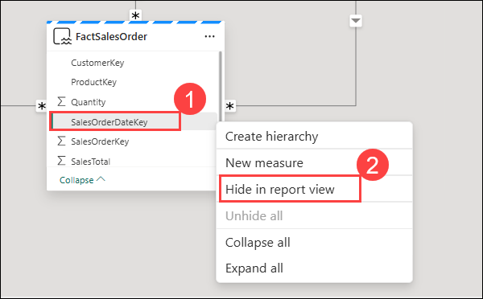
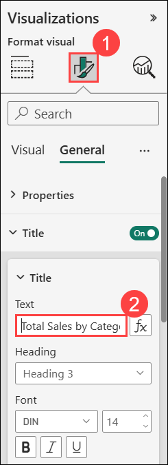
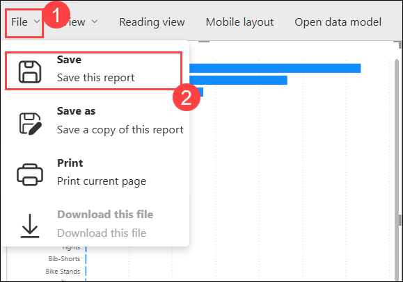

# Exercise 2: Analyze data in a data warehouse

### Estimated Duration: 75 Minutes

In this exercise, you'll analyze data in a Microsoft Fabric data warehouse using SQL and visual tools. You'll begin by creating a data warehouse, designing its schema with fact and dimension tables, and inserting sample data. You’ll then define relationships to build a data model, run SQL queries to analyze data, and create a view for reuse. Finally, you'll use visual query and reporting features to explore and present insights effectively.

## Lab objectives

You will be able to complete the following tasks:

- Task 1: Create a data warehouse
- Task 2: Create tables and insert data
- Task 3: Define a data model
- Task 4: Query data warehouse tables
- Task 5: Create a view
- Task 6: Create a visual query
- Task 7: Visualize your data

## Task 1: Create a data warehouse

In this task, you will design and implement a data warehouse by organizing data from multiple sources, creating ETL processes, and optimizing for performance. The goal is to enable efficient querying and reporting while ensuring security, compliance, and scalability.

1. Navigate to your workspace **fabric-<inject key="DeploymentID" enableCopy="false"/> (1)**, click on **+ New item (2)** to create a new warehouse.

    
   
1. In the search box, search **Warehouse (1)** and select **Warehouse** **(2)** from the list.
    
    

1. In the **New warehouse** window, enter the following:

    - Name: **Data Warehouse-<inject key="DeploymentID" enableCopy="false"/>** **(1)**

    - Click on **Create (2)**

        


## Task 2: Create tables and insert data

In this task, you’ll set up the foundation of your data warehouse. You’ll create tables with the right structure, load them with sample data, and then build a semantic model on top of those tables. This model provides a business-friendly layer that makes the warehouse data easier to explore and use in reports.

1. In your new warehouse, under **Build a warehouse** select the **T-SQL** tile.

   

1. Enter the following **SQL Code (1)** and click the **&#9655; Run (2)** button to run the SQL script, which creates a new table named **DimProduct** in the **dbo** schema of the data warehouse.

    ```SQL
   CREATE TABLE dbo.DimProduct
   (
       ProductKey INTEGER NOT NULL,
       ProductAltKey VARCHAR(25) NULL,
       ProductName VARCHAR(50) NOT NULL,
       Category VARCHAR(50) NULL,
       ListPrice DECIMAL(5,2) NULL
   );
   GO
    ```

   

1. Use the **Refresh** button on the toolbar to refresh the view. Then, in the **Explorer** pane, expand **Schemas** > **dbo** > **Tables** and verify that the **DimProduct** table has been created.

    

1. On the **Home** menu tab, use the **New SQL Query** button and from the drop down select **New SQL Query**  to create a new query, and enter the following INSERT statement:

    

    ```SQL
   INSERT INTO dbo.DimProduct
   VALUES
   (1, 'RING1', 'Bicycle bell', 'Accessories', 5.99),
   (2, 'BRITE1', 'Front light', 'Accessories', 15.49),
   (3, 'BRITE2', 'Rear light', 'Accessories', 15.49);
   GO
    ```

1. Run the above query to insert three rows into the **DimProduct** table.

1. In the **Explorer** pane, select the **DimProduct** table and verify that the three rows have been added to the table.

    

1. On the Home menu tab, use the **New SQL Query** button to create a new query for the table.

1. Open the **Lab VM** and navigate to the following path: `C:\LabFiles\Files\`.

    

1. Open the file **`create-dw-01.txt`** and copy the Transact-SQL code related to the **`DimProduct`** table.

    

1. Paste the copied code into the new query window.

1. Next, open the files **`create-dw-02.txt`** and **`create-dw-03.txt`**, one after the other, and copy their contents.

1. Paste the code from both files **below the existing code** in the **same query window**.

1. Once you have combined the code from all three files into a single query window, click **Run** to execute the query. This will create a basic data warehouse schema and populate it with sample data. The execution should take approximately **30 seconds** to complete.

     

1. Use the **Refresh** button on the toolbar to refresh the view. Then in the **Explorer** pane, verify that the **dbo** schema in the data warehouse now contains the following four tables:
   
    - **DimCustomer**
    - **DimDate**
    - **DimProduct**
    - **FactSalesOrder**

        

        > **Note:** If the schema takes a while to load, just refresh the browser page.

1. Now from the toolbar on the top, click **New semantic model**.

    

1. In the new semantic model window, name it **Data Warehouse-<inject key="DeploymentID" enableCopy="false"/> (1)**. Then navigate to **Schemas > dbo > Tables (2)** and select the following tables and then click **Confirm (3)**:

    - **DimCustomer**
    - **DimDate**
    - **DimProduct**
    - **FactSalesOrder**

        

> **Congratulations** on completing the task! Now, it's time to validate it. Here are the steps:
> - If you receive a success message, you can proceed to the next task.
> - If not, carefully read the error message and retry the step, following the instructions in the lab guide. 
> - If you need any assistance, please contact us at cloudlabs-support@spektrasystems.com. We are available 24/7 to help you out.

<validation step="ae9ea1a1-6466-459b-87da-12cb0f83b186" />

## Task 3: Define a data model

In this task, you will create a relational data warehouse consisting of fact and dimension tables, where fact tables hold numeric measures for analysis and dimension tables store entity attributes. You'll define relationships between tables in Microsoft Fabric to build a data model for efficient business performance analysis.

1. From the left apne, click on **fabric-<inject key="DeploymentID" enableCopy="false"/> (1)** and select **Data Warehouse-<inject key="DeploymentID" enableCopy="false"/> (2)** Semantic model.

    

1. Click on **Open semantic model**, from the toolbar on the top. 

    

1. In the top right corner, click on **Viewing (1)** drop-down and select **Editing (2)**.

    

1. In the model pane, rearrange the tables in your data warehouse so that the **FactSalesOrder** table is in the middle, like this:

     

1. Drag the **ProductKey** field from the **FactSalesOrder** table and drop it on the **ProductKey** field in the **DimProduct** table. Then confirm the following relationship details.
   
    - From table: **FactSalesOrder (1)**
    - Column: **ProductKey (2)**
    - To table: **DimProduct (3)**
    - Column: **ProductKey (4)**
    - Cardinality: **Many to one (*:1) (5)**
    - Cross filter direction: **Single (6)**
    - Make this relationship active: **Selected (7)**
    - Assume referential integrity: **Unselected (8)**
    - Click **Save (9)**.

        

1. Repeat the process to create many-to-one relationships between the following tables and click on **Save**.

    - **FactSalesOrder.CustomerKey** &#8594; **DimCustomer.CustomerKey**

        

    - **FactSalesOrder.SalesOrderDateKey** &#8594; **DimDate.DateKey**
  
        

1. When all of the relationships have been defined, the model should look like this:

    

## Task 4: Query data warehouse tables

In this task, you will query data warehouse tables using SQL to retrieve and analyze data. Most queries will involve aggregating and grouping data with functions and GROUP BY clauses, as well as joining related fact and dimension tables using JOIN clauses.

1. Create a **New SQL Query** from the top Menu bar, and run the following code:

    ```SQL
   SELECT  d.[Year] AS CalendarYear,
            d.[Month] AS MonthOfYear,
            d.MonthName AS MonthName,
           SUM(so.SalesTotal) AS SalesRevenue
   FROM FactSalesOrder AS so
   JOIN DimDate AS d ON so.SalesOrderDateKey = d.DateKey
   GROUP BY d.[Year], d.[Month], d.MonthName
   ORDER BY CalendarYear, MonthOfYear;
    ```
    
   
1. Note that the attributes in the time dimension enable you to aggregate the measures in the fact table at multiple hierarchical levels- in this case, year and month. This is a common pattern in data warehouses.

1. Modify the query as follows to add a second dimension to the aggregation.

    ```SQL
   SELECT  d.[Year] AS CalendarYear,
           d.[Month] AS MonthOfYear,
           d.MonthName AS MonthName,
           c.CountryRegion AS SalesRegion,
          SUM(so.SalesTotal) AS SalesRevenue
   FROM FactSalesOrder AS so
   JOIN DimDate AS d ON so.SalesOrderDateKey = d.DateKey
   JOIN DimCustomer AS c ON so.CustomerKey = c.CustomerKey
   GROUP BY d.[Year], d.[Month], d.MonthName, c.CountryRegion
   ORDER BY CalendarYear, MonthOfYear, SalesRegion;
    ```

1. **Run** the modified query and review the results, which now include Sales Revenue aggregated by Year, Month and Sales Region.

    

## Task 5: Create a view

In this task, you will create a view in the data warehouse to encapsulate SQL logic for easier querying and data abstraction. A Microsoft Fabric data warehouse offers similar capabilities to relational databases, allowing you to create views and stored procedures to streamline complex queries and improve data access efficiency.

1. Modify the query you created previously as follows to create a view (note that you need to remove the ORDER BY clause to create a view).

    ```SQL
   CREATE VIEW vSalesByRegion
   AS
   SELECT  d.[Year] AS CalendarYear,
           d.[Month] AS MonthOfYear,
           d.MonthName AS MonthName,
           c.CountryRegion AS SalesRegion,
          SUM(so.SalesTotal) AS SalesRevenue
   FROM FactSalesOrder AS so
   JOIN DimDate AS d ON so.SalesOrderDateKey = d.DateKey
   JOIN DimCustomer AS c ON so.CustomerKey = c.CustomerKey
   GROUP BY d.[Year], d.[Month], d.MonthName, c.CountryRegion;
    ```
    

2. **Run** the query to create the view. Then refresh the data warehouse schema and verify that the new view is listed in the **Explorer** pane.

    

3. Create a **New SQL query** from the top Menu bar and run the following SELECT statement:

    ```SQL
   SELECT CalendarYear, MonthName, SalesRegion, SalesRevenue
   FROM vSalesByRegion
   ORDER BY CalendarYear, MonthOfYear, SalesRegion;
    ```

## Task 6: Create a visual query

In this task, you will create a visual query using the graphical query designer to query data warehouse tables without writing SQL code. Similar to Power Query online, this no-code approach allows you to perform data transformations, and for more complex tasks, you can leverage Power Query's M language.

1. On the **Home** menu, from the **New SQL query (1)** drop-down and select **New visual query (2)**.

    

1. From Tables, drag **FactSalesOrder** onto the **canvas**. Notice that a preview of the table is displayed in the **Preview** pane below.

1. And then, drag **DimProduct** onto the **canvas**. We now have two tables in our query.

1. Click the **+ (1)** button on the **FactSalesOrder** and then click on **Merge queries (2)**.

    

   > **Note:** If the + option is not visible, click on the three dots (i.e., the Actions button) to view the required options. 

1. In the **Merge queries** window, select **DimProduct (1)** as the right table for merge. Select **ProductKey  (2)** in both queries, leave the default **Left outer (3)** to join type, and click **OK (4)**.

   

1. In the **Preview**, note that the new **DimProduct** column has been added to the FactSalesOrder table. Expand the column by clicking the **double-arrow (1)** to the right of the column name. Select **ProductName (2)** and click **OK (3)**.

    

1. If you're interested in looking at data for a single product, per a manager's request, you can now use the **ProductName** column to filter the data in the query. Filter the **ProductName** column to look at **Cable Lock** data only.

    

1. From here, you can analyze the results of this single query by selecting **Visualize results** or **Download Excel file**. You can now see exactly what the manager was asking for, so we don't need to analyze the results further.

## Task 7: Visualize your data

In this task, you will visualize your data from a single query or your data warehouse to gain insights and present findings effectively. Before creating visualizations, it's important to hide any columns or tables that may clutter the report and are not user-friendly for report designers.

1. Switch to the browser tab where the **Model layout** view is open.

1. Hide the following columns in your Fact and Dimension tables that are not necessary to create a report. Note that this does not remove the columns from the model; it simply hides them from view on the report canvas.
   
    - FactSalesOrder
      
      - **SalesOrderDateKey**
      - **CustomerKey**
      - **ProductKey**

        

    - DimCustomer
      - **CustomerKey**
      - **CustomerAltKey**

    - DimDate
      - **DateKey**
      - **DateAltKey**

    - DimProduct
      - **ProductKey**
      - **ProductAltKey** 

        

    > **Note:** If the screen stutters while making these changes, try refreshing the browser window.

1. On the **File (1)** tab, select **Create new report (2)**. This will open a new window, where you can create a Power BI report.

     

1. In the **Data** pane, expand **DimProduct**. Note that the columns you hide are no longer visible. 

    

1. Now select **Category**. This will add the column to the **Report canvas**. Because the column is a numeric value, the default visual is a **column chart**.

    

1. Ensure that the column chart on the canvas is active (with a grey border and handles), and then select **SalesTotal** from the **FactSalesOrder** table to add a category to your column chart.

    

1. In the **Visualizations** pane, change the chart type from a column chart to a **clustered bar chart**. Then resize the chart as necessary to ensure that the categories are readable.

    

1. In the **Visualizations** pane, select the **Format your visual (1)** tab and in the **General** sub-tab, in the **Title** section, change the **Text** to **Total Sales by Category (2)**.

   

1. From the **File (1)** menu, select **Save (2)**.

    

1. In the **Save your report** window, select **fabric-<inject key="DeploymentID" enableCopy="false"/> (1)**, enter a name as **Sales Report (2)**, and click the **Save (3)** button .

   

## Summary

In this exercise, you

-  Created a data warehouse containing multiple related tables.
- Used SQL to: 
    - Insert data into the tables.
    - Query the data for analysis.
- Leveraged the visual query tool to explore and transform the data.
- Enhanced the data model for the default dataset in the data warehouse.
- Used the enhanced dataset as the source for building a report.

### You have successfully completed the exercise. Click on Next >> to proceed with next exercise.

.png)