# Lab 04: Get started with Real-Time Analytics in Microsoft Fabric

### 所要時間: 45分

## 概要

Microsoft Fabricは、Kusto Query Language (KQL) を使用してデータを保存およびクエリするためのランタイムを提供します。Kustoは、ログファイルやIoTデバイスからのリアルタイムデータなど、時系列コンポーネントを含むデータに最適化されています。

前のステップでワークスペースを作成したので、ポータルで*Synapse Real-Time Analytics*エクスペリエンスに切り替えます。

## ラボの目的

次のタスクを完了できるようになります：

- タスク 1: KQLデータベースの作成
- タスク 2: KQLを使用して売上テーブルをクエリする
- タスク 3: KQLクエリセットからPower BIレポートを作成する
- タスク 4: ストリーミングデータにデルタテーブルを使用する

### タスク 1: KQLデータベースの作成

Kustoクエリ言語 (KQL) は、KQLデータベースに定義されたテーブル内の静的またはストリーミングデータをクエリするために使用されます。売上データを分析するために、KQLデータベースにテーブルを作成し、ファイルからデータを取り込む必要があります。

1. ホーム画面左下で、**Real-Time Intelligence** エクスペリエンスを選択します：

    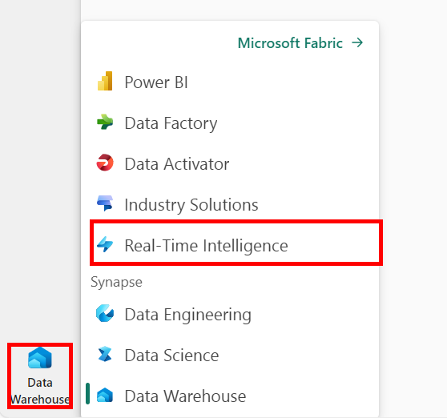

2. **Real-Time Analytics**エクスペリエンスの**ホーム**ページで、**イベントハウス** を選択し、イベントハウスを作成します。

    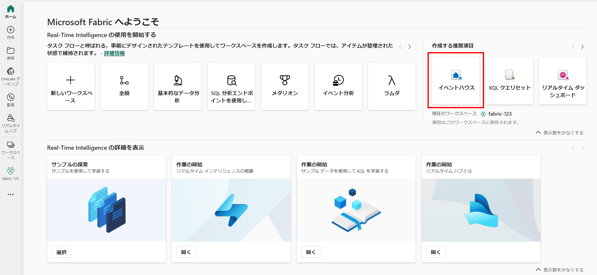

3. **名前:** に **Eventhouse-<inject key="DeploymentID" enableCopy="false"/> (1)** を入力し、**作成 (2)** をクリックします。

     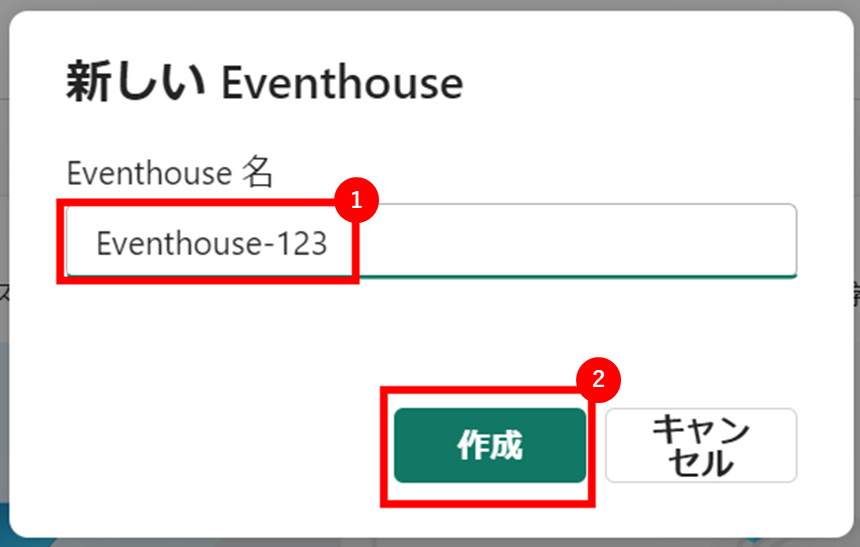

    >**注:** アップグレードに関するポップアップが表示された場合は**OK**をクリックします。アップグレード後に表示されるポップアップを閉じます。

4. 新しいイベントハウスが作成されたら、左側のペインのKQLデータベースの下から **Eventhouse-<inject key="DeploymentID" enableCopy="false"/>** を選択します。

   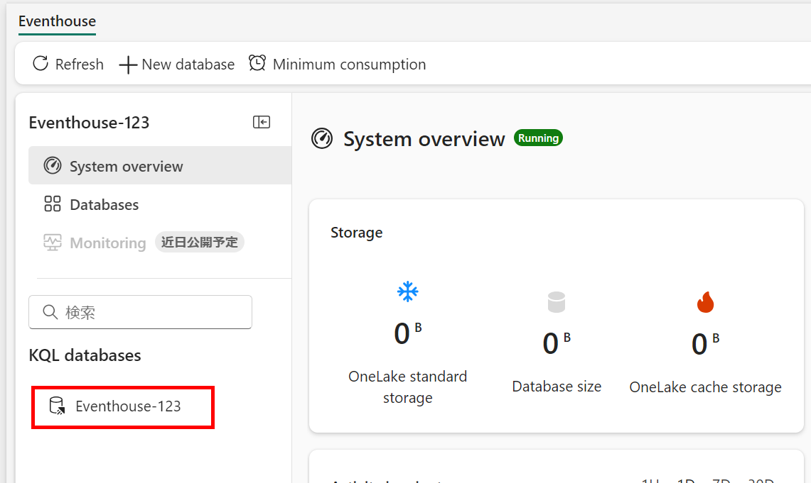

    >**注:** Get started が表示されたボタンをクリックして完了させます。
5. リボンのメニューから **Get data** 内にある **Local file**　を選択します。

    

6. ウィザードを使用して新しいテーブルにデータをインポートするために次のオプションを選択します：
    - **宛先テーブルの選択とソースの構成**:
        - **宛先テーブルの選択又は作成:** 新しいテーブルとして **sales** となる名前を入力しチェックマークで確定します。
        - **1000 個までのファイルを追加する:** **C:\LabFiles\Files\sales.csv**からファイルをドラッグまたは参照します。

            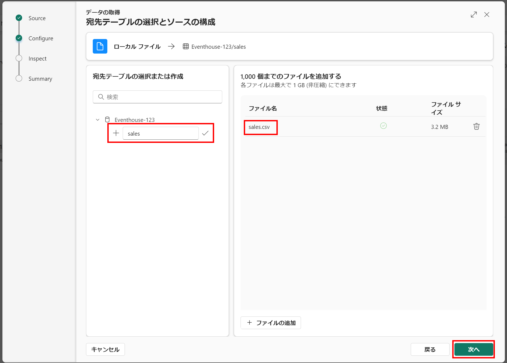

    - **データの検査:** データをプレビューし、**終了**をクリックします。

        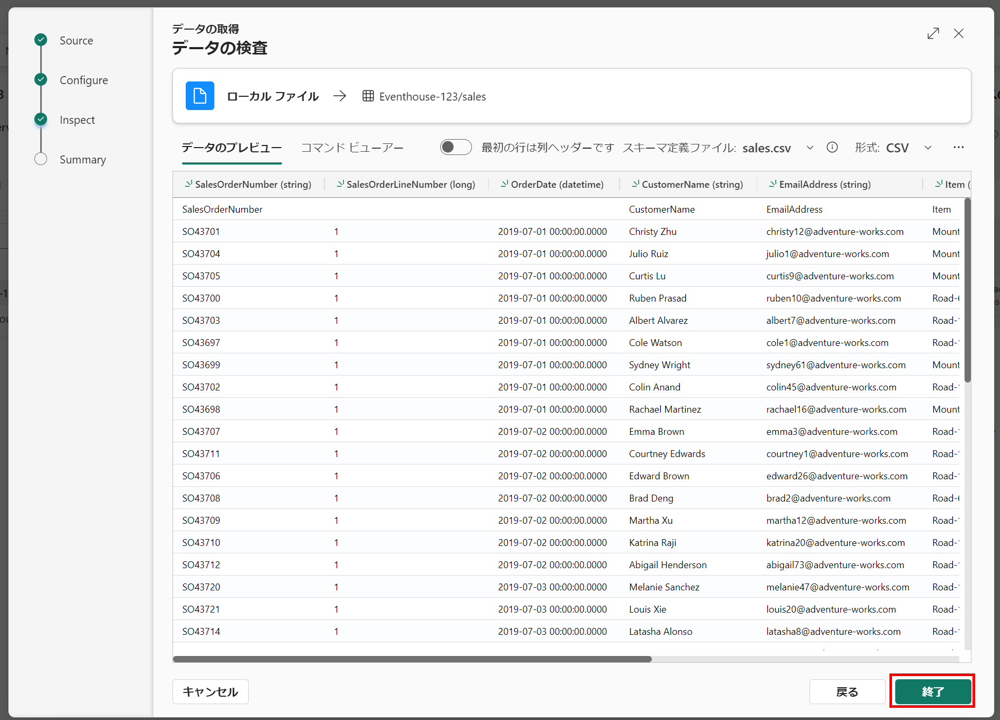

    - **概要:**
        - テーブルのプレビューを確認し、**ウィザードを閉じます。**

            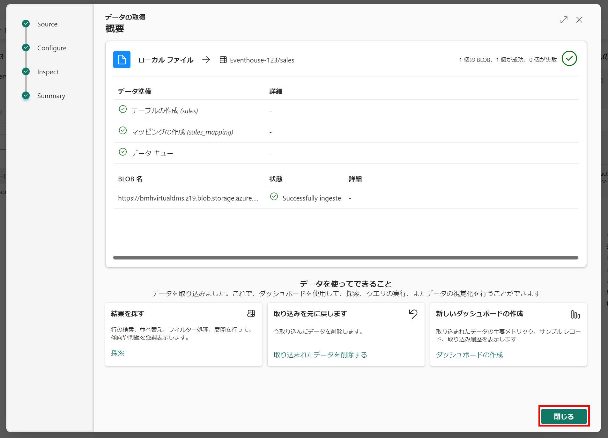

> **注:** この例では、ファイルから非常に少量の静的データをインポートしましたが、この演習には問題ありません。実際には、Azure Event Hubsなどのストリーミングソースからのリアルタイムデータを含む、はるかに大規模なデータをKustoを使用して分析できます。

### タスク 2: KQLを使用して売上テーブルをクエリする

データベースにデータのテーブルができたので、KQLコードを使用してクエリを実行できます。

1. **sales**テーブルがハイライトされていることを確認します。メニューバーから**Query table** ドロップダウンを選択し、**Show any 100 records** を選択します。

    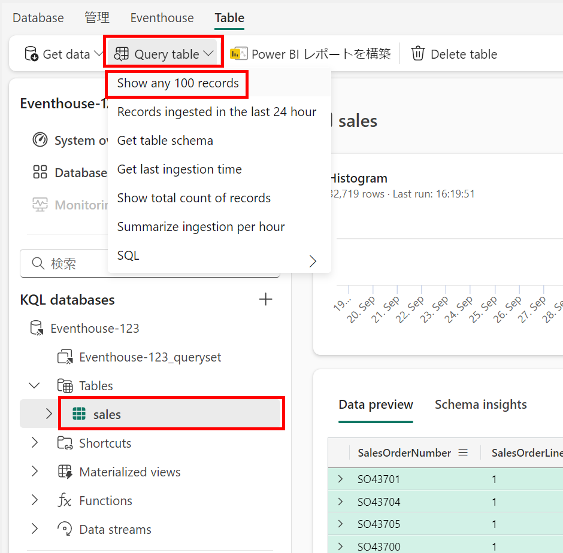

2. 新しいペインが開き、クエリとその結果が表示されます。

    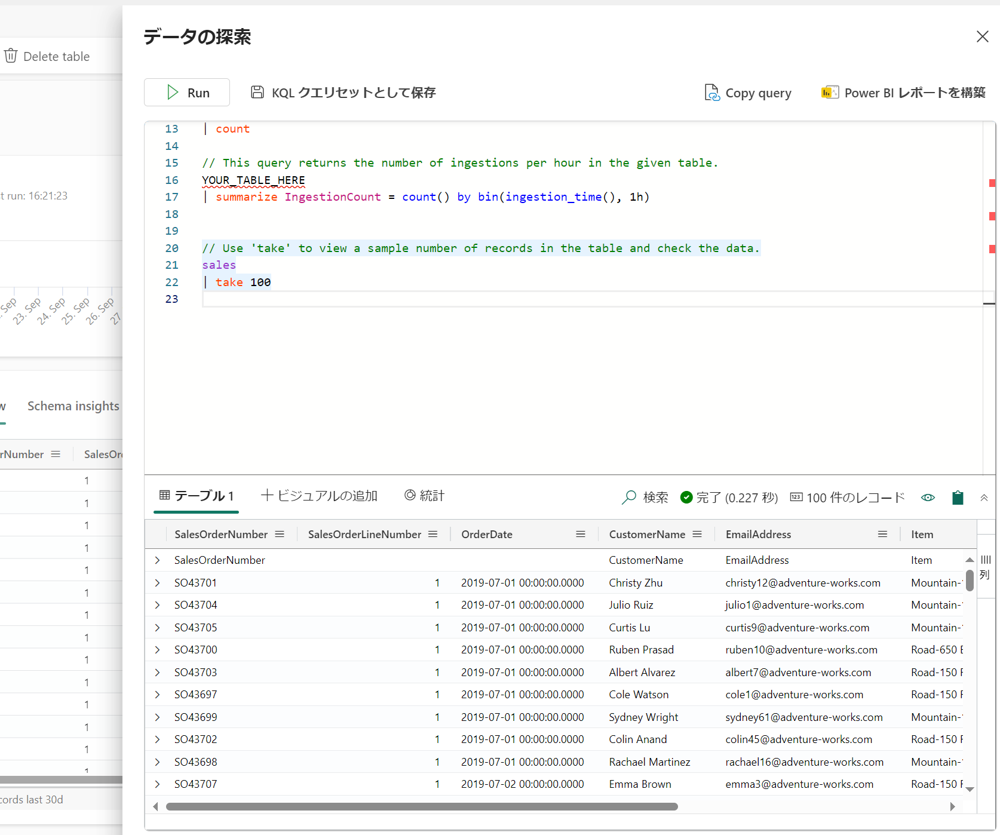

3. クエリを次のように変更します：

    ```kusto
   sales
   | where Item == 'Road-250 Black, 48'
    ```

4. クエリを実行します。次に、結果を確認します。結果には*Road-250 Black, 48*製品の売上注文のみが含まれているはずです。

5. クエリを次のように変更します：

    ```kusto
   sales
   | where Item == 'Road-250 Black, 48'
   | where datetime_part('year', OrderDate) > 2020
    ```

6. クエリを実行し、結果を確認します。結果には2020年以降に行われた*Road-250 Black, 48*の売上注文のみが含まれているはずです。

7. クエリを次のように変更します：

    ```kusto
   sales
   | where OrderDate between (datetime(2020-01-01 00:00:00) .. datetime(2020-12-31 23:59:59))
   | summarize TotalNetRevenue = sum(UnitPrice) by Item
   | sort by Item asc
    ```

8. クエリを実行し、結果を確認します。結果には、2020年1月1日から2020年12月31日までの各製品の総純収益が製品名の昇順で含まれているはずです。

9. **KQLクエリセットとして保存**を選択し、クエリを**Revenue by Product**として保存します。
    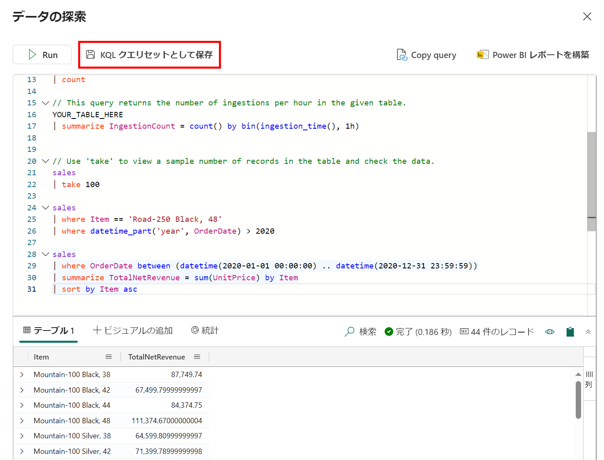


### タスク 3: KQLクエリセットからPower BIレポートを作成する

KQLクエリセットを基にPower BIレポートを作成できます。

1. KQL クエリセットのクエリエディタ画面で、クエリを実行し、結果を待ちます。

    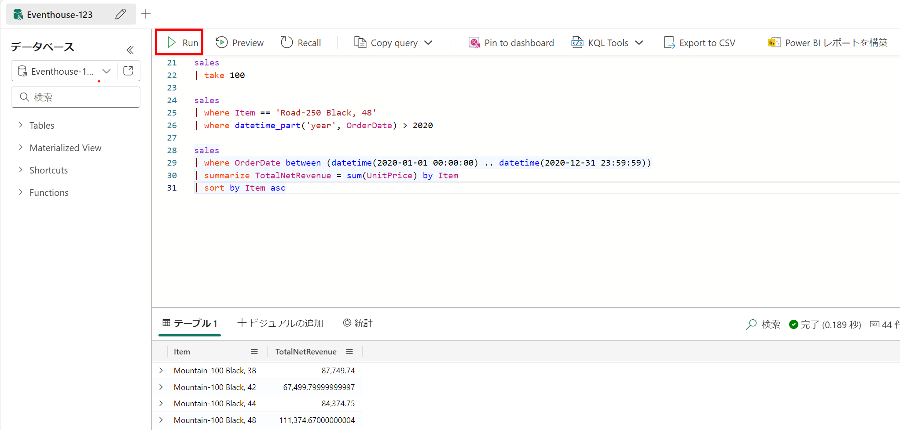

2. **Power BIレポートを構築**を選択し、レポートエディタが開くのを待ちます。

3. レポートエディタの**データ**ペインで、**Kusto Query Result**を展開し、**Item**と**TotalRevenue**フィールドを選択します。

4. レポートデザインキャンバスで、追加されたテーブルビジュアライゼーションを選択し、**視覚化**ペインで**集合棒グラフ**を選択します。

    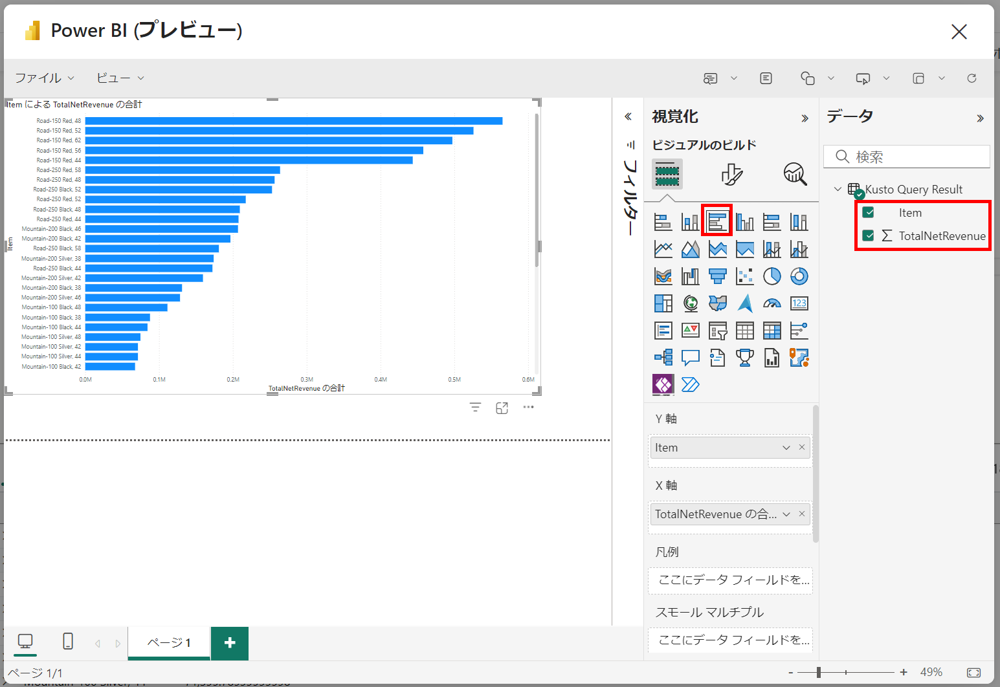

5. **Power BI**ウィンドウで、**ファイル**メニューから**保存**を選択します。次に、レイクハウスとKQLデータベースが定義されているワークスペースに**Revenue by Item.pbix**としてレポートを保存します。

6. **Power BI**ウィンドウを閉じ、左側のバーでワークスペースのアイコンを選択します。

    必要に応じてワークスペースページを更新し、含まれているすべてのアイテムを表示します。

7. ワークスペース内のアイテムのリストで、**Revenue by Item**レポートがリストされていることを確認します。

### タスク 4: ストリーミングデータにデルタテーブルを使用する

デルタレイクはストリーミングデータをサポートします。デルタテーブルは、Spark Structured Streaming APIを使用して作成されたデータストリームの*シンク*または*ソース*になることができます。この例では、シミュレートされたIoTシナリオでストリーミングデータのシンクとしてデルタテーブルを使用します。

1. ワークスペースに戻り、**Load Sales Notebook**を開きます。ノートブックに新しいコードセルを追加します。次に、新しいセルに次のコードを追加して実行します：

    ```python
   from notebookutils import mssparkutils
   from pyspark.sql.types import *
   from pyspark.sql.functions import *

   # フォルダを作成
   inputPath = 'Files/data/'
   mssparkutils.fs.mkdirs(inputPath)

   # フォルダからデータを読み取るストリームを作成し、JSONスキーマを使用
   jsonSchema = StructType([
   StructField("device", StringType(), False),
   StructField("status", StringType(), False)
   ])
   iotstream = spark.readStream.schema(jsonSchema).option("maxFilesPerTrigger", 1).json(inputPath)

   # フォルダにイベントデータを書き込む
   device_data = '''{"device":"Dev1","status":"ok"}
   {"device":"Dev1","status":"ok"}
   {"device":"Dev1","status":"ok"}
   {"device":"Dev2","status":"error"}
   {"device":"Dev1","status":"ok"}
   {"device":"Dev1","status":"error"}
   {"device":"Dev2","status":"ok"}
   {"device":"Dev2","status":"error"}
   {"device":"Dev1","status":"ok"}'''
   mssparkutils.fs.put(inputPath + "data.txt", device_data, True)
   print("ソースストリームが作成されました...")
    ```

    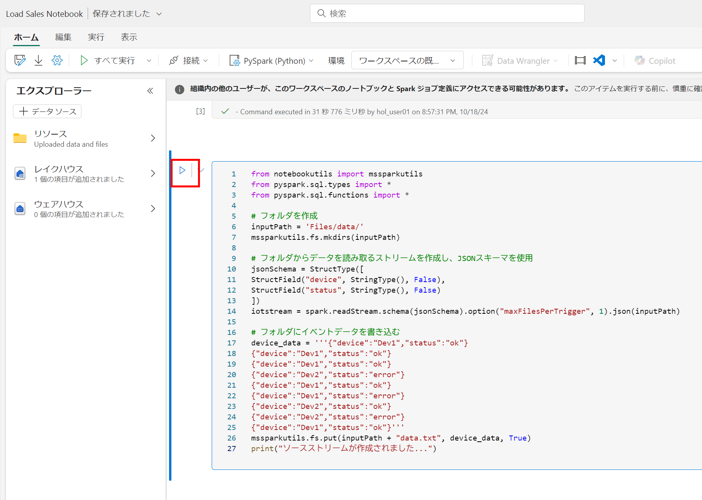

2. メッセージ*ソースストリームが作成されました...*が表示されることを確認します。実行したコードは、フォルダに保存されたデータに基づいてストリーミングデータソースを作成しました。これは仮想のIoTデバイスからの読み取りを表しています。
3. 新しいコードセルに次のコードを追加して実行します：

    ```python
   # ストリームをデルタテーブルに書き込む
   delta_stream_table_path = 'Tables/iotdevicedata'
   checkpointpath = 'Files/delta/checkpoint'
   deltastream = iotstream.writeStream.format("delta").option("checkpointLocation", checkpointpath).start(delta_stream_table_path)
   print("デルタシンクへのストリーミング...")
    ```

    このコードは、ストリーミングデバイスデータをデルタ形式で**iotdevicedata**というフォルダに書き込みます。**Tables**フォルダの場所にパスがあるため、自動的にテーブルが作成されます。

4. 新しいコードセルに次のコードを追加して実行します：

    ```sql
   %%sql

   SELECT * FROM IotDeviceData;
    ```

    このコードは、ストリーミングソースからのデバイスデータを含む**IotDeviceData**テーブルをクエリします。

    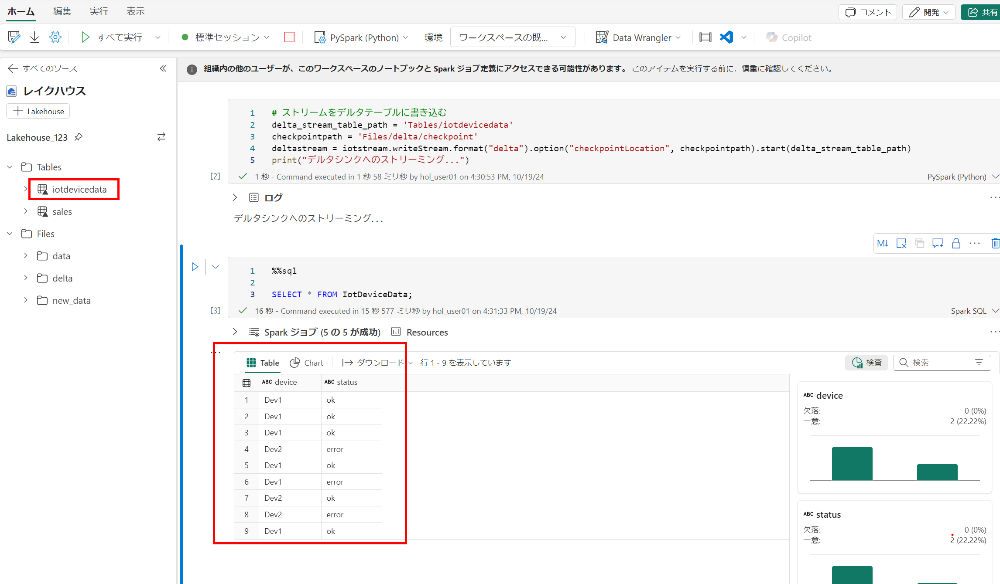

5. 新しいコードセルに次のコードを追加して実行します：

    ```python
   # ソースストリームにデータを追加
   more_data = '''{"device":"Dev1","status":"ok"}
   {"device":"Dev1","status":"ok"}
   {"device":"Dev1","status":"ok"}
   {"device":"Dev1","status":"ok"}
   {"device":"Dev1","status":"error"}
   {"device":"Dev2","status":"error"}
   {"device":"Dev1","status":"ok"}'''

   mssparkutils.fs.put(inputPath + "more-data.txt", more_data, True)
    ```

    このコードは、ストリーミングソースに仮想のデバイスデータをさらに書き込みます。

6. 次のコードを含むセルを再実行します：

    ```sql
   %%sql

   SELECT * FROM IotDeviceData;
    ```

    このコードは、**IotDeviceData**テーブルを再度クエリし、ストリーミングソースに追加された追加データを含むはずです。
    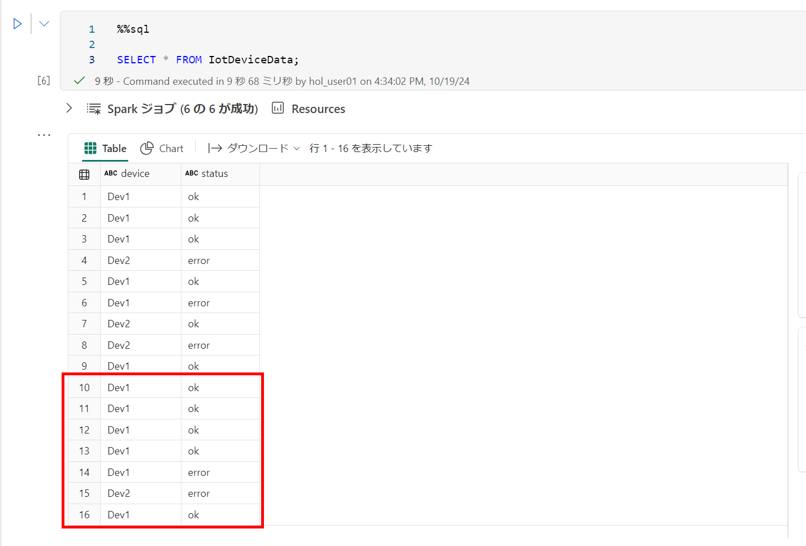

7. 新しいコードセルに次のコードを追加して実行します：

    ```python
   deltastream.stop()
    ```

    このコードはストリームを停止します。

    <validation step="3e3b6775-5941-4063-965e-9f1d3a6baa2e" />

    > **おめでとうございます** タスクを完了しました！次のステップで検証します：
    > - 対応するタスクの検証ボタンを押します。
    > - 成功メッセージが表示された場合、次のタスクに進むことができます。表示されない場合は、エラーメッセージをよく読み、ラボガイドの指示に従ってステップを再試行します。
    > - サポートが必要な場合は、labs-support@spektrasystems.comまでご連絡ください。24時間365日対応しています。


## まとめ

このラボでは、レイクハウスを作成し、レイクハウスにアップロードされたデータを分析するためのKQLデータベースを作成しました。KQLを使用してデータをクエリし、クエリセットを作成し、それを基にPower BIレポートを作成しました。


### ラボを正常に完了しました

