# 演習 06: Apache Spark を使用してデータを分析する

### 所要時間: 60 分

## 概要

Apache Sparkは、分散データ処理のためのオープンソースエンジンであり、データレイクストレージ内の膨大なデータを探索、処理、分析するために広く使用されています。Sparkは、Azure HDInsight、Azure Databricks、Azure Synapse Analytics、Microsoft Fabricなど、多くのデータプラットフォーム製品で処理オプションとして利用可能です。Sparkの利点の一つは、Java、Scala、Python、SQLなど、幅広いプログラミング言語をサポートしていることです。これにより、データのクレンジングおよび操作、統計分析と機械学習、データ分析と可視化などのデータ処理ワークロードに非常に柔軟なソリューションとなっています。

## ラボの目的

次のタスクを完了できるようになります：

- タスク 1: レイクハウスを作成し、ファイルをアップロードする
- タスク 2: ノートブックを作成する
- タスク 3: データフレームにデータをロードする
- タスク 4: データフレーム内のデータを探索する
- タスク 5: Sparkを使用してデータファイルを変換する
- タスク 6: 変換されたデータを保存する
- タスク 7: パーティション化したファイルにデータを保存する
- タスク 8: テーブルとSQLを使用する
- タスク 9: Sparkでデータを可視化する
- タスク 10: ノートブックを保存し、Sparkセッションを終了する

### タスク 1: レイクハウスを作成し、ファイルをアップロードする

作成済みのワークスペース上で、ポータルで*データエンジニアリング*エクスペリエンスに切り替え、分析するデータファイルのためのデータレイクハウスを作成します。

1. Power BIポータルの左下にある**Power BI**アイコンを選択し、**データエンジニアリング**エクスペリエンスに切り替えます。

    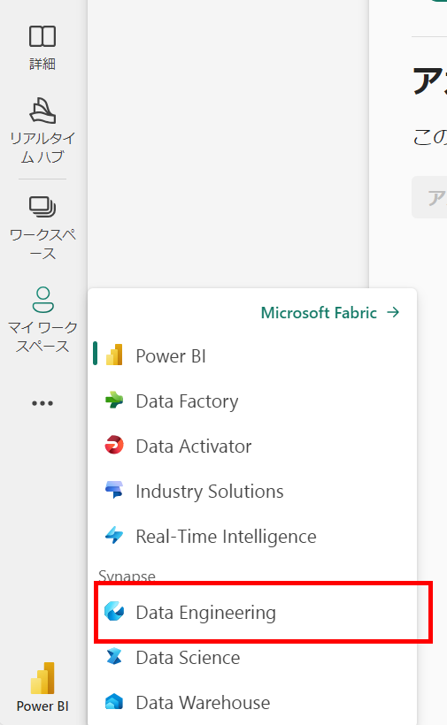

2. **Synapse Data Engineering**ホームページで、新しい**レイクハウス**を作成します。

    - **名前:** **fabric_lakehouse_<inject key="DeploymentID" enableCopy="false"/>** と入力します。

     1分ほどで、新しい空のレイクハウスが作成されます。分析のためにデータレイクハウスにデータを取り込む必要があります。これには複数の方法がありますが、この演習では**LabVM**からレイクハウスにアップロードします。

3. レイクハウスを含むウェブブラウザタブに戻り、**Explorer**ペインの**Files**フォルダーの **...** メニューで**Upload**と**Upload folder**を選択し、**C:\LabFiles\Files\orders**から**orders**フォルダーをレイクハウスにアップロードします。

4. ファイルがアップロードされた後、**Files**を展開し、**orders**フォルダーを選択して、CSVファイルがアップロードされたことを確認します。
    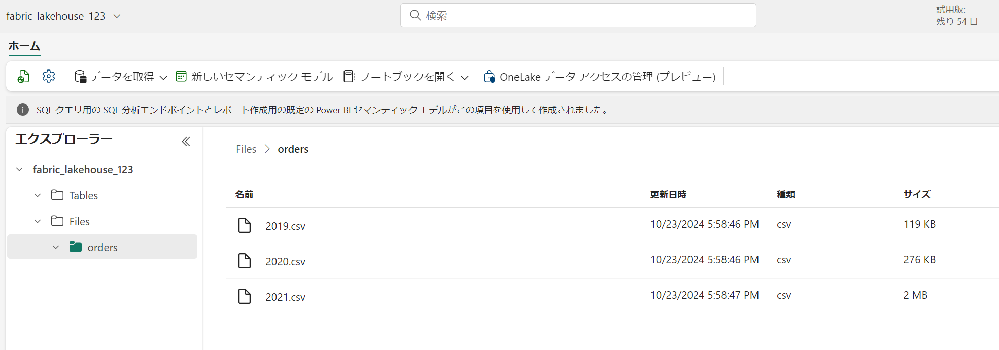
   
### タスク 2: ノートブックを作成する

Apache Sparkでデータを操作するには、*ノートブック*を作成することができます。ノートブックは、コードを記述して実行し、ドキュメント化するためのインタラクティブな環境を提供します。

1. データレイク内の**orders**フォルダーの内容を表示している**ホーム**ページで、 **ノートブックを開く (1)** メニューから **新しいノートブック (2)** を選択します。

    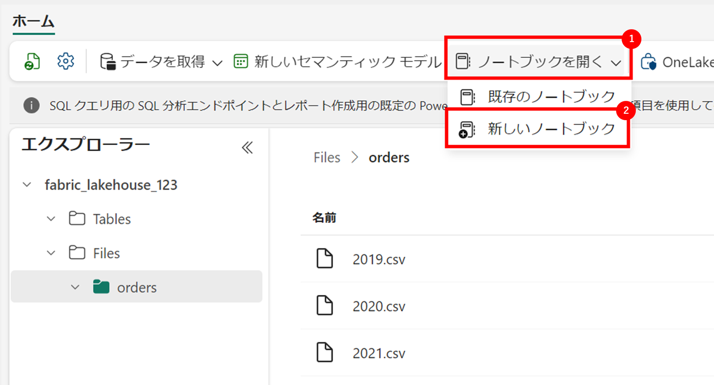

     数秒後、新しいノートブックが1つの*セル*を含んで開きます。ノートブックは、*コード*または*マークダウン*（フォーマットされたテキスト）を含む1つ以上のセルで構成されます。

2. 最初のセル（現在は*コード*セル）を選択し、右上の動的ツールバーで **M&#8595;** ボタンを使用してセルを*マークダウン*セルに変換します。

     セルがマークダウンセルに変わると、その内容がレンダリングされます。

3. **&#128393;**（編集）ボタンを使用してセルを編集モードに切り替え、次のようにマークダウンを修正します：

    ```
   # 売上注文データの探索

    このノートブックのコードを使用して、売上注文データを探索してください。
     ```

4. セルの外側をクリックして編集を終了し、レンダリングされたマークダウンを確認します。

    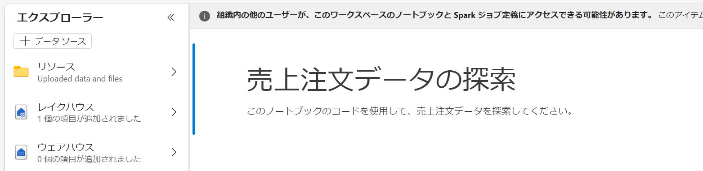

### タスク 3: データをデータフレームにロードする

次に、データを*データフレーム*にロードするコードを実行します。Sparkのデータフレームは、PythonのPandasデータフレームに似ており、行と列でデータを操作するための共通の構造を提供します。

> **注**: SparkはScala、Javaなど複数のコーディング言語をサポートしています。この演習では、Sparkに最適化されたPythonのバリアントである*PySpark*を使用します。PySparkはSparkで最も一般的に使用される言語の1つであり、Fabricノートブックのデフォルト言語です。

1. ノートブックを表示した状態で、**Files** リストを展開し、**orders** フォルダーを選択して、CSVファイルがノートブックエディタの横にリストされるようにします：

     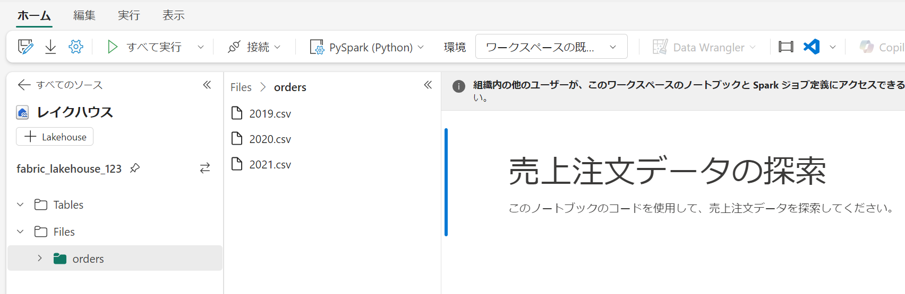

2. **2019.csv**の **...** メニューで、**Load data** > **Spark** を選択します。

   

3. 次のコードを含む新しいコードセルがノートブックに追加されます：

    ```python
   df = spark.read.format("csv").option("header","true").load("Files/orders/2019.csv")
   # df now is a Spark DataFrame containing CSV data from "Files/orders/2019.csv".
   display(df)
    ```

     > **ヒント**: 左側のレイクハウスエクスプローラペインを**<<**アイコンで非表示にすることができます。これにより、ノートブックに集中できます。abfsパスが失敗した場合、csvファイルを右クリックしてabfsパスをコピーし、ロードパスに貼り付けます。

4. セルの左側にある **&#9655; Run cell** ボタンを使用してセルを実行します。

     > **注**: これは初めてSparkコードを実行するため、Sparkセッションが開始されます。最初の実行には1分ほどかかることがありますが、その後の実行はより速くなります。

5. セルコマンドが完了したら、セルの下の出力を確認します。次のように表示されるはずです：

    | Index | SO43701 | 11 | 2019-07-01 | Christy Zhu | christy12@adventure-works.com | Mountain-100 Silver, 44 | 16 | 3399.99 | 271.9992 |
    | -- | -- | -- | -- | -- | -- | -- | -- | -- | -- |
    | 1 | SO43704 | 1 | 2019-07-01 | Julio Ruiz | julio1@adventure-works.com | Mountain-100 Black, 48 | 1 | 3374.99 | 269.9992 |
    | 2 | SO43705 | 1 | 2019-07-01 | Curtis Lu | curtis9@adventure-works.com | Mountain-100 Silver, 38 | 1 | 3399.99 | 271.9992 |
    | ... | ... | ... | ... | ... | ... | ... | ... | ... | ... |

     出力には2019.csvファイルのデータの行と列が表示されます。ただし、列ヘッダーが正しく表示されていないことに注意してください。デフォルトのコードは、CSVファイルの最初の行に列名が含まれていると仮定していますが、この場合、CSVファイルにはヘッダー情報が含まれていません。

6. コードを修正して、**header** オプションを **false** に設定します：

    ```python
   df = spark.read.format("csv").option("header","false").load("Files/orders/2019.csv")
   # df now is a Spark DataFrame containing CSV data from "Files/orders/2019.csv".
   display(df)
    ```

7. セルを再実行し、出力を確認します。次のように表示されるはずです：

   | Index | _c0 | _c1 | _c2 | _c3 | _c4 | _c5 | _c6 | _c7 | _c8 |
    | -- | -- | -- | -- | -- | -- | -- | -- | -- | -- |
    | 1 | SO43701 | 11 | 2019-07-01 | Christy Zhu | christy12@adventure-works.com | Mountain-100 Silver, 44 | 16 | 3399.99 | 271.9992 |
    | 2 | SO43704 | 1 | 2019-07-01 | Julio Ruiz | julio1@adventure-works.com | Mountain-100 Black, 48 | 1 | 3374.99 | 269.9992 |
    | 3 | SO43705 | 1 | 2019-07-01 | Curtis Lu | curtis9@adventure-works.com | Mountain-100 Silver, 38 | 1 | 3399.99 | 271.9992 |
    | ... | ... | ... | ... | ... | ... | ... | ... | ... | ... |

     データフレームには最初の行がデータ値として正しく含まれていますが、列名は自動生成されており、あまり役に立ちません。データを理解するためには、正しいスキーマとデータ型を明示的に定義する必要があります。

8. 次のようにコードを修正してスキーマを定義し、データをロードする際に適用します：

    ```python
   from pyspark.sql.types import *

   orderSchema = StructType([
       StructField("SalesOrderNumber", StringType()),
       StructField("SalesOrderLineNumber", IntegerType()),
       StructField("OrderDate", DateType()),
       StructField("CustomerName", StringType()),
       StructField("Email", StringType()),
       StructField("Item", StringType()),
       StructField("Quantity", IntegerType()),
       StructField("UnitPrice", FloatType()),
       StructField("Tax", FloatType())
       ])

   df = spark.read.format("csv").schema(orderSchema).load("Files/orders/2019.csv")
   display(df)
    ```

9. 修正したセルを実行し、出力を確認します。次のように表示されるはずです：

   | Index | SalesOrderNumber | SalesOrderLineNumber | OrderDate | CustomerName | Email | Item | Quantity | UnitPrice | Tax |
    | -- | -- | -- | -- | -- | -- | -- | -- | -- | -- |
    | 1 | SO43701 | 11 | 2019-07-01 | Christy Zhu | christy12@adventure-works.com | Mountain-100 Silver, 44 | 16 | 3399.99 | 271.9992 |
    | 2 | SO43704 | 1 | 2019-07-01 | Julio Ruiz | julio1@adventure-works.com | Mountain-100 Black, 48 | 1 | 3374.99 | 269.9992 |
    | 3 | SO43705 | 1 | 2019-07-01 | Curtis Lu | curtis9@adventure-works.com | Mountain-100 Silver, 38 | 1 | 3399.99 | 271.9992 |
    | ... | ... | ... | ... | ... | ... | ... | ... | ... | ... |

     データフレームには正しい列名が含まれています（**Index**はすべてのデータフレームに含まれる組み込み列で、各行の順序位置に基づいています）。列のデータ型は、セルの最初にインポートされたSpark SQLライブラリで定義された標準の型を使用して指定されています。

10. データフレームを表示して、変更が適用されたことを確認します。次のセルを実行します：

    ```python
    display(df)
    ```

11. データフレームには**2019.csv**ファイルのデータのみが含まれています。ファイルパスに **\* ワイルドカード**を使用して**orders**フォルダー内のすべてのファイルから販売注文データを読み込むようにコードを修正します：

    ```python
    from pyspark.sql.types import *
    
    orderSchema = StructType([
        StructField("SalesOrderNumber", StringType()),
        StructField("SalesOrderLineNumber", IntegerType()),
        StructField("OrderDate", DateType()),
        StructField("CustomerName", StringType()),
        StructField("Email", StringType()),
        StructField("Item", StringType()),
        StructField("Quantity", IntegerType()),
        StructField("UnitPrice", FloatType()),
        StructField("Tax", FloatType())
    ])
    
    df = spark.read.format("csv").schema(orderSchema).load("Files/orders/*.csv")
    display(df)
    ```

12. 修正したコードセルを実行し、出力を確認します。これで2019年、2020年、2021年の販売データが含まれているはずです。

     **注**: 表示される行のサブセットのみが表示されるため、すべての年の例を確認できない場合があります。

### タスク 4: データフレーム内のデータを探索する

データフレームオブジェクトには、含まれるデータをフィルタリング、グループ化、その他の操作を行うための多くの関数が含まれています。

#### データフレームをフィルタリングする

1. セルの出力の下にある **+ コード** アイコンを使用して新しいコードセルをノートブックに追加し、次のコードを入力します。

    ```Python
   customers = df['CustomerName', 'Email']
   print(customers.count())
   print(customers.distinct().count())
   display(customers.distinct())
    ```

2. 新しいコードセルを実行し、結果を確認します。次の点に注意してください：
    - データフレームに対して操作を行うと、その結果は新しいデータフレームになります（この場合、特定の列のサブセットを選択することで新しい**customers**データフレームが作成されます）
    - データフレームには、含まれるデータを要約およびフィルタリングするために使用できる**count**や**distinct**などの関数が提供されています。
    - `dataframe['Field1', 'Field2', ...]`構文は、列のサブセットを定義するための省略形です。**select**メソッドを使用することもでき、上記のコードの最初の行は`customers = df.select("CustomerName", "Email")`と書くことができます。

3. コードを次のように修正します：

    ```Python
   customers = df.select("CustomerName", "Email").where(df['Item']=='Road-250 Red, 52')
   print(customers.count())
   print(customers.distinct().count())
   display(customers.distinct())
    ```

4. 修正したコードを実行して、*Road-250 Red, 52* の製品を購入した顧客を表示します。複数の関数を連続で記述して、ある関数の出力を次の関数の入力として使用できることに注意してください。この場合、**select**メソッドで作成されたデータフレームが、フィルタリング条件を適用するために使用される**where**メソッドのソースデータフレームとなります。

#### データフレーム内のデータを集計およびグループ化する

1. ノートブックに新しいコードセルを追加し、次のコードを入力します：

    ```Python
   productSales = df.select("Item", "Quantity").groupBy("Item").sum()
   display(productSales)
    ```

2. 追加したコードセルを実行し、結果を確認します。結果には、製品ごとにグループ化された注文数量の合計が表示されます。**groupBy**メソッドは行を*Item*でグループ化し、その後の**sum**集計関数が残りのすべての数値列（この場合は*Quantity*）に適用されます。

3. ノートブックにさらに新しいコードセルを追加し、次のコードを入力します：

    ```Python
   from pyspark.sql.functions import *

   yearlySales = df.select(year(col("OrderDate")).alias("Year")).groupBy("Year").count().orderBy("Year")
   display(yearlySales)
    ```

4. 追加したコードセルを実行し、結果を確認します。結果には、年ごとの販売注文の数が表示されます。**select**メソッドには、**OrderDate** フィールドの年の部分を抽出するための **year** 関数が含まれています（そのため、コードにはSpark SQLライブラリから関数をインポートするための**import**文が含まれています）。その後、**alias**メソッドを使用して抽出された年の値に列名を割り当てます。データは派生した*Year*列でグループ化され、各グループの行数が計算され、最後に**orderBy**メソッドを使用して結果のデータフレームがソートされます。

### タスク 5: Sparkを使用してデータファイルを変換する

データエンジニアにとって一般的なタスクは、特定の形式や構造でデータを取り込み、さらなる下流処理や分析のために変換することです。

#### データフレームメソッドと関数を使用してデータを変換する

1. ノートブックに新しいコードセルを追加し、次のコードを入力します：

    ```Python
   from pyspark.sql.functions import *

   ## 年と月の列を作成
   transformed_df = df.withColumn("Year", year(col("OrderDate"))).withColumn("Month", month(col("OrderDate")))

   # 新しいFirstNameとLastNameフィールドを作成
   transformed_df = transformed_df.withColumn("FirstName", split(col("CustomerName"), " ").getItem(0)).withColumn("LastName", split(col("CustomerName"), " ").getItem(1))

   # 列をフィルタリングして並べ替え
   transformed_df = transformed_df["SalesOrderNumber", "SalesOrderLineNumber", "OrderDate", "Year", "Month", "FirstName", "LastName", "Email", "Item", "Quantity", "UnitPrice", "Tax"]

   # 最初の5つの注文を表示
   display(transformed_df.limit(5))
    ```

2. コードを実行して、元の注文データから次の変換を行った新しいデータフレームを作成します：
    - **OrderDate**列に基づいて、**Year**と**Month**列を追加。
    - **CustomerName**列に基づいて、**FirstName**と**LastName**列を追加。
    - 列をフィルタリングして並べ替えることで、**CustomerName**列を削除。

3. 出力を確認し、データに対して変換が行われたことを確認します。

    Spark SQLライブラリの全機能を使用して、行のフィルタリング、列の派生、削除、名前変更、その他の必要なデータ変更を適用できます。

    > **ヒント**: データフレームオブジェクトのメソッドについて詳しくは、[Sparkデータフレームドキュメント](https://spark.apache.org/docs/latest/api/python/reference/pyspark.sql/dataframe.html)を参照してください。

### タスク 6: 変換されたデータを保存する

1. 次のコードを含む新しいセルを追加し、変換されたデータフレームをParquet形式で保存します（既存のデータがある場合は上書き）：

    ```python
   transformed_df.write.mode("overwrite").parquet('Files/transformed_data/orders')
   print ("Transformed data saved!")
    ```

    > **注**: さらなる分析や分析ストアへの取り込みに使用するデータファイルには、一般的に*Parquet*形式が好まれます。Parquetは非常に効率的な形式であり、ほとんどの大規模データ分析システムでサポートされています。実際、データ変換の要件が単に別の形式（例えばCSV）からParquetに変換することだけの場合もあります！

2. セルを実行し、**Transformed data saved!**というメッセージが表示されるまで待ちます。その後、左側の**エクスプローラー** ペインで **...** メニューから **最新の情報に更新** を選択し、**transformed_data** フォルダーを選択して、新しい**orders**フォルダーが含まれていることを確認します。このフォルダーには1つ以上のParquetファイルが含まれています。

    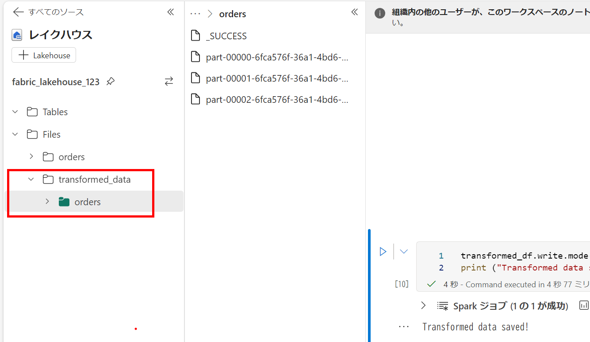

3. 次のコードを含む新しいセルを追加し、**transformed_data/orders**フォルダー内のParquetファイルから新しいデータフレームをロードします：

    ```python
   orders_df = spark.read.format("parquet").load("Files/transformed_data/orders")
   display(orders_df)
    ```

4. セルを実行し、Parquetファイルからロードされた注文データが表示されることを確認します。
### タスク 7: パーティション化されたファイルにデータを保存する

1. 次のコードを含む新しいセルを追加し、データフレームを**Year**および**Month**でパーティション分けして保存します：

    ```python
   orders_df.write.partitionBy("Year","Month").mode("overwrite").parquet("Files/partitioned_data")
   print ("Transformed data saved!")
    ```

2. セルを実行し、データが保存されたというメッセージが表示されるまで待ちます。その後、左側の**エクスプローラー** ペインで **...** メニューから **最新の情報に更新** を選択し、**partitioned_data**フォルダーを展開して、**Year=*xxxx***という名前のフォルダーの階層が含まれていることを確認します。各月フォルダーには、その月の注文が含まれるParquetファイルが含まれています。

    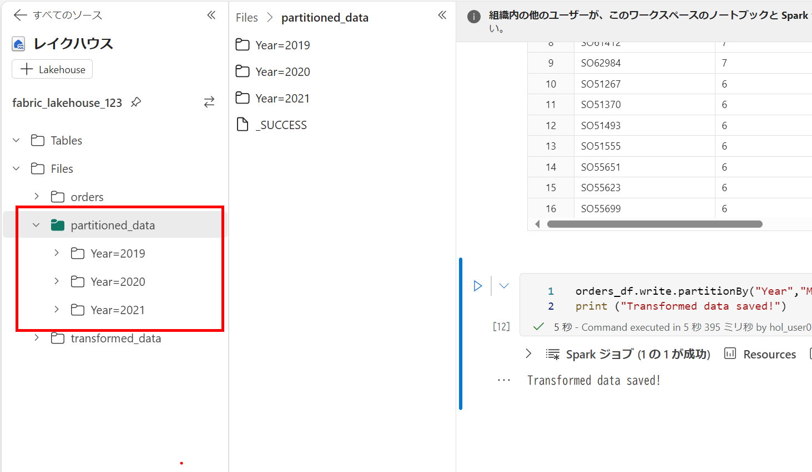

    パーティション化されたデータファイルは、大量のデータを扱う際のパフォーマンスを最適化する一般的な方法です。この技術はパフォーマンスを大幅に向上させ、データのフィルタリングを容易にします。

3. 次のコードを含む新しいセルを追加し、**orders.parquet**ファイルから新しいデータフレームをロードします：

    ```python
   orders_2021_df = spark.read.format("parquet").load("Files/partitioned_data/Year=2021/Month=*")
   display(orders_2021_df)
    ```

4. セルを実行し、結果が2021年の販売データを表示することを確認します。パスで指定されたパーティション列（**Year**および**Month**）はデータフレームに含まれないことに注意してください。

### タスク 8: テーブルとSQLを使用する

データフレームオブジェクトのネイティブメソッドを使用して、ファイルからデータを効果的にクエリおよび分析できることを確認しました。しかし、多くのデータアナリストは、SQL構文を使用してクエリを実行できるテーブルで作業する方が快適です。Sparkは、リレーショナルテーブルを定義できる*メタストア*を提供します。データフレームオブジェクトを提供するSpark SQLライブラリは、メタストア内のテーブルに対してSQLステートメントを使用してクエリを実行することもサポートしています。これらのSparkの機能を使用することで、データレイクの柔軟性とリレーショナルデータウェアハウスの構造化データスキーマおよびSQLベースのクエリを組み合わせることができます。

#### テーブルを作成する

Sparkメタストアのテーブルは、データレイク内のファイルに対するリレーショナル抽象化です。テーブルは **マネージド**（ファイルがメタストアによって管理される）または **外部**（テーブルがデータレイク内のファイル位置を参照し、メタストアとは独立して管理される）にすることができます。

1. ノートブックに新しいコードセルを追加し、次のコードを入力します。これは、販売注文データのデータフレームを**salesorders**という名前のテーブルとして保存します：

    ```Python
   # Create a new table
   df.write.format("delta").saveAsTable("salesorders")

   # Get the table description
   spark.sql("DESCRIBE EXTENDED salesorders").show(truncate=False)
    ```

    > **注**: この例についていくつか注目すべき点があります。まず、明示的なパスが提供されていないため、テーブルのファイルはメタストアによって管理されます。次に、テーブルは**delta**形式で保存されます。複数のファイル形式（CSV、Parquet、Avroなど）に基づいてテーブルを作成できますが、*delta lake*はテーブルにトランザクション、行バージョニング、その他の便利な機能を追加するSpark技術です。Fabricのデータレイクハウスでは、delta形式でテーブルを作成することが推奨されます。

2. コードセルを実行し、新しいテーブルの定義を説明する出力を確認します。

3. **Explorer**ペインで、**...**メニューから**Refresh**を選択します。次に**Tables**ノードを展開し、**salesorders**テーブルが作成されたことを確認します。

   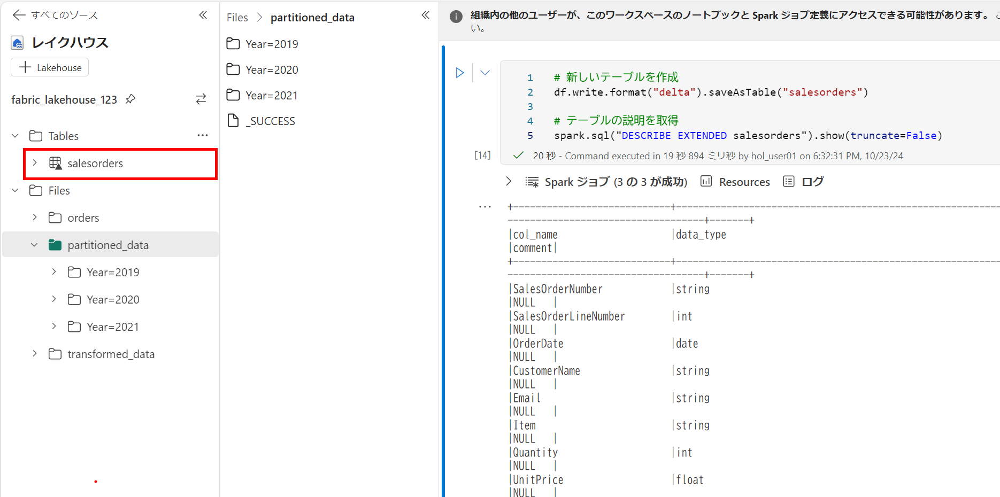
   

5. **salesorders**テーブルの **...** メニューで、**Load data** > **Spark**を選択します。

    ノートブックに次のようなコードを含む新しいコードセルが追加されます：

    ```Python
   df = spark.sql("SELECT * FROM [レイクハウス名].salesorders LIMIT 1000")
   display(df)
    ```

1. 新しいコードを実行し、PySparkコードに埋め込まれたSQLクエリを使用して**salesorder**テーブルに対してクエリを実行し、クエリの結果をデータフレームにロードします。
   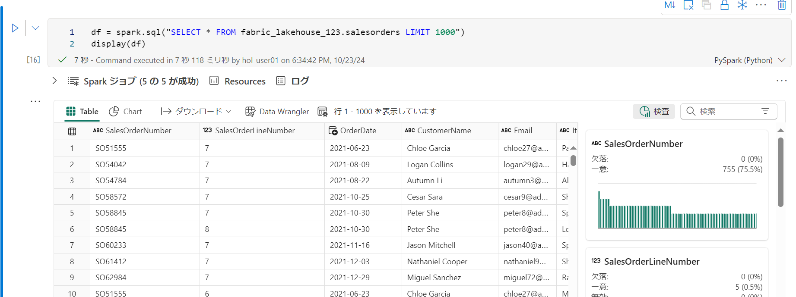

#### セルでSQLコードを実行する

SQLステートメントをセルに埋め込むことができるのは便利ですが、データアナリストは直接SQLで作業したいことがよくあります。

1. ノートブックに新しいコードセルを追加し、次のコードを入力します：

    ```sql
   %%sql
   SELECT YEAR(OrderDate) AS OrderYear,
          SUM((UnitPrice * Quantity) + Tax) AS GrossRevenue
   FROM salesorders
   GROUP BY YEAR(OrderDate)
   ORDER BY OrderYear;
    ```

2. セルを実行し、結果を確認します。次の点に注意してください：
    - セルの先頭にある`%%sql` （**マジックコマンド** と呼ばれる）は、このセルのコードをPySparkではなくSpark SQLランタイムで実行することを示しています。
    - SQLコードは、以前に作成した**salesorders**テーブルを参照しています。
    - SQLクエリの出力は自動的にセルの下に表示されます。

> **注**: Spark SQLおよびデータフレームに関する詳細については、[Spark SQLドキュメント](https://spark.apache.org/docs/2.2.0/sql-programming-guide.html)を参照してください。

### タスク 9: Sparkでデータを可視化する

百聞は一見に如かず、千行のデータよりも優れたチャートがあります。Fabricのノートブックには、データフレームやSpark SQLクエリから表示されるデータのための組み込みのチャートビューが含まれていますが、包括的なチャート作成には設計されていません。しかし、**matplotlib**や**seaborn**などのPythonグラフィックスライブラリを使用して、データフレーム内のデータからチャートを作成することができます。

#### 結果をチャートとして表示する

1. ノートブックに新しいコードセルを追加し、次のコードを入力します：

    ```sql
   %%sql
   SELECT * FROM salesorders
    ```

2. コードを実行し、以前に作成した**salesorders**ビューからデータが返されることを確認します。

3. セルの下の結果セクションで、**View**オプションを**Table**から**Chart**に変更します。

4. チャートの右側にある**Customize chart**をクリックして、チャートのオプションペインを表示します。次のようにオプションを設定し、**Apply**を選択し、チャートが次のように表示されることを確認します：
    - **Chart type**: Bar chart
    - **Key**: Item
    - **Values**: Quantity
    - **Series Group**: *空白のまま*
    - **Aggregation**: Sum
    - **Stacked**: *未選択*
      
         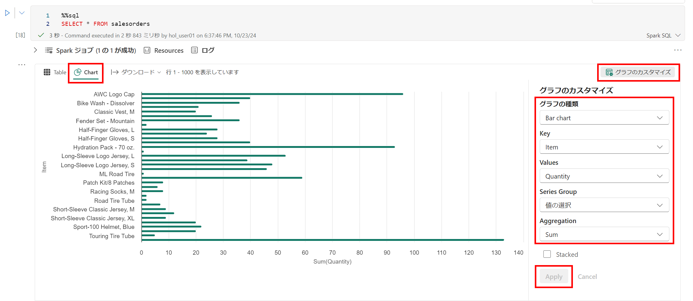


#### **matplotlib**を使ってみる

1. ノートブックに新しいコードセルを追加し、次のコードを入力します：

    ```Python
   sqlQuery = "SELECT CAST(YEAR(OrderDate) AS CHAR(4)) AS OrderYear, \
                   SUM((UnitPrice * Quantity) + Tax) AS GrossRevenue \
               FROM salesorders \
               GROUP BY CAST(YEAR(OrderDate) AS CHAR(4)) \
               ORDER BY OrderYear"
   df_spark = spark.sql(sqlQuery)
   df_spark.show()
    ```

2. コードを実行し、年間収益を含むSparkデータフレームが返されることを確認します。

    次に、データをチャートとして視覚化するために、まず**matplotlib** Pythonライブラリを使用していきます。このライブラリは多くの他のライブラリの基盤となっており、チャート作成において非常に柔軟です。

3. ノートブックに新しいコードセルを追加し、次のコードを入力します：

    ```Python
   from matplotlib import pyplot as plt

   # matplotlibはSparkデータフレームではなくPandasデータフレームを必要とします
   df_sales = df_spark.toPandas()

   # 年ごとの収益の棒グラフを作成
   plt.bar(x=df_sales['OrderYear'], height=df_sales['GrossRevenue'])

   # プロットを表示
   plt.show()
    ```

4. セルを実行し、結果を確認します。結果は各年の総収益を示す棒グラフです。次の点に注意してください：
    - **matplotlib**ライブラリは*Pandas*データフレームを必要とするため、Spark SQLクエリから返された*Spark*データフレームをこの形式に変換する必要があります。
    - **matplotlib**ライブラリの中心は**pyplot**オブジェクトです。これはほとんどのプロット機能の基盤です。
    - デフォルトの設定で使えるチャートが作成されますが、カスタマイズの余地が大いにあります。

5. コードを次のように修正してチャートをプロットします：

    ```Python
   from matplotlib import pyplot as plt

   # プロットエリアをクリア
   plt.clf()

   # 年ごとの収益の棒グラフを作成
   plt.bar(x=df_sales['OrderYear'], height=df_sales['GrossRevenue'], color='orange')

   # チャートをカスタマイズ
   plt.title('Revenue by Year')
   plt.xlabel('Year')
   plt.ylabel('Revenue')
   plt.grid(color='#95a5a6', linestyle='--', linewidth=2, axis='y', alpha=0.7)
   plt.xticks(rotation=45)

   # 図を表示
   plt.show()
    ```

6. コードセルを再実行し、結果を確認します。チャートにはさらに多くの情報が含まれています。

    プロットは技術的には**Figure**内に含まれます。前の例では、図は暗黙的に作成されましたが、明示的に作成することもできます。

7. コードを次のように修正してチャートをプロットします：

    ```Python
   from matplotlib import pyplot as plt

   # プロットエリアをクリア
   plt.clf()

   # 図を作成
   fig = plt.figure(figsize=(8,3))

   # 年ごとの収益の棒グラフを作成
   plt.bar(x=df_sales['OrderYear'], height=df_sales['GrossRevenue'], color='orange')

   # チャートをカスタマイズ
   plt.title('Revenue by Year')
   plt.xlabel('Year')
   plt.ylabel('Revenue')
   plt.grid(color='#95a5a6', linestyle='--', linewidth=2, axis='y', alpha=0.7)
   plt.xticks(rotation=45)

   # 図を表示
   plt.show()
    ```

8. コードセルを再実行し、結果を確認します。図はプロットの形状とサイズを決定します。

    図には複数のサブプロットを含めることができ、それぞれが独自の*軸*を持ちます。

9. コードを次のように修正してチャートをプロットします：

    ```Python
   from matplotlib import pyplot as plt

   # プロットエリアをクリア
   plt.clf()

   # 2つのサブプロット（1行2列）の図を作成
   fig, ax = plt.subplots(1, 2, figsize = (10,4))

   # 最初の軸に年ごとの収益の棒グラフを作成
   ax[0].bar(x=df_sales['OrderYear'], height=df_sales['GrossRevenue'], color='orange')
   ax[0].set_title('Revenue by Year')

   # 2番目の軸に年ごとの注文数の円グラフを作成
   yearly_counts = df_sales['OrderYear'].value_counts()
   ax[1].pie(yearly_counts)
   ax[1].set_title('Orders per Year')
   ax[1].legend(yearly_counts.keys().tolist())

   # 図にタイトルを追加
   fig.suptitle('Sales Data')

   # 図を表示
   plt.show()
    ```

10. コードセルを再実行し、結果を確認します。図にはコードで指定されたサブプロットが含まれています。
    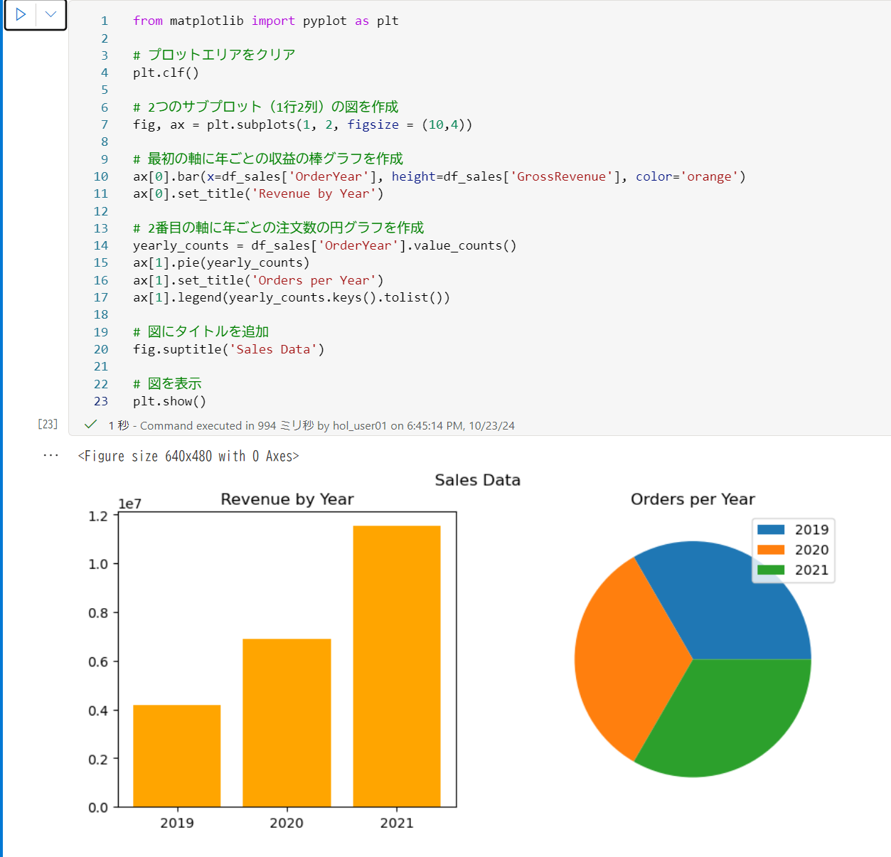

> **注**: matplotlibを使用したプロットについて詳しくは、[matplotlibのドキュメント](https://matplotlib.org/)を参照してください。

#### **seaborn**ライブラリを使用する

**matplotlib**は複数のタイプの複雑なチャートを作成することができますが、最良の結果を得るためには複雑なコードが必要になることがあります。このため、**matplotlib**の基盤の上に構築され、その複雑さを抽象化し、機能を強化する多くの新しいライブラリが登場しました。その一つが**seaborn**です。

1. ノートブックに新しいコードセルを追加し、次のコードを入力します：

    ```Python
   import seaborn as sns

   # プロットエリアをクリア
   plt.clf()

   # 棒グラフを作成
   ax = sns.barplot(x="OrderYear", y="GrossRevenue", data=df_sales)
   plt.show()
    ```

2. コードを実行し、seabornライブラリを使用して棒グラフが表示されることを確認します。

3. コードを次のように修正します：

    ```Python
   import seaborn as sns

   # プロットエリアをクリア
   plt.clf()

   # seabornのビジュアルテーマを設定
   sns.set_theme(style="whitegrid")

   # 棒グラフを作成
   ax = sns.barplot(x="OrderYear", y="GrossRevenue", data=df_sales)
   plt.show()
    ```

4. 修正したコードを実行し、seabornがプロットの一貫したカラーテーマを設定できることを確認します。

5. コードを次のように再度修正します：

    ```Python
   import seaborn as sns

   # プロットエリアをクリア
   plt.clf()

   # 折れ線グラフを作成
   ax = sns.lineplot(x="OrderYear", y="GrossRevenue", data=df_sales)
   plt.show()
    ```

6. 修正したコードを実行し、年間収益を折れ線グラフとして表示します。
    
    

> **注**: seabornを使用したプロットについて詳しくは、[seabornのドキュメント](https://seaborn.pydata.org/index.html)を参照してください。
### タスク 10: ノートブックを保存し、Sparkセッションを終了する

データの操作が完了したら、ノートブックに意味のある名前を付けて保存し、Sparkセッションを終了します。

1. ノートブックのメニューバーで、⚙️ **設定**アイコンを使用してノートブックの設定を表示します。
2. ノートブックの**名前**を**Explore Sales Orders Notebook**に設定し、設定ペインを閉じます。
3. ノートブックメニューで、**セッションを停止**を選択してSparkセッションを終了します。
   
   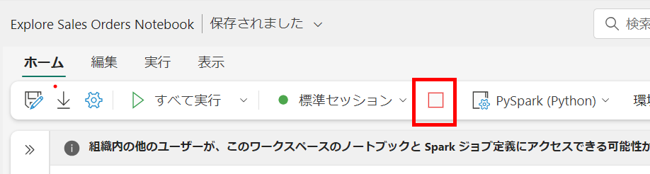

    <validation step="17b4e545-1878-4b1e-8b41-f6d4401d997a" />

    > **おめでとうございます** タスクを完了しました！次に、タスクを検証します。以下の手順に従ってください：
    > - 対応するタスクの検証ボタンを押します。
    > - 成功メッセージが表示されたら、次のタスクに進むことができます。エラーメッセージが表示された場合は、エラーメッセージをよく読み、ラボガイドの指示に従ってステップを再試行してください。
    > - サポートが必要な場合は、labs-support@spektrasystems.comまでご連絡ください。24時間365日対応しています。

## まとめ

このラボでは、Microsoft FabricでSparkを使用してデータを操作する方法を学びました。

### ラボを正常に完了しました
