# Exercise 8: Create a Dataflow (Gen2) in Microsoft Fabric

### Estimated Duration: 40 Minutes

In this exercise, you'll explore data ingestion and transformation in Microsoft Fabric using Dataflow Gen2. You'll begin by creating a Dataflow to import and shape sales data using Power Query Online. Then, you'll define a lakehouse as the data destination, configure column mappings, and publish the Dataflow. Finally, you'll integrate the Dataflow into a pipeline to automate data processing and verify that the transformed data is successfully loaded into the lakehouse for future analysis.

## Lab objectives

You will be able to complete the following tasks:

- Task 1: Create a Dataflow (Gen2) to ingest data
- Task 2: Add data destination for Dataflow
- Task 3: Add a dataflow to a pipeline

## Task 1: Create a Dataflow (Gen2) to ingest data

In this task, you will create a Dataflow (Gen2) to efficiently ingest and transform data from multiple sources for analysis. This process streamlines data preparation, enabling you to prepare the data for further processing and insights.

1. In the left pane, on **fabric-<inject key="DeploymentID" enableCopy="false"/> (1)** Workspace, click on **+ New item (2)**. In the Search box search for **Dataflow Gen2 (3)** and select **Dataflow Gen2 (4)**. Leave the **Name (5)** as default, **Uncheck (6)** the **Enable Git integration, deployment pipelines and Public API Scenarios** and click on **Create (7)**. After a few seconds, the Power Query editor for your new dataflow will open.

   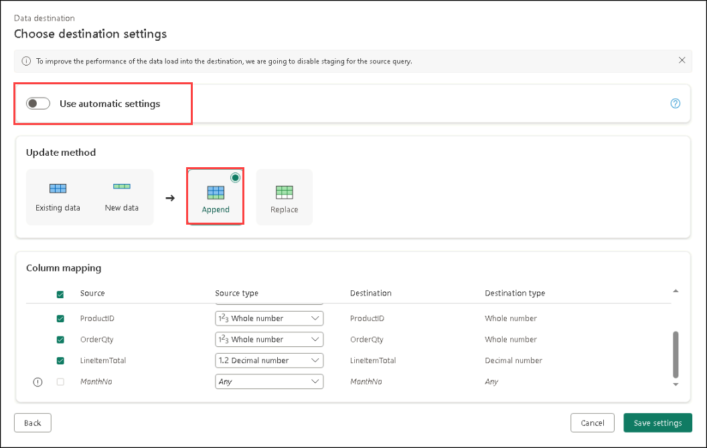
   
   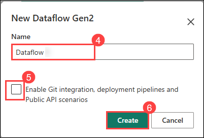

1. From the center **Get data** pane, select **Import from a Text/CSV file**.

   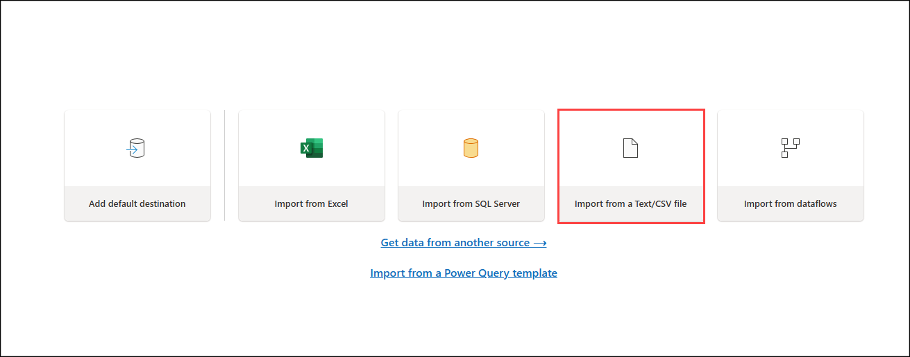

1. Create a new data source with the following settings:

    - **Link to file: (1)** *Selected*
    - **File path or URL: (2)** `https://raw.githubusercontent.com/MicrosoftLearning/dp-data/main/orders.csv`
    - **Connection: (3)** Create new connection
    - **Connection Name: (4)** Connection
    - **data gateway: (5)** (none)
    - **Authentication kind: (6)** Anonymous
    - **Privacy level: (7)** None
    - Click **Next (8)**

      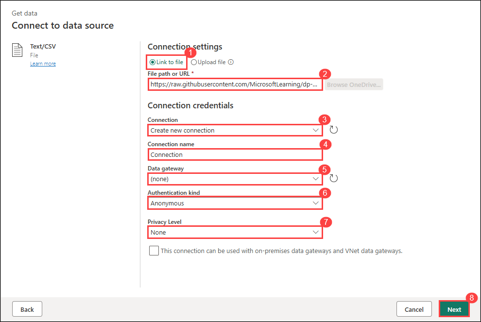

1. Preview the file data, and then click **Create** the data source. The Power Query editor shows the data source and an initial set of query steps to format the data, as shown below:

   

1. Select the **Add column  (1)** tab on the toolbar ribbon. Then, choose **Custom column (2)** and create a new column with Name **MonthNo (3)** and enter the formula **Date.Month([OrderDate]) (4)** in the **Custom column formula** box and then click **OK (5)**.

   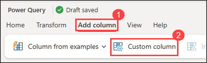

   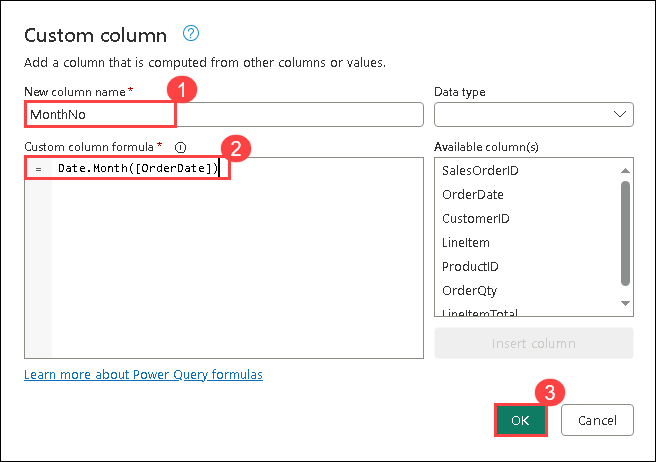

1. The step to add the custom column is added to the query, and the resulting column is displayed in the data pane:

   

1. Duplicate the existing tab. In the left pane, go to the **fabric_lakehouse<inject key="DeploymentID" enableCopy="false"/>** Lakehouse, and then delete the **orders** file.

## Task 2: Add data destination for Dataflow

In this task, you’ll add a data destination for the Dataflow to determine where the ingested and transformed data will be stored for future use.

1. In the **Query Settings** in the right pane, click on **+** for Data Destination, then choose **Lakehouse** from the drop-down menu.

   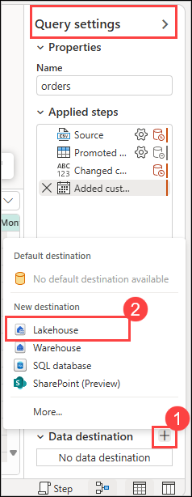

   >**Note:** If this option is greyed out, you may already have a data destination set. Check the data destination at the bottom of the Query settings pane on the right side of the Power Query editor. If a destination is already set, you can change it using the gear.

1. In the **Connect to data destination** dialog box, make sure **Create a new connection** is selected and the **<inject key="AzureAdUserEmail"></inject>** account is signed in. Click on **Next**.

   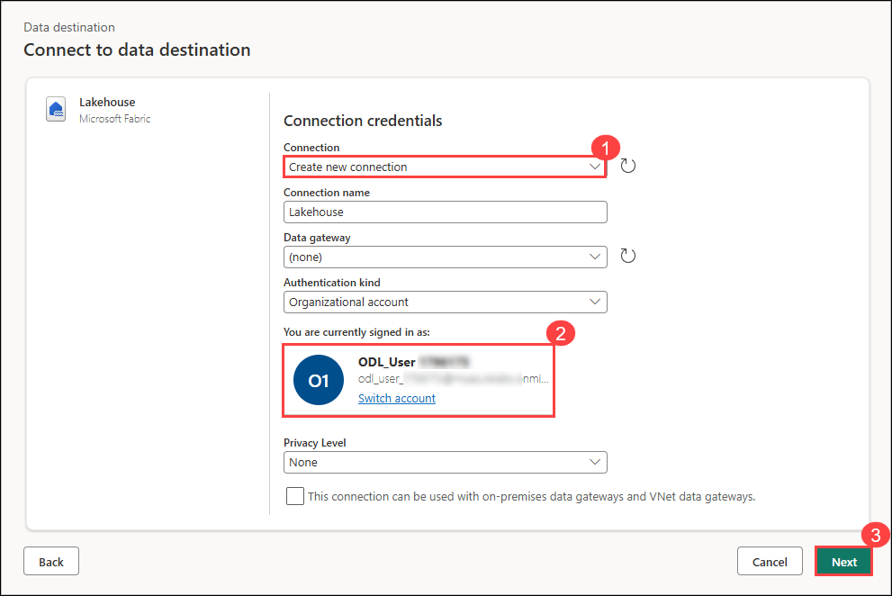

1. Select the **fabric-<inject key="DeploymentID" enableCopy="false"/>** Workspace. Choose the **fabric_lakehouse<inject key="DeploymentID" enableCopy="false"/> (1)** then specify the new table name as **orders (2)**, then click **Next (1)**.

   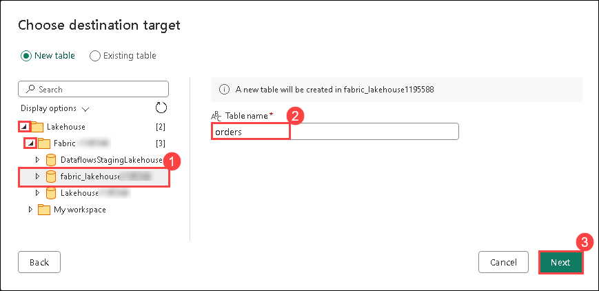

1. On the Destination settings page, observe that **MonthNo** is not selected in the Column mapping, and an informational message is displayed.
 
1. On the Destination settings page, toggle **off (1)** the **Use Automatic Settings** option. Then, for the **MonthNo** column header and change the **Source Type** to **Whole number (2)**. Now, click on **Save Settings (3)**.
   
   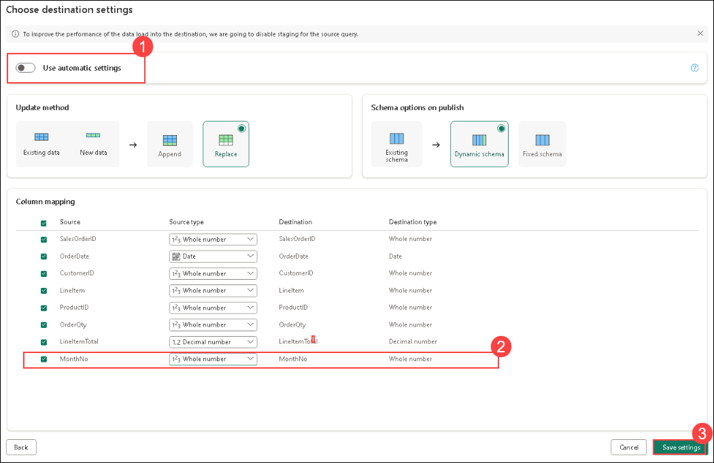

1. Select **Publish** to publish the dataflow. Then wait for the **Dataflow** to be created in the workspace.

   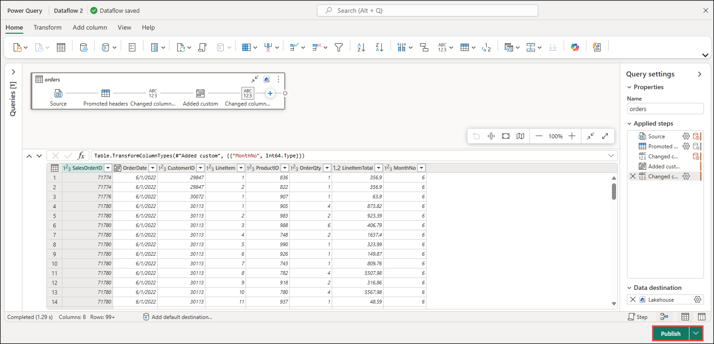

1. Click on the **Dataflow (1)** on the top left, and rename the dataflow as **Transform Orders Dataflow (2)**.

   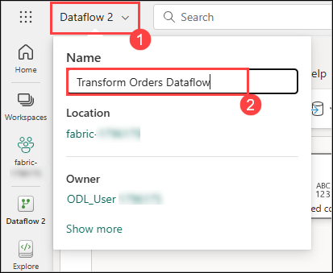

## Task 3: Add a dataflow to a pipeline

In this task, you’ll add a dataflow to a pipeline to streamline the data processing workflow and enable automated data transformations.

1. In the left pane, click on your **fabric-<inject key="DeploymentID" enableCopy="false"/> (1)** workspace, Select **+ New item (2)**. In the Search box, search for **Data pipeline (3)**, and select **Data pipeline (4)**.

   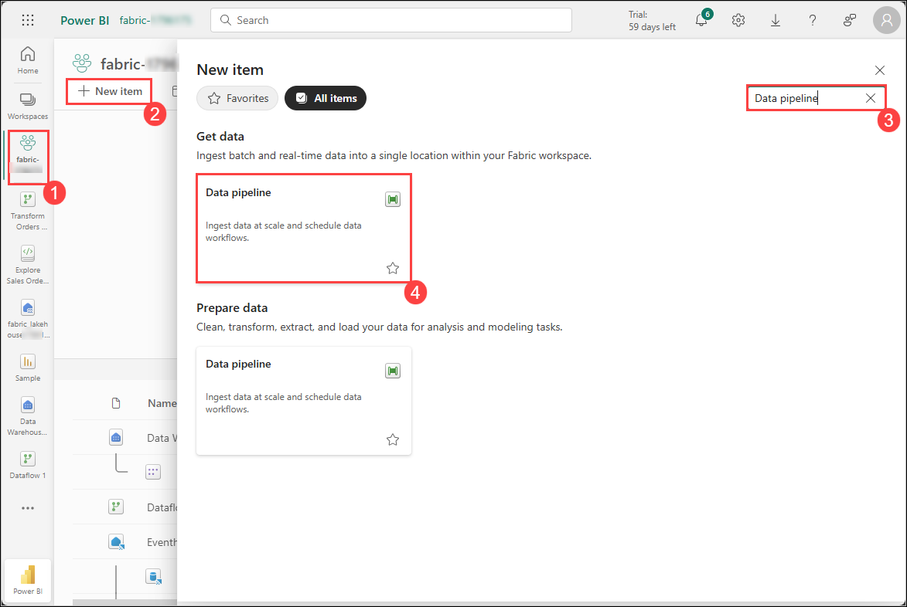

1. Set the Name as **Load Orders pipeline (1)** and click on **Create (2)**. This will open the pipeline editor.

   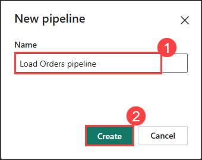

   > **Note:** If the Copy Data wizard opens automatically, close it!

1. Select **pipeline activity (1)**, and select **Dataflow (2)** activity to the pipeline.

   

1. With the new **Dataflow1** activity selected, go to the **Settings (1)** tab in the bottom. In the **Workspace** drop-down list, choose **fabric-<inject key="DeploymentID" enableCopy="false"/> (2)** and in **Dataflow** drop-down list, select **Transform Orders Dataflow (3)** (the data flow you created previously).

   
   
1. **Save** the pipeline from the top left corner.

   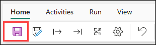

1. Use the **Run** button to run the pipeline, and wait for it to complete. It may take a few minutes.

   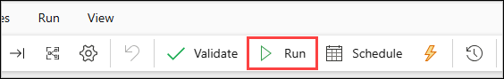
   
   

1. In the left pane, select **fabric_lakehouse<inject key="DeploymentID" enableCopy="false"/>** Lakehouse.

1. Expand the **Tables** section and select the **orders** table created by your dataflow.

   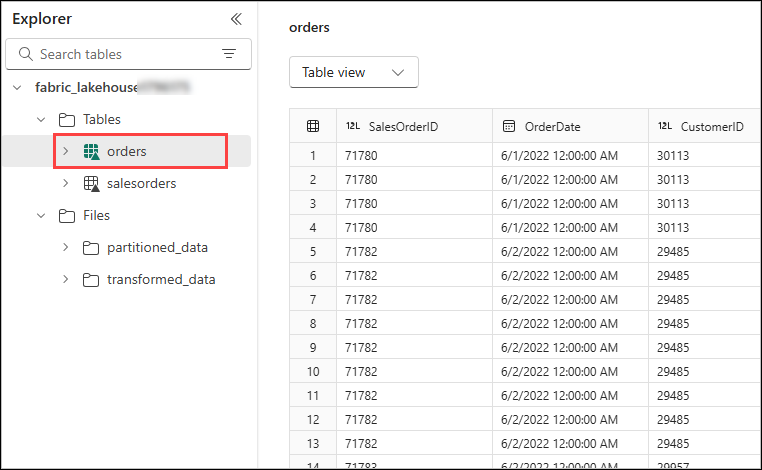

   >**Note:** You might have to refresh the browser to get the expected output.

### Summary

In this exercise, you:

- Created a **Dataflow (Gen2)** to ingest and prepare data.
- Added a **data destination** to store the output of the Dataflow.
- Integrated the **Dataflow into a pipeline** for automated data processing.

### You have successfully completed the Hands-on lab
