

# 演習 09: Microsoft Fabric で Dataflow (Gen2) を作成する

### 所要時間: 45 分

## 概要

Microsoft Fabric では、Dataflows (Gen2) を使用してさまざまなデータ ソースに接続し、Power Query Online で変換を実行可能です。次に、データ パイプラインで使用してデータをレイクハウスやその他の分析ストアに取り込んだり、Power BI レポート用のデータセットを定義したりできます。

このラボは、Dataflows (Gen2) のさまざまな要素を紹介することを目的としており、企業で存在する可能性のある複雑なソリューションの作成は行いません。

## ラボの目的

次のタスクを完了できるようになります。

- タスク 1: データを取り込むための Dataflow (Gen2) を作成する
- タスク 2: データフローのデータの宛先を追加する
- タスク 3: パイプラインにデータフローを追加する

### タスク 1: データを取り込むための Dataflow (Gen2) を作成する

レイクハウスを作成したので、そこにデータを取り込む必要があります。これを行う 1 つの方法は、*抽出、変換、および読み込み* (ETL) プロセスをカプセル化するデータフローを定義することです。

1. 左下から **Data Warehouse** を選択し、ホームページで **Dataflow Gen2** を選択します。数秒後、新しいデータフローの Power Query エディターが開きます。

    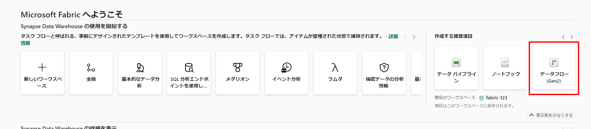

2. **Text ファイルまたは CSV ファイルからインポート** を選択します。

    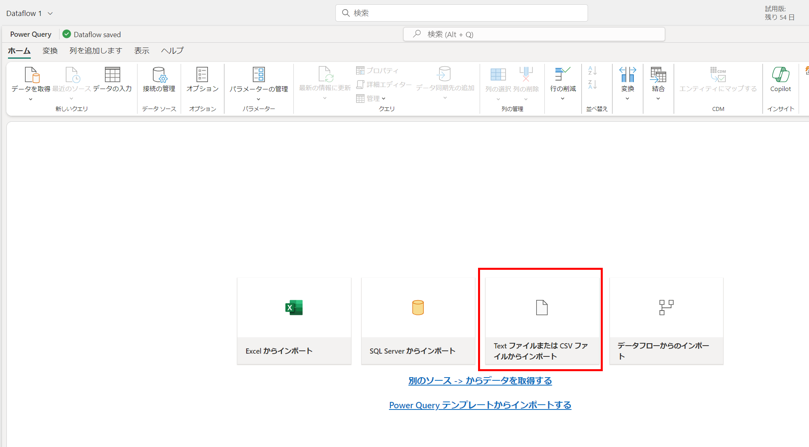

3. 設定で新しいデータ ソースを作成します。
 - **ファイルへのリンク**: *選択済み*
 - **ファイル パスまたは URL**: `https://raw.githubusercontent.com/MicrosoftLearning/dp-data/main/orders.csv`
 - **接続**: 新しい接続を作成
 - **データ ゲートウェイ**: (なし)
 - **認証の種類**: 匿名
 - **プライバシーレベル**: なし

4. **次へ** を選択してファイル データをプレビューし、次にデータ ソースを **作成** します。
   
    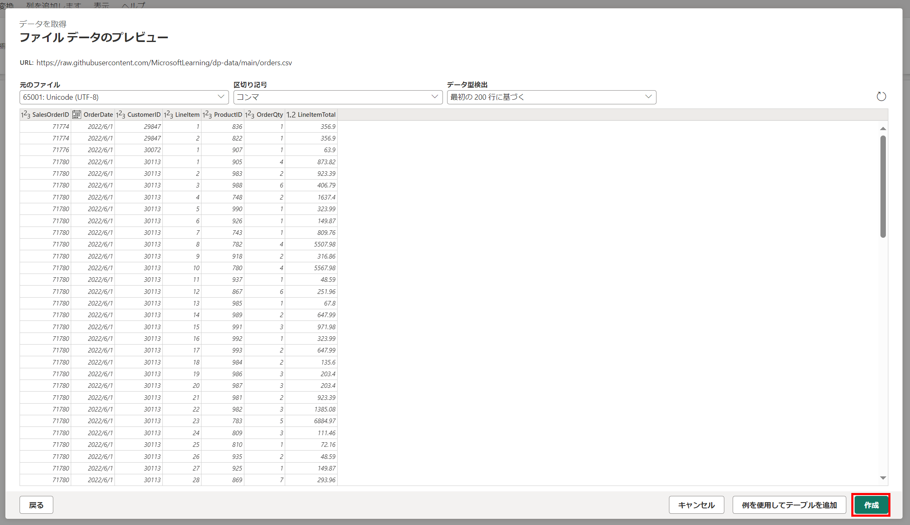

5. Power Query エディターにデータ ソースとデータの書式設定の初期クエリ ステップが表示されます。

    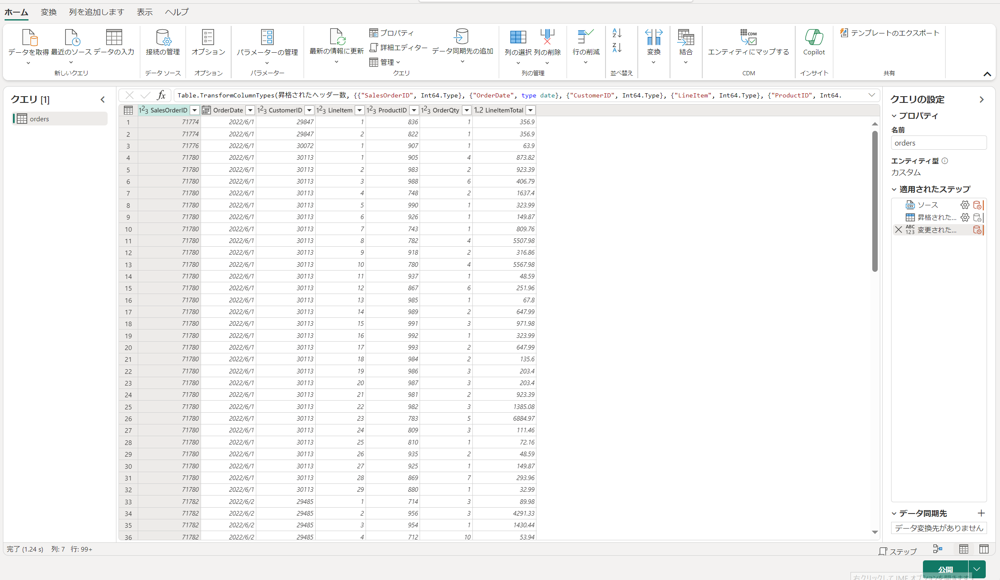

1. ツールバー リボンで **列の追加** タブを選択します。次に **カスタム列** を選択し、`Date.Month([OrderDate])` という数式に基づいて数値を含む **MonthNo** という名前の新しい列を作成し、**OK** をクリックします。
     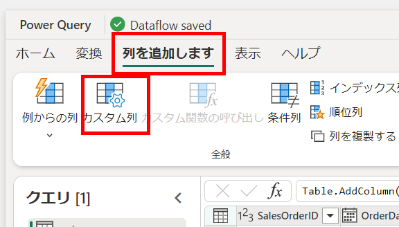

     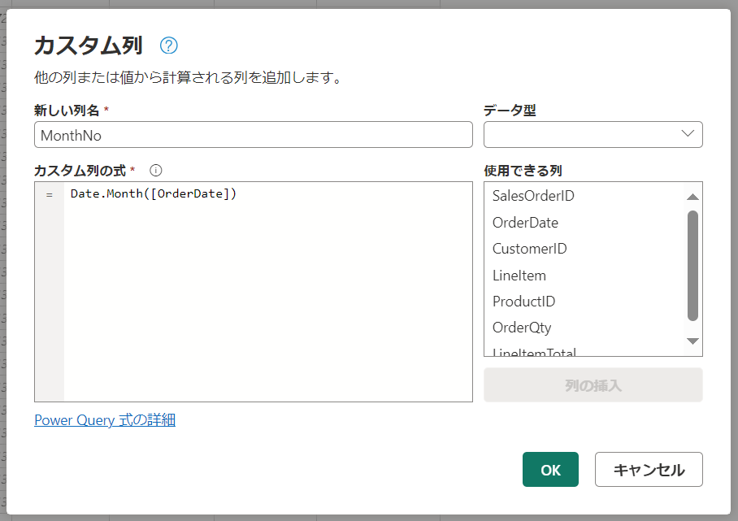

      カスタム列を追加するステップがクエリに追加され、結果の列がデータ ペインに表示されます。
      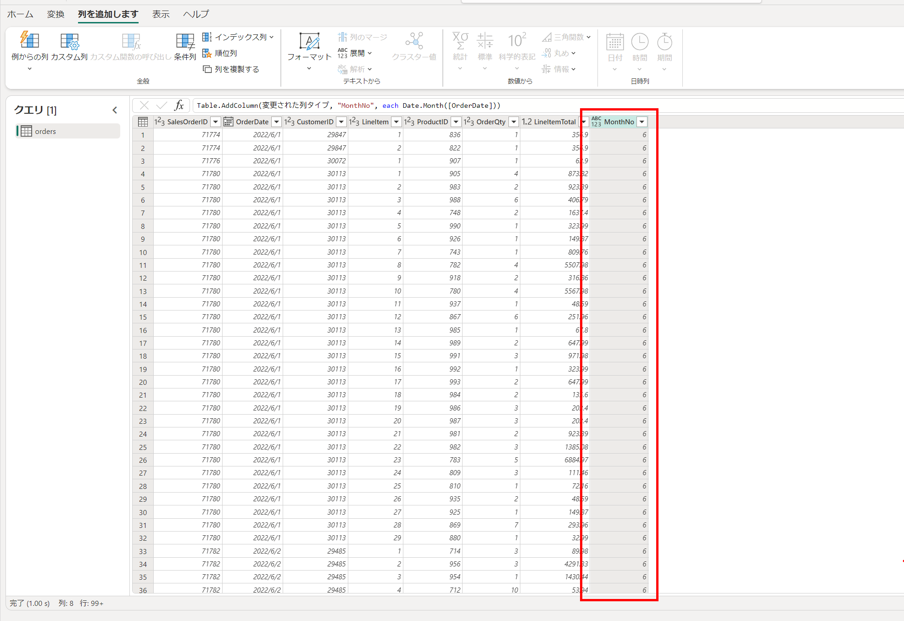

> **ヒント:** 右側のクエリ設定ペインで、**適用されたステップ** に各変換ステップが含まれていることに注意してください。下部では、**ダイアグラム フロー** ボタンを切り替えてステップのビジュアル ダイアグラムをオンにすることもできます。
>
> ステップは上下に移動したり、歯車アイコンを選択して編集したり、各ステップを選択してプレビュー ペインで変換を適用することができます。

### タスク 2: Dataflow のデータの宛先を追加する

1. ツールバー リボンで **ホーム** タブを選択します。次に **データの宛先を追加** ドロップダウン メニューで **レイクハウス** を選択します。

    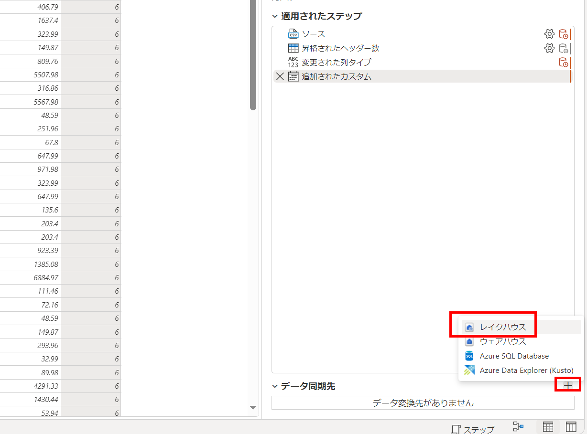

    > **注:** このオプションがグレー表示されている場合は、すでにデータの宛先が設定されている可能性があります。Power Query エディターの右側のクエリ設定ペインの下部でデータの宛先を確認してください。すでに宛先が設定されている場合は、歯車を使用して変更できます。

2. **データの宛先に接続** ダイアログ ボックスで接続を編集し、Power BI 組織アカウントを使用してサインインし、データフローがレイクハウスにアクセスするための ID を設定して **次へ** を選択します。

     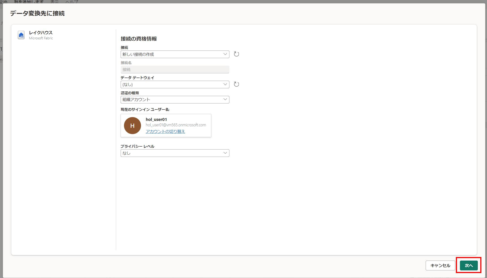

3. 利用可能なワークスペースのリストで、ワークスペースを見つけ、最初の演習で作成したレイクハウスを選択します。次に、**orders** という新しいテーブルを指定し、**次へ** をクリックします。

     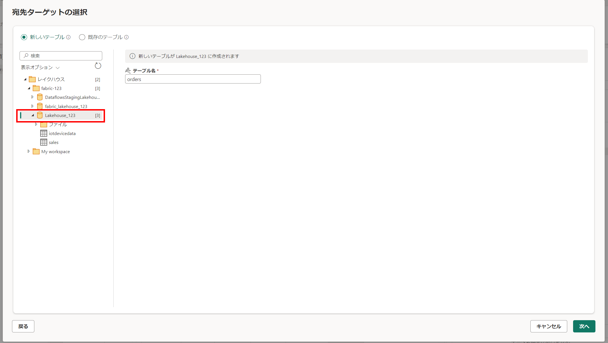

    >**注:** **宛先設定** ページで、 MonthNo が列マッピングで選択されておらず、*任意型となっている列を含めることができない* という旨のメッセージが表示されていることに注意してください。

    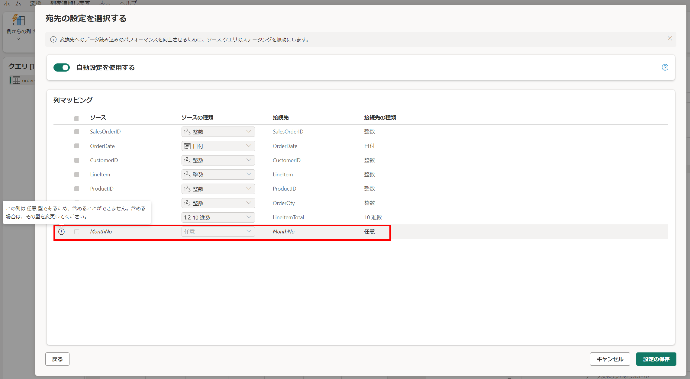

4. この操作をキャンセルし、Power Query Online で OrderDate 列と MonthNo 列に戻ります。列ヘッダーを右クリックして **変更の種類** を選択し、以下のように設定します。

    - MonthNo = 整数

    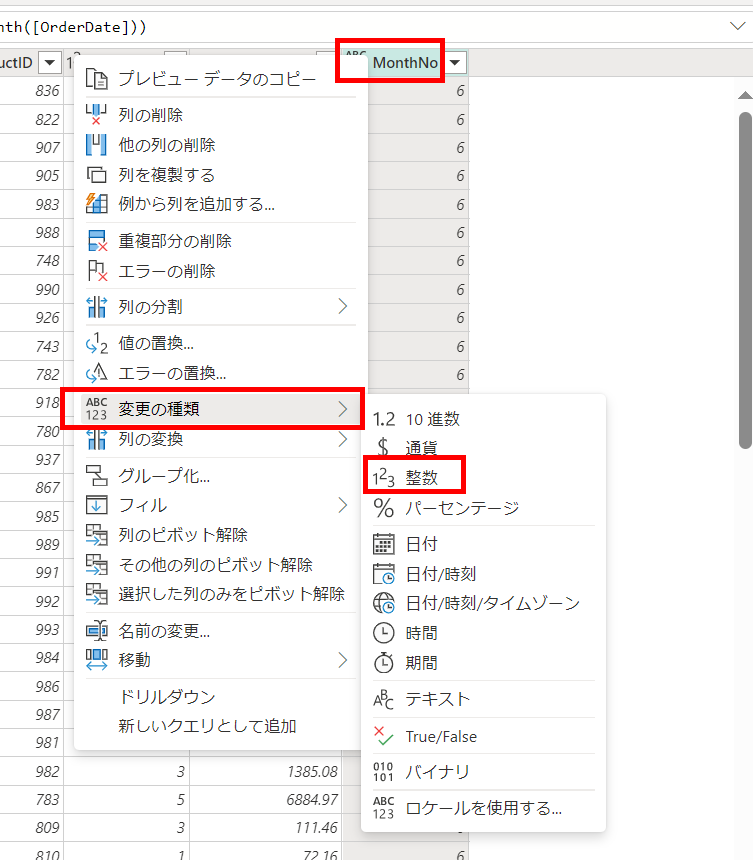

5. 先ほど説明した手順を繰り返してレイクハウスの宛先を追加します。

6. **宛先設定** ページで **自動設定を使用するを無効化 (1)** し、 **アペンドする (2)** を選択し、**設定を保存 (3)** します。
   
   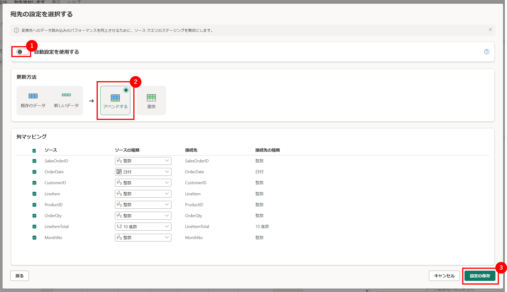

7. データフローの名前を **Transform Orders Dataflow** に変更し **公開** を選択してデータフローを発行します。
    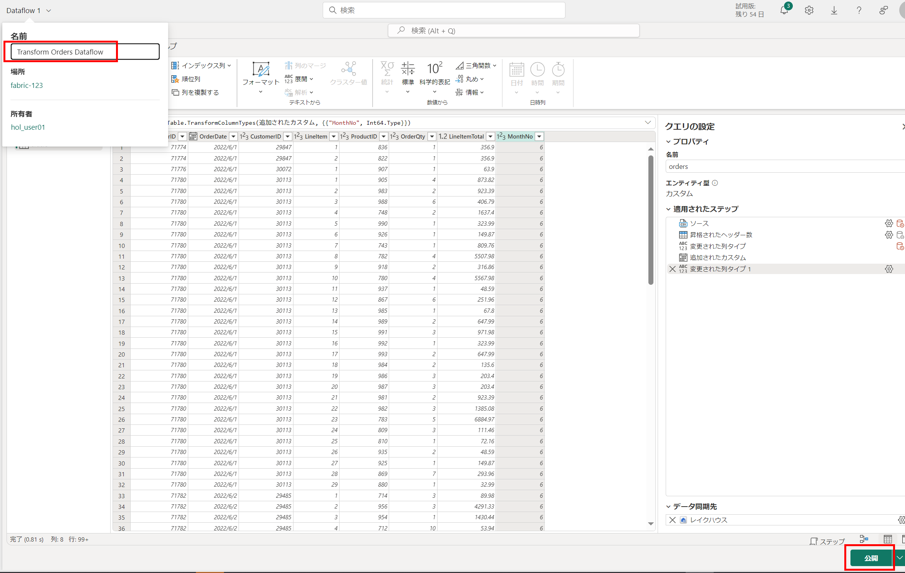

### タスク 3: パイプラインにデータフローを追加する

データフローをパイプラインのアクティビティとして含めることができます。パイプラインはデータの取り込みと処理アクティビティをオーケストレーションするために使用され、データフローを他の種類の操作と組み合わせて単一のスケジュールされたプロセスにすることができます。パイプラインは、Data Factory エクスペリエンスを含むいくつかの異なるエクスペリエンスで作成できます。

1. Fabric 対応のワークスペースから **Data Factory** エクスペリエンスに切り替えます。
   
   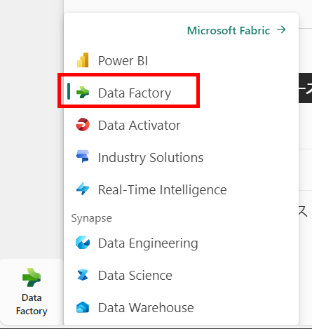

2. **データ パイプライン** をクリックし、**Load Orders pipeline** と名前を付けて **保存** をクリックします。

    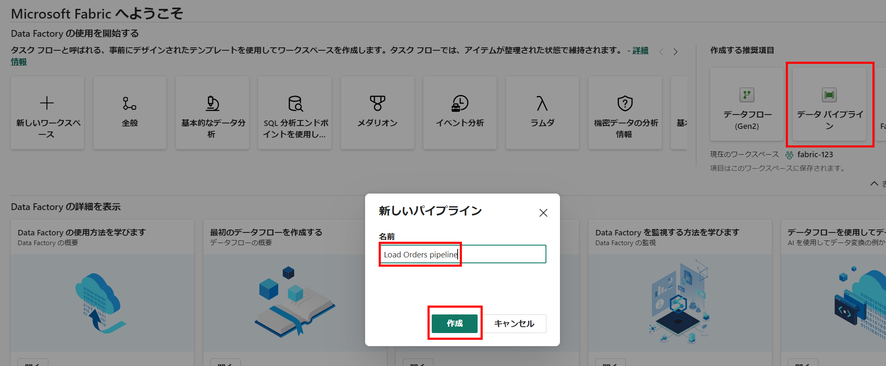
    
    パイプライン エディターが開きます。

    > **ヒント**: コピー データ ウィザードが自動的に開いた場合は、閉じてください。

3. **パイプライン アクティビティを追加** を選択し、パイプラインに **データフロー** アクティビティを追加します。

    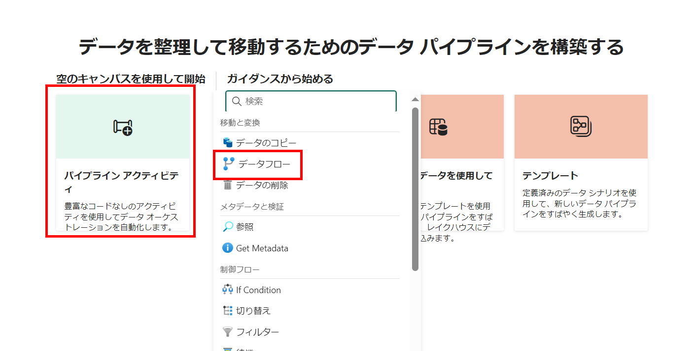

4. 新しい **Dataflow1** アクティビティを選択した状態で、**設定** タブの **データフロー** ドロップダウン リストで、以前に作成したデータフロー **Transform Orders Dataflow** を選択します。

     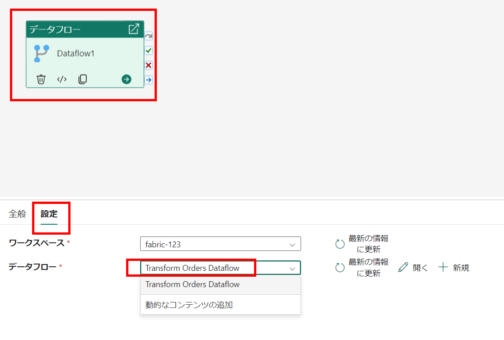

5. **ホーム** タブで、**&#128427;** (*保存*) アイコンを使用してパイプラインを保存します。
6. **&#9655; 実行** ボタンを使用してパイプラインを実行し、完了するまで待ちます。数分かかる場合があります。

     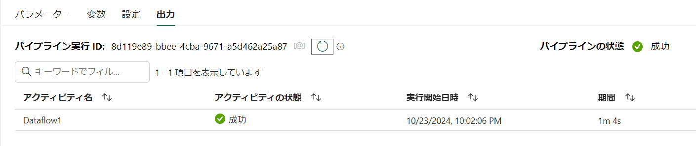

7. 左端のメニュー バーでレイクハウスを選択します。
    > **ヒント**: メニューバーに表示されない場合は、ワークスペース名のアイコンをクリックして一覧画面からレイクハウスに移動してください。

8. **...** メニューで **テーブル** を選択し、**更新** を選択します。次に **テーブル** を展開し、データフローによって作成された **orders** テーブルを選択します。

    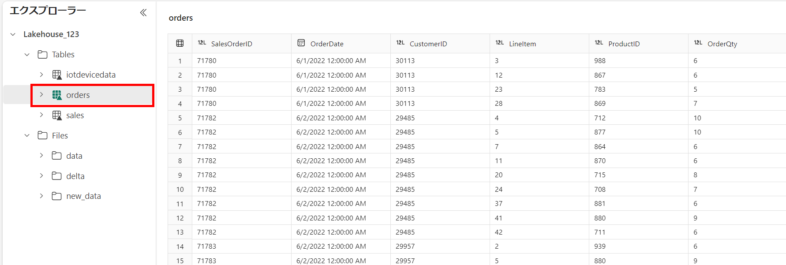

## まとめ

このラボでは、データを取り込むための Dataflow (Gen2) を作成し、Dataflow のデータの宛先を追加し、パイプラインにデータフローを追加しました。

## ラボを正常に完了しました

