# Exercise 5: Data Engineering Ingest Data in Fabric with Fabric Copilot

### Estimated Duration: 30 Minutes

## Overview

In the exercise, you'll create a simple data pipeline to bring in customer sales data. You are using the KiZAN Fabric Tenant - where we have Copilot enabled- demonstrate doing the same thing, but by using a new Data Flow Gen2 and leveraging the native integration of Copilot to use natural language to ingest and transform your data.

## Lab objectives

You will be able to complete the following task:

- Task 1: Create New - Dataflow Gen2

## Task 1: Create New - Dataflow Gen2

In this task, you’ll create a **Dataflow Gen2** in Microsoft Fabric, import a CSV file using Power Query, and use **Copilot** to clean and transform the data. You'll split the "Item" column into Description, Color, and Size fields, and apply logic to increase the quantity of red bikes. The lab highlights the ease of using **Visual Query** for basic tasks and the power of **M-Code** for advanced data transformations.

1. In the left pane, navigate back to your workspace **fabric-<inject key="DeploymentID" enableCopy="false"/>**, then click on **+ New item (1)**. Search for **Dataflow Gen2 (2)** and select **Dataflow Gen2 (3)**. Leave the name as default, **Uncheck (4)** the **Enable Git integration, deployment pipelines and Public API scenarios**, and then click on **Create (5)**.

   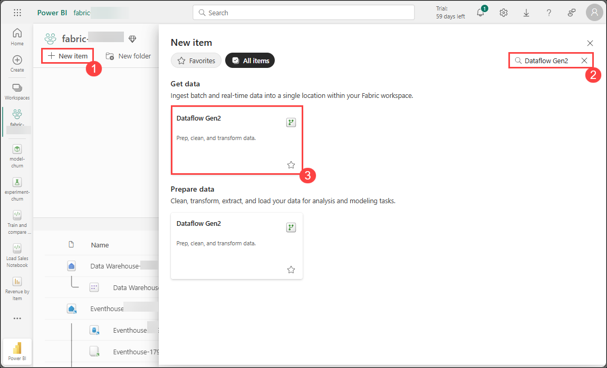

   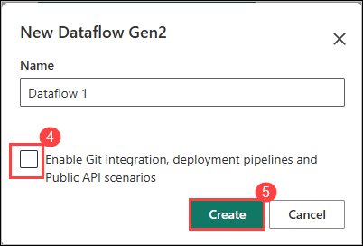

1. After a few seconds, the Power Query editor for your new dataflow will open. From there, select **Import from a Text/CSV file**.

   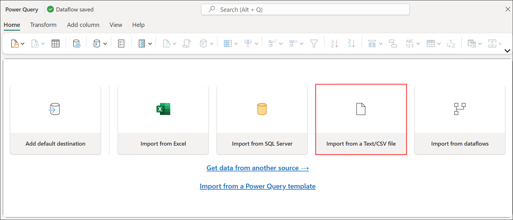

1. Create a new data source with the following settings:

   - **Link to file (1):** *Selected*
   - **File path or URL (2):** `https://raw.githubusercontent.com/MicrosoftLearning/dp-data/main/sales.csv`
   - **Connection (3):** Create new connection
   - **Connection name (4):** Connection
   - **Data gateway (5):** (none)
   - **Authentication kind (6):** Anonymous
   - Click **Next (7)**.

      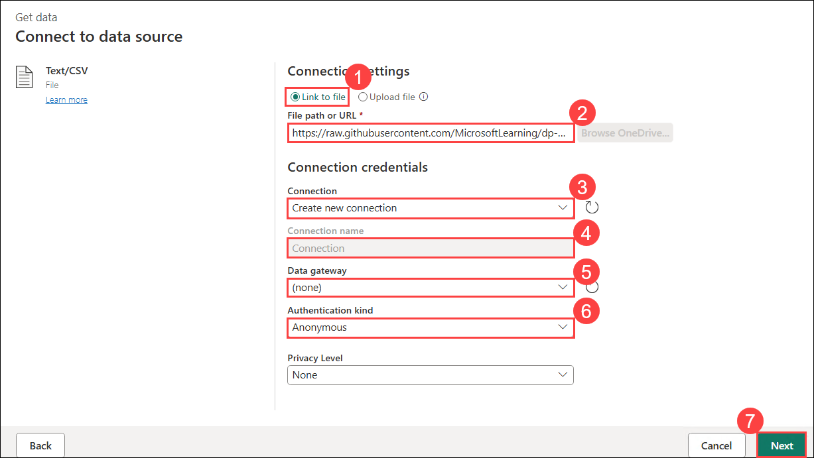

1. On **Preview file data** page, Click on **Create**.

   

1. Click **Copilot** button on Ribbon. 

    
   
   > Note: If you are unable to locate Copilot, click Expand Ribbon in the top-right corner.
   
   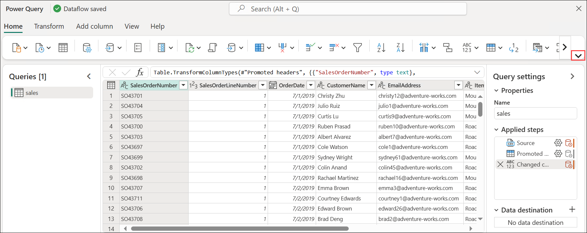

1. To give you a clearer view of everything Copilot is doing, expand the UI slightly to reveal what’s happening behind the scenes.

1. Expand **Query settings** (these are the steps in the query that bring in the data)
   
   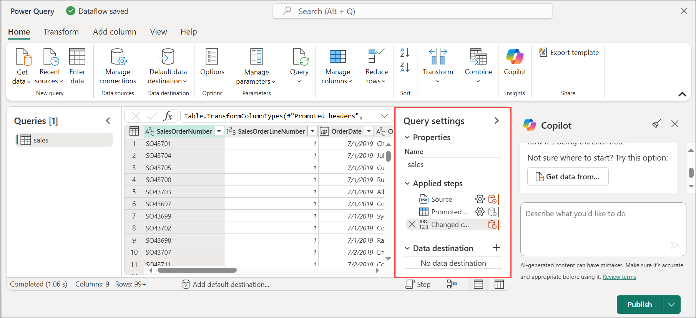

1. **View menu**: Look for the option or menu labeled "View" in the toolbar or menu bar. Click on it to reveal a dropdown menu.

   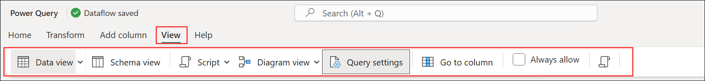

1. **Diagram View**: From the drop-down menu, select "Diagram View." This will switch your view to a visual representation of your code.

   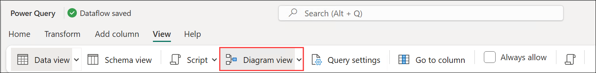

1. **Script View**: Once you're in Script View, you should be able to see the M-Code that Copilot has generated. This is the underlying code representation of the actions or commands depicted in the Diagram View.

   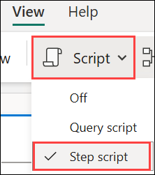

1. Looking at the data… Notice the Item Column.

1. This is really three different fields -- It contains a short description of the item, a color and a size.

1.	The fields are not consistently delimited (' ' and then ',')

1. Let's use Copilot to clean this up:

1. Type the following into Copilot:
 
    ```
    In the Item column, replace the ',' with ' '
    ```
 
1. The Item column now consistently has a delimiter of **' '**.

   

1. Type the following query into Copilot:
 
    ```
    Split the Item column on the ' ', creating two new fields called Description and Color
    ```
 
1. Type the following query into Copilot:
 
    ```
    Split the Item column on the ' ', creating two new fields called Color and Size
    ```

1. Three new fields have now been created to replace the Item Column.

   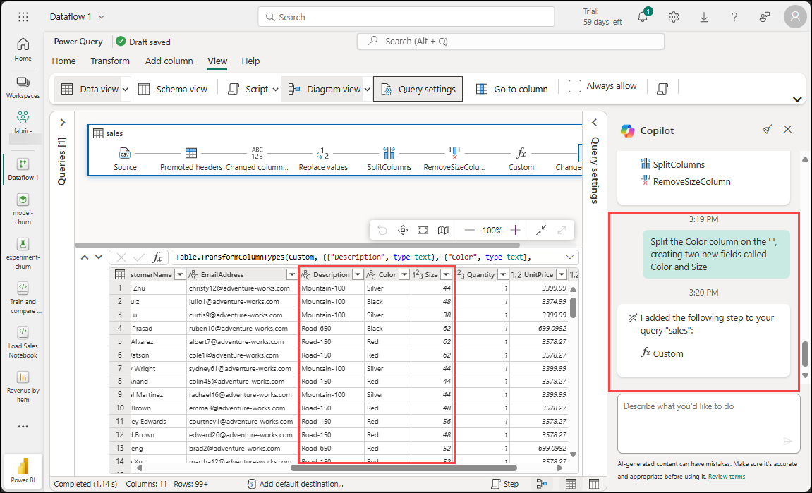
 
   >**Note:** Copilot can do more than transform the table; we can actually change data as well.

1. **Scenario:** If you think Red bikes are going to be a big seller, then you increase the quantity in the Inventory Call out that the quantities for all items are 1.

1. Add a step to type the following query into Copilot:
 
    ```
    Add a new column named QuantityNew where for each row, if the Color column is equal to "Red", multiply the Quantity by 10, otherwise keep the same value. Then, remove the old Quantity column and rename QuantityNew back to Quantity.
    ```
 
1. Show that the quantity field for Red bikes is now 10 instead of 1.

   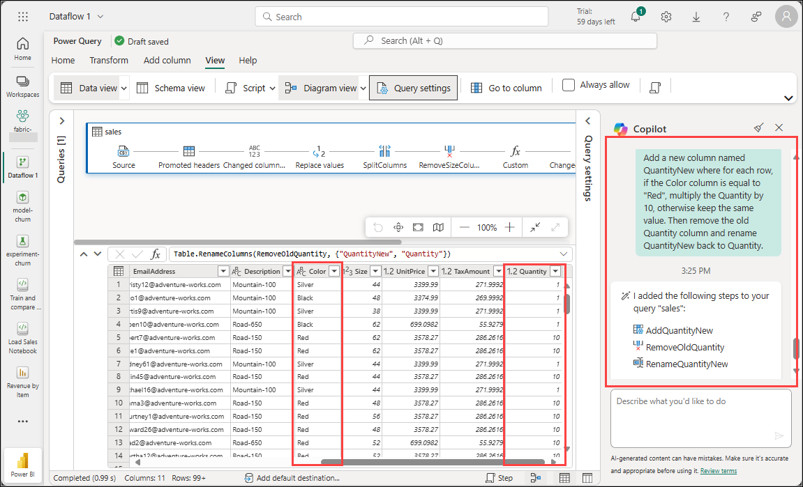
 
1. Here is a concise summary highlighting the impacts of Visual Query and M-Query/M-Code scripting:

1. **Visual Query**:
   - **Streamlines data exploration**: Visual Query tools offer intuitive interfaces, enabling users to interact with data visually and facilitating quicker insights without extensive coding.
   - **Enhances accessibility**: With Visual Query, users with varying technical expertise can extract insights from data, reducing reliance on specialized programming skills and promoting broader data utilization across teams.

1. **M-Query/M-Code scripting**:
   - **Enables advanced data manipulation**: M-Query/M-Code scripting provides a robust framework for performing intricate data transformations and analysis, empowering users to tailor processes to specific requirements beyond the capabilities of visual tools.
   - **Facilitates automation and customization**: Through M-Query/M-Code scripting, users can automate repetitive tasks, build custom functions, and create tailored solutions, increasing efficiency and flexibility in data workflows.

## Summary
In this exercise, you:

- Created a notebook to develop and execute a machine learning workflow.
- Built and trained a machine learning model using Scikit-Learn.
- Utilized MLflow to track experiments, including model parameters, metrics, and performance outcomes.

### You have successfully completed the exercise. Click on Next >> to proceed with the next exercise.

.png)
