# 演習 06: Fabric Copilot を使用したデータエンジニアリング、データ取り込み

### 所要時間: 30分

このラボでは、顧客の売上データを取り込むためのシンプルなデータパイプラインを作成します。KiZAN Fabric テナントを使用し、Copilot が有効になっている環境で、新しい Data Flow Gen2 を使用して、自然言語を利用してデータを取り込み、変換する方法を示します。

## ラボの目的

次のタスクを完了できるようになります:

- データソースへの接続  
- 取り込み設定の構成  
- Fabric へのデータ取り込み  
- 取り込みプロセスの監視  
- 取り込んだデータの検証  
- 取り込みプロセスの言語化
   
# 新規作成 - Dataflow Gen2

1. ワークスペース **fabric-<inject key="DeploymentID" enableCopy="false"/>** を選択します（これはラボ環境を模倣するワークスペースです）

   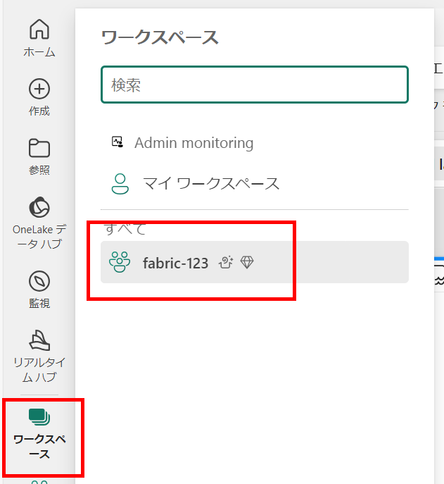

1. ワークスペース内の **Data Factory** オブジェクトを選択します。

   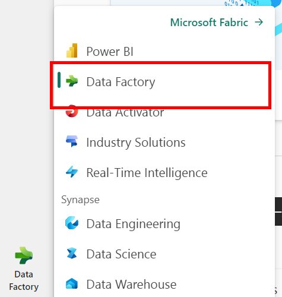

2. ワークスペースのホームページで **データフロー Gen2** を選択します。

   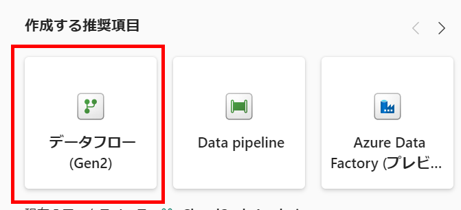

3. 数秒後、新しいデータフローの Power Query エディターが開きます。

   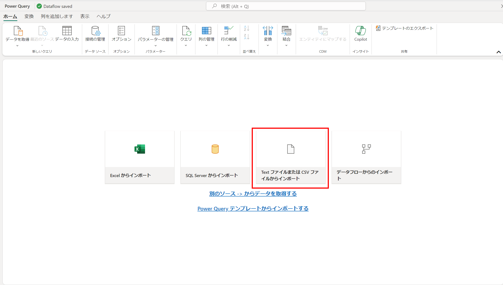

4. **Import from a Text/CSV file** を選択し、次の設定で新しいデータソースを作成します:

   - **新しい接続を作成**
   - **ファイルへのリンク**: *選択*
   - **ファイルパスまたは URL**: `https://raw.githubusercontent.com/MicrosoftLearning/dp-data/main/sales.csv`
   - **接続**: 新しい接続を作成
   - **データゲートウェイ**: (なし)
   - **認証の種類**: 匿名
   - **次へ** をクリック。

     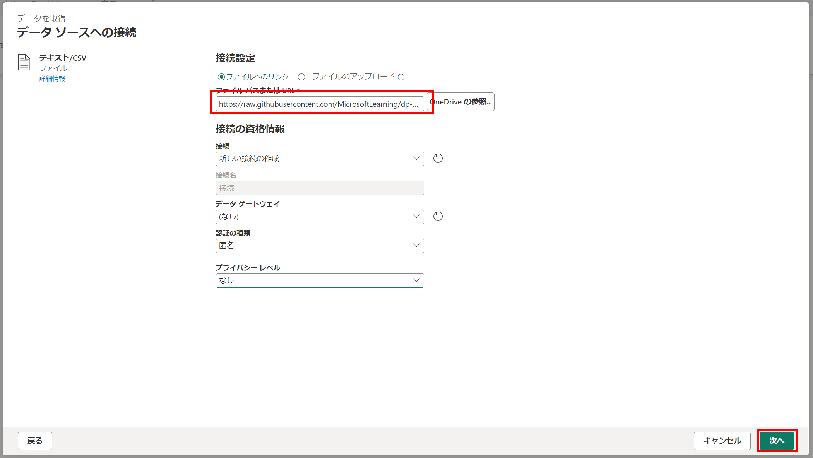

5. **ファイルデータのプレビュー** ページで **作成** をクリック。

   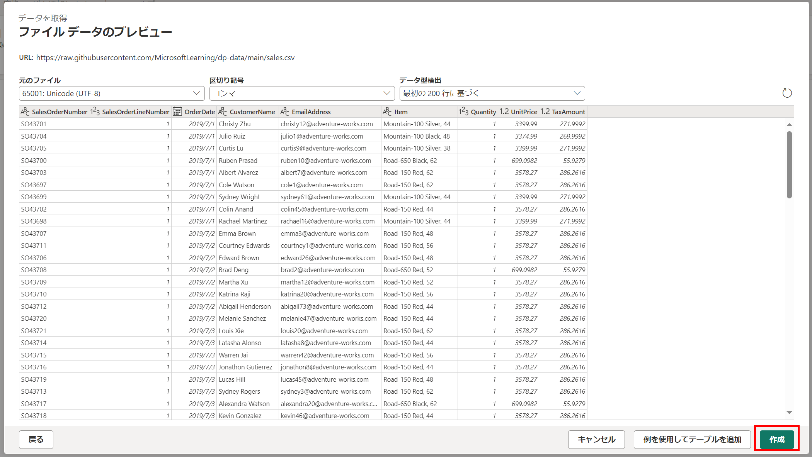

6. リボンの **Copilot** ボタンをクリック。

   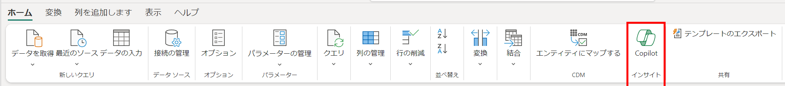

7. Copilot が行っているすべてのことをよりよく示すために、UI を少し拡張して、背後で何が起こっているかを確認します。

8. **クエリ設定** を展開します（これはデータを取り込むクエリのステップです）

    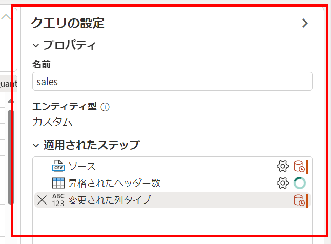

9.  **表示メニュー**: ツールバーまたはメニューバーにある「表示」ラベルのオプションまたはメニューを探します。クリックしてドロップダウンメニューを表示します。

10. **ダイアグラムビュー**: ドロップダウンメニューから「ダイアグラムビュー」を選択します。これにより、コードの視覚的な表現に切り替わります。

11. **スクリプトビュー**: スクリプトビューに切り替えると、Copilot が生成した M コードが表示されます。これは、ダイアグラムビューで示されたアクションやコマンドの基礎となるコード表現です。

   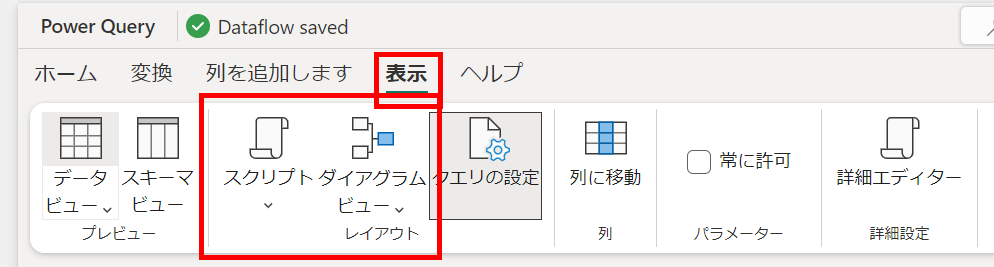

12. データを見てみましょう… アイテム列に注目してください。

    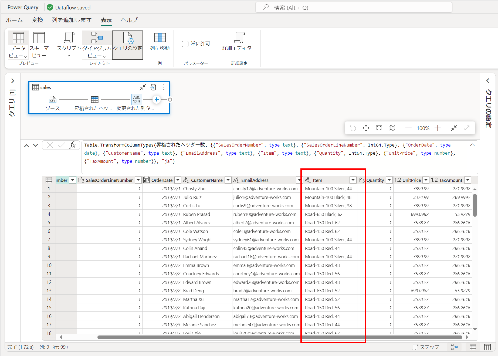

13. これは実際には 3 つの異なるフィールドです -- アイテムの短い説明、色、サイズが含まれています。

14. フィールド内で区切り文字が一貫していません（' ' と ','）

15. これを整理するために Copilot を使用しましょう。**次の手順を追加** します:

   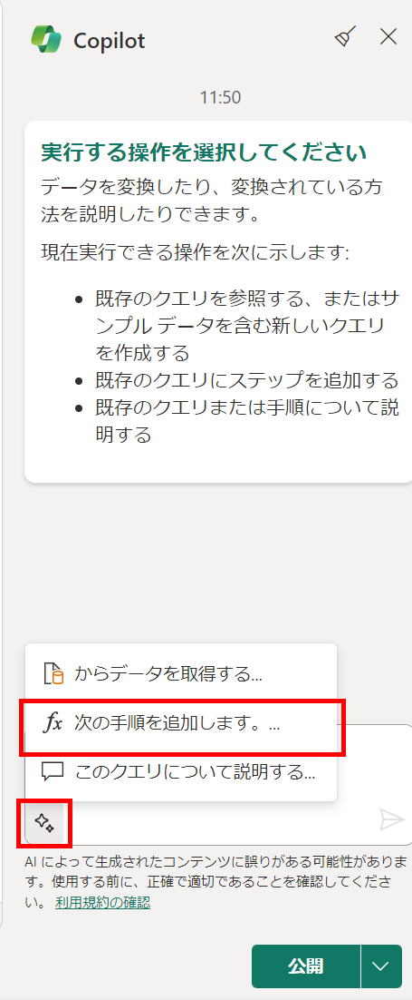

16. 続けて Copilot とのチャットボックスに次のように入力し、送信します:
 
   ```
   アイテム列の ',' を ' 'に置き換え
   ```
   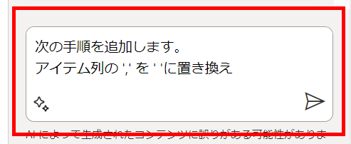

17. アイテム列は一貫して **' '** の区切り文字を持つようになりました。

   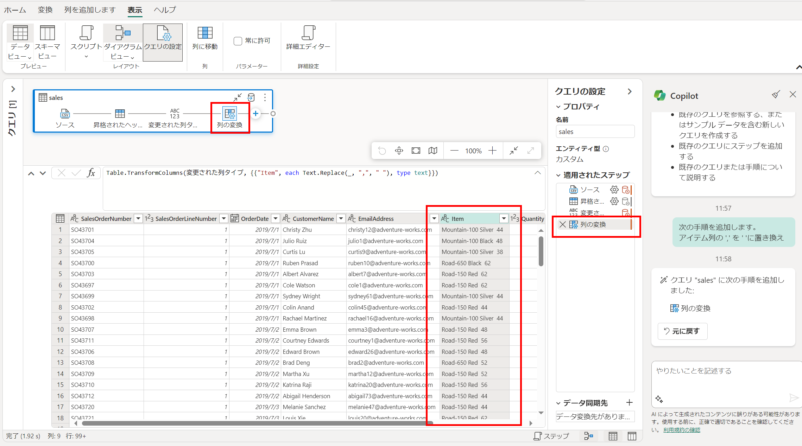

18. Copilot が生成した m コードと新しいクエリステップを表示します。
 

   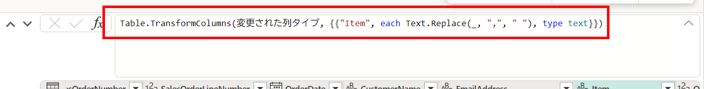

19. Copilot に次のように入力します:
 
   ```
   アイテム列を ' ' で分割し、Description , Color , Sizeという 3 つの新しい列を作成
   ```
   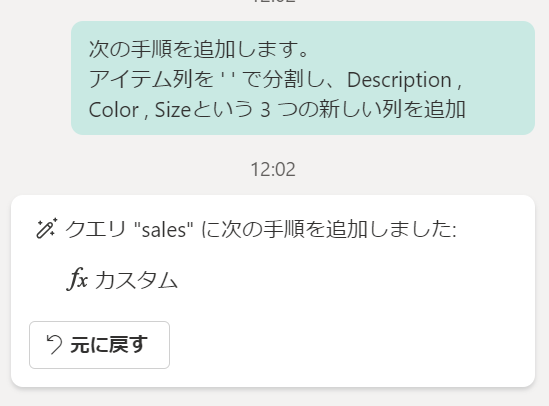

20. アイテム列を置き換えるために 3 つの新しいフィールドが作成されました。

   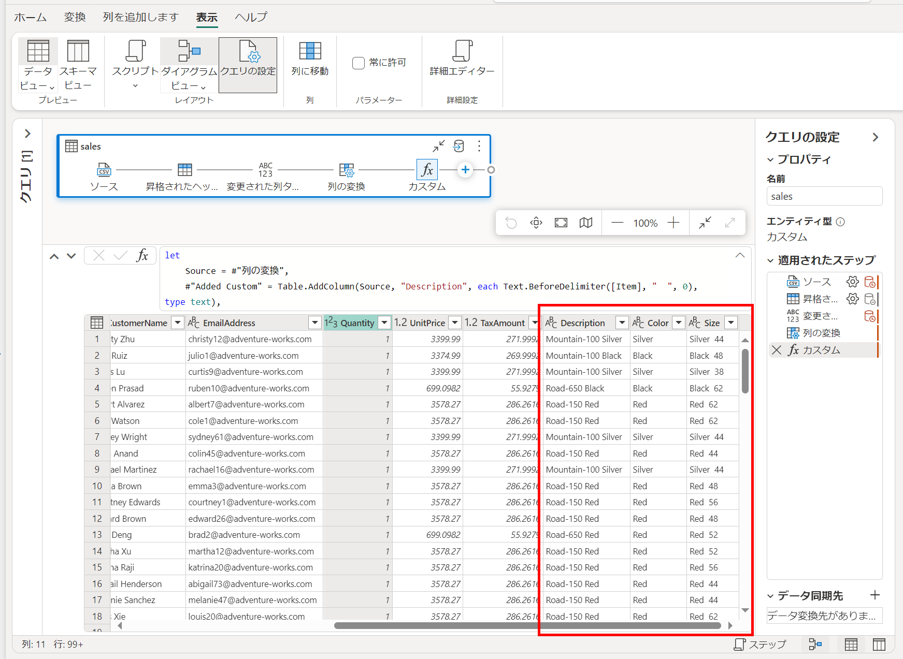
 
21. Copilot が生成した m コードと新しいクエリステップを表示します。
 
   >**注:** Copilot はテーブルの変換だけでなく、データの変更も行えます。

   

22. ここでシナリオを仮定し、赤い自転車が大ヒットすることを予期して在庫の数量を増やします。
すべてのアイテムの数量が 1 であることを確認します。
 
1. Copilot に次のように入力します:
 
   ```
   次の手順を追加します。 
   Color 列が 'Red' のすべての行でQuantity 列を 10 倍にします。Color 列をテキストとして、Quantity列を数字として扱ってください
   ```
   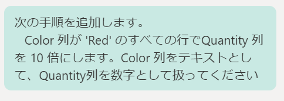

2. 赤い自転車の数量フィールドが 1 から 10 に変更されたことを示します。

   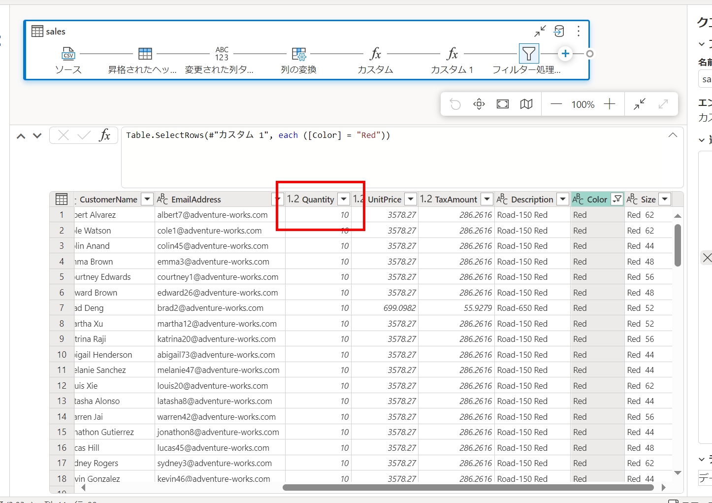
 
3. データフローを閉じます。

## まとめ

この演習では、Fabric に含まれる Copilot を使用してデータ変換を作成し、ビジュアルクエリと M クエリ/M コードに関する特徴を確認しました。

   - **ビジュアルクエリ**:
     - **データ探索の効率化**: ビジュアルクエリツールは直感的なインターフェースを提供し、ユーザーが視覚的にデータと対話できるようにし、広範なコーディングなしで迅速な洞察を得ることができます。
     - **アクセシビリティの向上**: ビジュアルクエリを使用すると、さまざまな技術的専門知識を持つユーザーがデータから洞察を引き出すことができ、専門的なプログラミングスキルへの依存を減らし、チーム全体でのデータ利用を促進します。

   - **M クエリ/M コードによるコーディング**:
     - **高度なデータ操作を可能にする**: M クエリ/M コードスクリプティングは、複雑なデータ変換と分析を実行するための強力なフレームワークを提供し、視覚的ツールの能力を超えた特定の要件にプロセスを適応させることができます。
     - **自動化とカスタマイズを促進**: M クエリ/M コードスクリプティングを通じて、ユーザーは反復的なタスクを自動化し、カスタム関数を作成し、カスタマイズされたソリューションを構築することで、データワークフローの効率と柔軟性を向上させることができます。

## ラボを正常に完了しました。次の演習に進むには、Next >> をクリックしてください。

