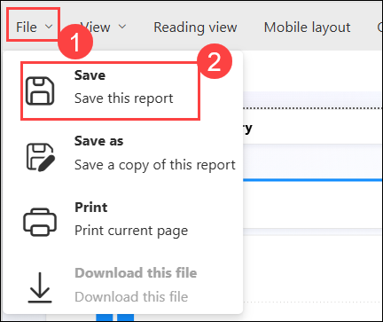

# Exercise 6: Analyze Data in a Warehouse with Fabric Copilot

### Estimated Duration: 60 Minutes

## Overview

In this exercise, you will analyze data in a warehouse using Fabric Copilot by connecting to your data source, running queries, and visualizing insights to drive informed decision-making. 

## Lab objectives

You will be able to complete the following task:

- Task 1: Analyze Data in a Warehouse

## Task 1: Analyze Data in a Warehouse

In this task, you’ll explore a **Data Warehouse** in Microsoft Fabric, review table relationships, and understand the **semantic model** used in Power BI. With **Copilot**, you’ll generate a sales report, get insights like **Sales by Region**, and create an **executive summary** demonstrating how AI enhances data analysis and reporting.

1. In the left pane, click **Workspaces** and select the workspace **fabric-<inject key="DeploymentID" enableCopy="false"/>**.

   
 
1. Select **Data Warehouse-<inject key="DeploymentID" enableCopy="false"/>** from the list.

   

1. In the **Explorer** pane, verify that the **dbo** schema in the data warehouse contains the following four tables:
   
   - **DimCustomer**

   - **DimDate**

   - **DimProduct**

   - **FactSalesOrder**

        

    > **Note:** If the schema takes a while to load, just refresh the browser page.
 
1. Click on **Data Warehouse-<inject key="DeploymentID" enableCopy="false"/>** Semantic model to open it.

   

1. Click **Open semantic model** from the top toolbar to view the relationships between the tables in your data warehouse.

    

1. In the top-right corner, click the **Viewing (1)** drop-down and select **Editing (2)**.

    

1. When you click on the **Relationship (1)** between **FactSalesOrder** and **DimCustomer** and access its **Properties (2)** pop-up on the right of the window, you're essentially examining how these two tables are linked together. This relationship defines how data from these tables can be combined or related when querying or visualizing in Power BI.

     

    - This relationship indicates that each record in the "FactSalesOrder" table is associated with a specific customer represented in the "DimCustomer" table. For example, if we have a sales record in "FactSalesOrder" for a particular transaction, we can use this relationship to look up additional details about the corresponding customer from the "DimCustomer" table.

    - This linkage is crucial for defining the Semantic Model used by Power BI. The Semantic Model essentially acts as a blueprint that outlines how data elements are interconnected and how they should be interpreted within Power BI. By establishing and defining relationships between tables, we're instructing Power BI on how to navigate and analyze the data effectively.
 
1. From the **File (1)** menu, select **Create new report (2)**. This creates a new report in Power BI using the semantic model built on the relationships defined in the data warehouse.
 
   

1. The Semantic Model, as defined in the data warehouse, is reflected in the Power BI interface. This includes the tables and their respective fields visible in the Data Pane of Power BI, which you can use to build your reports.

1. Locate and click on the **Copilot** feature within the tool or platform you're using.

   

1. If the pop-up titled **Welcome to Copilot in Power BI** appears, proceed by selecting **Get started**.

   

1. Locate the **Prompt guide (1)** icon, then click on it to access its **Menu (2)**.

   

1. Recognize that Copilot offers functionalities such as providing suggestions, generating code snippets, and offering explanations. However, it's important to note its limitations, which may include the inability to create certain visualizations or directly modify page layouts.

1. Selecting **What's in my data?** prompts Copilot to analyze the semantic model or dataset currently in use.

   

   - Copilot's analysis indicates that your dataset encompasses **sales performance**, **customer details**, **product information**, and **query performance**, offering a holistic view of your business operations. It suggests potential applications such as sales trend analysis, regional performance evaluation, customer segmentation, product evaluation, and query optimization. This highlights Copilot's adept understanding of dataset components and analytical techniques, providing valuable insights for strategic decision-making, customer engagement strategies, product refinement, and system enhancement.
    
   - Copilot represents a significant advancement in AI utilization, showcasing its capability beyond just generating code or manipulating data. Its capacity to assist in analyzing datasets is particularly noteworthy, as it offers intelligent insights and suggestions that enhance the entire data analysis process. By leveraging Copilot, users can gain a deeper understanding and uncover valuable patterns within their datasets, ultimately empowering them to make informed decisions based on the insights derived. This highlights the transformative potential of AI in augmenting human capabilities and driving innovation in data analysis methodologies.

1. Click on **Prompt guide (1)** icon, select **Create a report that shows ... (2)**.

    
   
1. At this time, you can only ask for a page or report to be created. You can't ask for specific visuals.
 
1. Type the following command into Copilot:
  
    ```
    Create a report that shows "Total Sales by Product Category."
    ```
 
1. **Execute the command** and let Copilot generate the report. Note that AI-generated results may vary, and you're never entirely sure what you'll get.

    

   - The report provides a comprehensive analysis of total sales across a spectrum of product categories, revealing a consistent pattern of total sales summing up to 19.59 million across all 39 categories. Similarly, the quantity sold uniformly stands at 25.98 thousand units for each category. With an average total sales figure of 4.55 thousand, it suggests an even distribution of sales performance across all categories. This uniformity underscores a balanced sales landscape across diverse product categories, thereby offering valuable insights for informed decision-making in subsequent business strategies.

   
1. Type the following command into Copilot

    ```
    Suggest Content for this Report
    ```
 
1. **Expand each suggestion** to see the text of the prompt and what will be created. This helps illustrate the range of suggestions Copilot can provide.
 
1. Select the **Sales Performance by Region (1)** report as it's usually a decent report to work with. Note that the report generated can vary.
  
    >**Note:** Click **Edit (2)** to demonstrate that you can adjust the query and customize the report.

   

1. **Clear the input box** and click **Prompt guide** icon and select **Give me an executive summary**:
    
    

1. Click on **File (1)** tab from the menu bar, and select **Save (2)**. In the **Save your report** window, enter the name as **Sample (3)** and click on **Save (4)**.

   

   

## Summary

In this exercise, you:

- **Connected to a data warehouse** using **Fabric Copilot**.
- **Explored available datasets** to understand the data structure and content.
- **Executed queries** to extract meaningful insights from the data.
- **Created visualizations** to support clear and effective data analysis.
- **Compiled findings into reports** for presentation and decision-making.
- **Collaborated with team members** to review and discuss the results.

### You have successfully completed the exercise. Click on Next >> to proceed with the next exercise.

.png)
