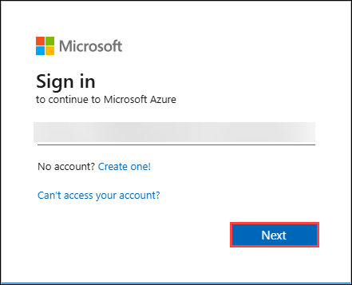
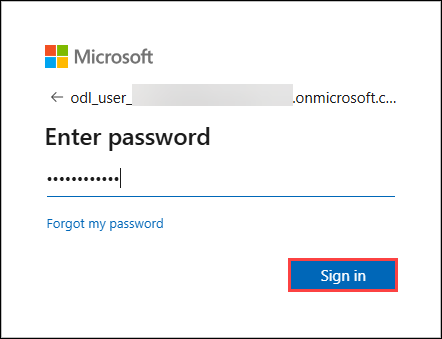
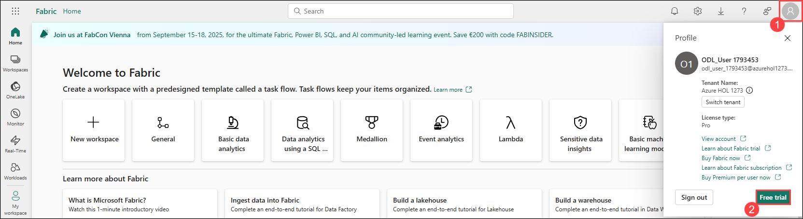
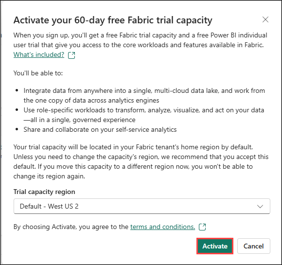
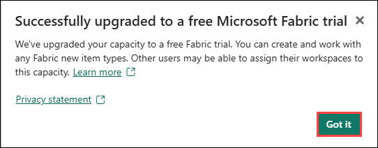
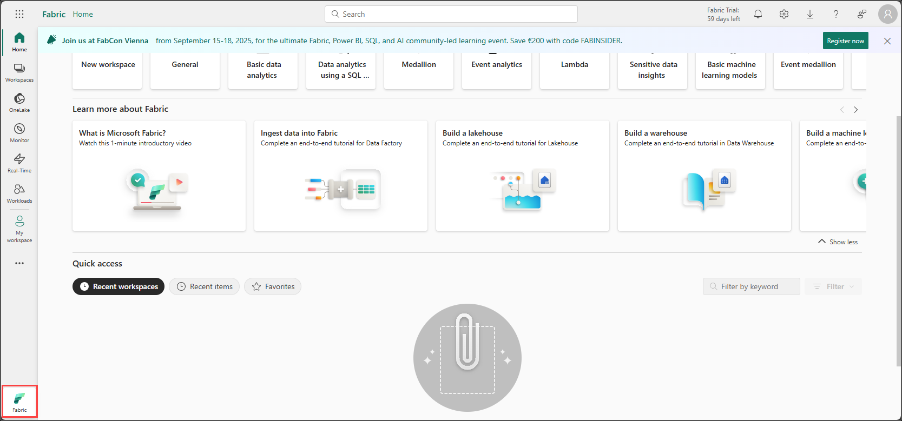
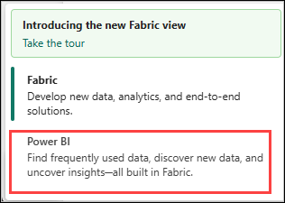
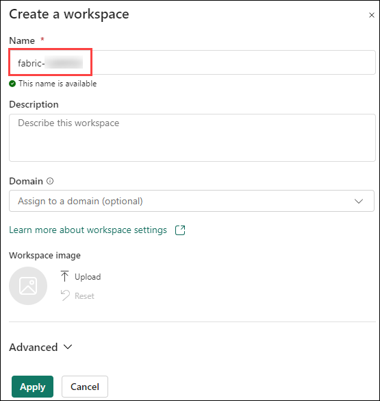
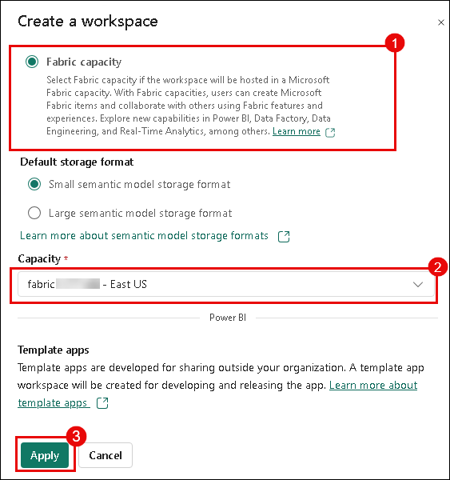

# Lab 01: Create a Fabric workspace

### Estimated Duration: 20 minutes

## Overview

In this lab, you will set up and configure a centralized environment within Microsoft Fabric to streamline data management, collaboration, and project organization.

## Lab Objectives

You will be able to complete the following tasks:

- Task 1: Assign Fabric Administrator Role
- Task 2: Sign up for Microsoft Fabric Trial
- Task 3: Create a workspace

### Task 1: Assign Fabric Administrator Role

1. Start by searching for **Microsoft Entra ID** in the search pane in Azure portal:

   

2. Navigate to **Roles and administrators**:

   

3. In the **Roles and administrators** page, search for **Fabric Administrator**, and click on it:

   

4. This will take you to the **Fabric Administrator | Assignments** page where you will have to assign yourself the **Fabric Administrator role**. Now, click on **+ Add Assignments (1)**:

   

5. Make sure to **check the box(1)** next to your username, confirm if it is **Selected(2)** and click on **Add(3)**:

   

6. You can confirm the **Fabric Administrator** role has been added successfully by **refreshing(1)** Fabric Administrators | Assignments page. After **confirming(2)** it has been added successfully, navigate back to **Home(3)**.

   

----

### Task 2: Sign up for Microsoft Fabric Trial

1. Copy the **microsoft fabric homepage link**, and open this link inside the VM in a new tab:

   ```
   https://app.fabric.microsoft.com/
   ```

1. If required, enter your credentials below and sign in

   **Email/Username:** <inject key="AzureAdUserEmail"></inject>
 
   **Password:** <inject key="AzureAdUserPassword"></inject>

   
   

1. On the top right corner of the screen, select the **user icon (1)**, and then click on **Free Trial (2)**.
   
   

1. On the **Activate your 60-day free Fabric trial capacity** click on **Activate**.

   

1. You will see a prompt for successful upgrade, click on **Got it**.

   

1. Click on **Fabric** on the bottom left of the screen. Now Select **Power BI** from the options .

   
   

### Task 3: Create a workspace

Here, you create a Fabric workspace. The workspace contains all the items needed for this lakehouse tutorial, which includes lakehouse, dataflows, Data Factory pipelines, the notebooks, Power BI datasets, and reports.

1. Now, select **Workspaces (1)** and click on **+ New workspace (2)**:
   
    

1. Fill out the **Create a workspace** form with the following details:

   - **Name:** Enter **fabric-<inject key="DeploymentID" enableCopy="false"/>**.
   
     

   - **Advanced:** Expand it and Under **License mode**, select **Fabric capacity(1)**.

1. Leave **Capacity(2)** as default and then click on **Apply(3)** to create and open the workspace.

   

    > **Congratulations** on completing the task! Now, it's time to validate it. Here are the steps:
    > - Hit the Validate button for the corresponding task.
    > - If you receive a success message, you can proceed to the next task. If not, carefully read the error message and retry the step, following the instructions in the lab guide.
    > - If you need any assistance, please contact us at labs-support@spektrasystems.com. We are available 24/7 to help you out.

    <validation step="796cb471-1103-4bc8-8e98-9e6dd3e8c025" />


## Summary

In this exercise, you assigned Fabric Administrator Role to your Azure user, signed up for Microsoft Fabric Trial and created a workspace.

### You have successfully completed the lab

