<div style="font-family: 'Meiryo'"> 

# 演習 01: Fabric ワークスペースの作成

### 所要時間: 20分

## 概要

このラボでは、Microsoft Fabric 内でデータ管理、コラボレーション、およびプロジェクト整備を簡素化するための環境を設定および構成します。

## ラボの目的

次のタスクを完了できるようになります:

- タスク 1: Fabric 管理者ロールの割り当て
- タスク 2: Microsoft Fabric トライアルへのサインアップ
- タスク 3: ワークスペースの作成

### タスク 1: Fabric 管理者ロールの割り当て

1. Azure ポータルの検索ペインで **Microsoft Entra ID** を検索します:

   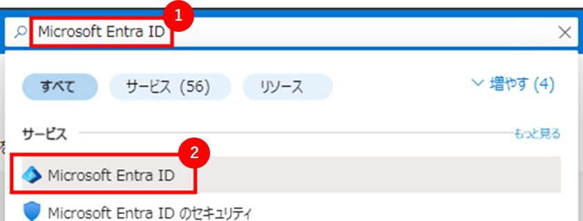

2. **ロールと管理者** に移動します:

   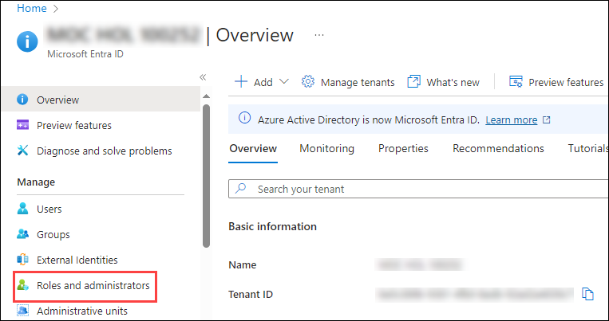

3. **ロールと管理者** ページで **Fabric 管理者** (または Fabric Administrator )を検索し、クリックします:

   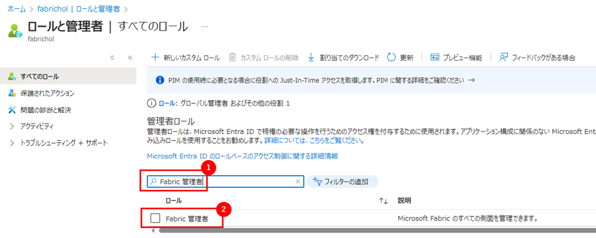

4. これにより **Fabric 管理者 | 割り当て** ページに移動し、**Fabric 管理者ロール** を自分に割り当てる必要があります。次に、**+ 割り当ての追加 (1)** をクリックします:

   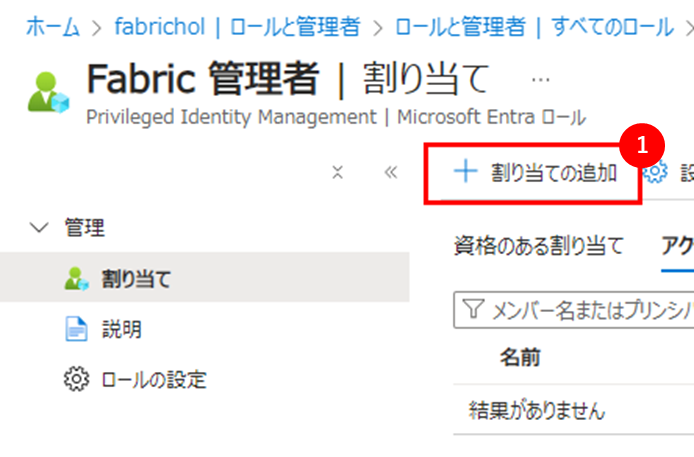

5. ユーザー名の横にある **チェックボックス(1)** を確認し、それが **選択済み(2)** であることを確認してから、**追加(3)** をクリックします:

   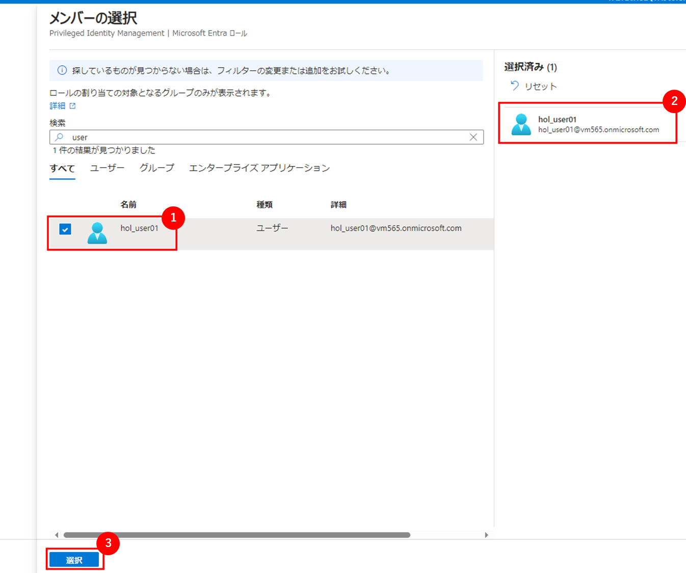

6. **Fabric 管理者** ロールが正常に追加されたことを確認するには、**Fabric 管理者 | 割り当て** ページを **更新(1)** します。正常に追加されたことを **確認(2)** した後、**ホーム(3)** に戻ります。

   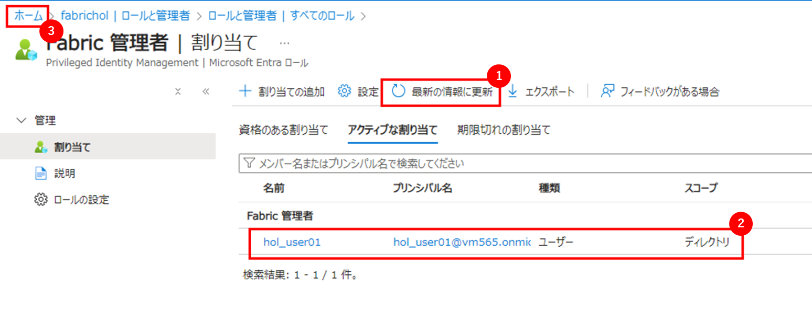

----

### タスク 2: Microsoft Fabric トライアルへのサインアップ

1. **Microsoft Fabric ホームページリンク** をコピーし、VM 内の新しいタブでこのリンクを開きます:

   ```
   https://app.fabric.microsoft.com/
   ```


2. Microsoft Fabric ページで、**メールアドレス**(1) を入力し、**送信**(2) をクリックします。これにより、新しいアカウントを作成する必要があるかどうかが確認されます。

   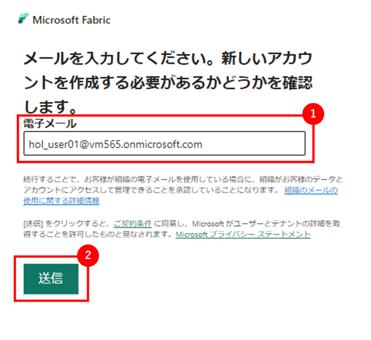


3. 新しいウィンドウが表示され、**パスワード** を入力してから **サインイン** をクリックするように求められます。

   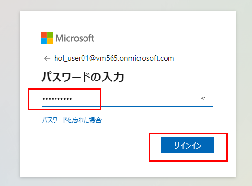

4. サインイン状態を維持するウィンドウで、**はい** をクリックします。

   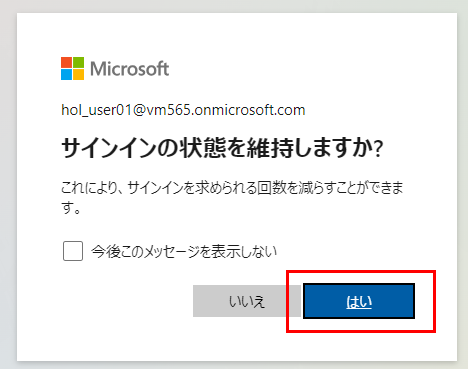


5. 次に、Microsoft Fabric にサインインします。**サインイン** をクリックします。

   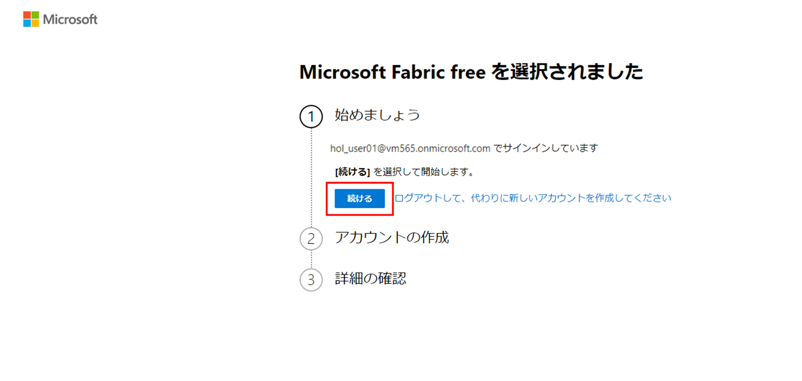

6. アカウント作成セクションで、必要なフィールド **(1)** および **(2)** を入力し、**開始**(3) をクリックします。

   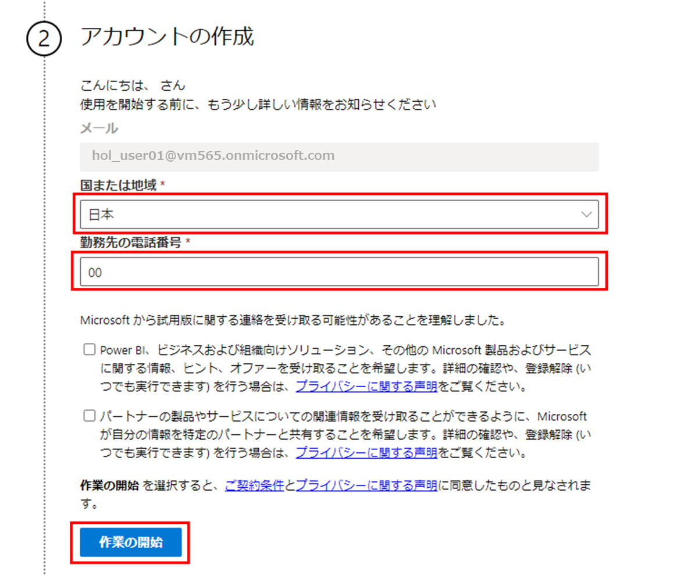

7. Microsoft Fabric アカウントの作成に成功しました。**開始** をクリックします。

   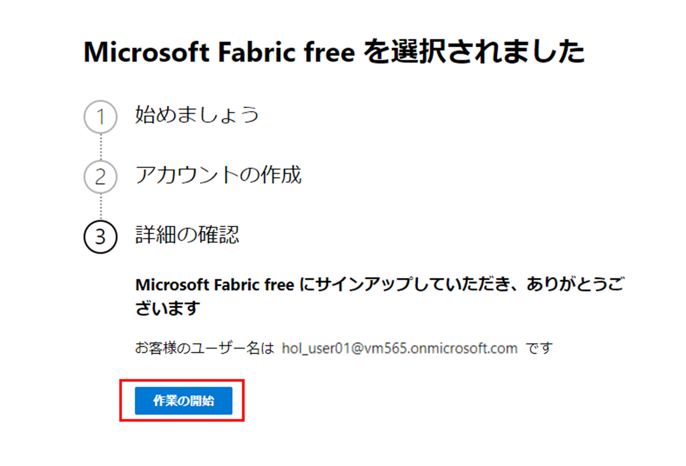

### タスク 3: ワークスペースの作成

ここでは、Fabric ワークスペースを作成します。このワークスペースには、レイクハウス、データフロー、Data Factory パイプライン、ノートブック、Power BI データセット、およびレポートが含まれます。

1. **ワークスペース (1)** を選択し、**+ 新しいワークスペース (2)** をクリックします:

    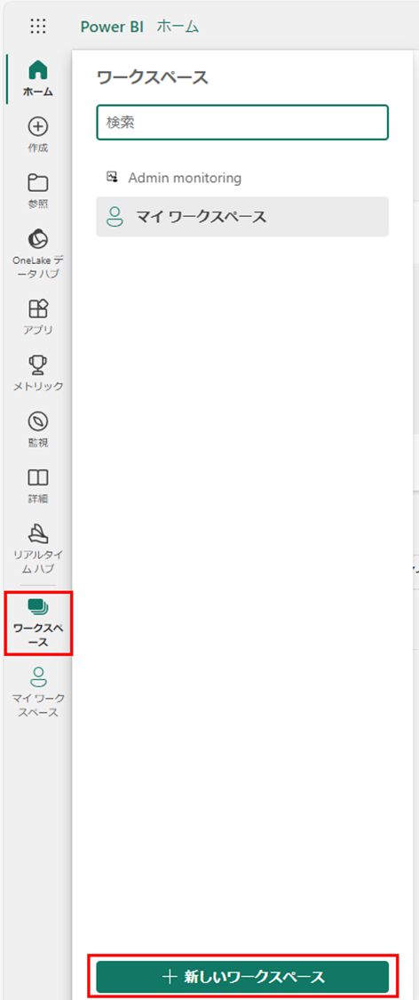

2. **ワークスペースの作成** フォームで、 **名前:** **fabric-<inject key="DeploymentID" enableCopy="false"/>** を入力し、**詳細 (2):** を展開します。
   
   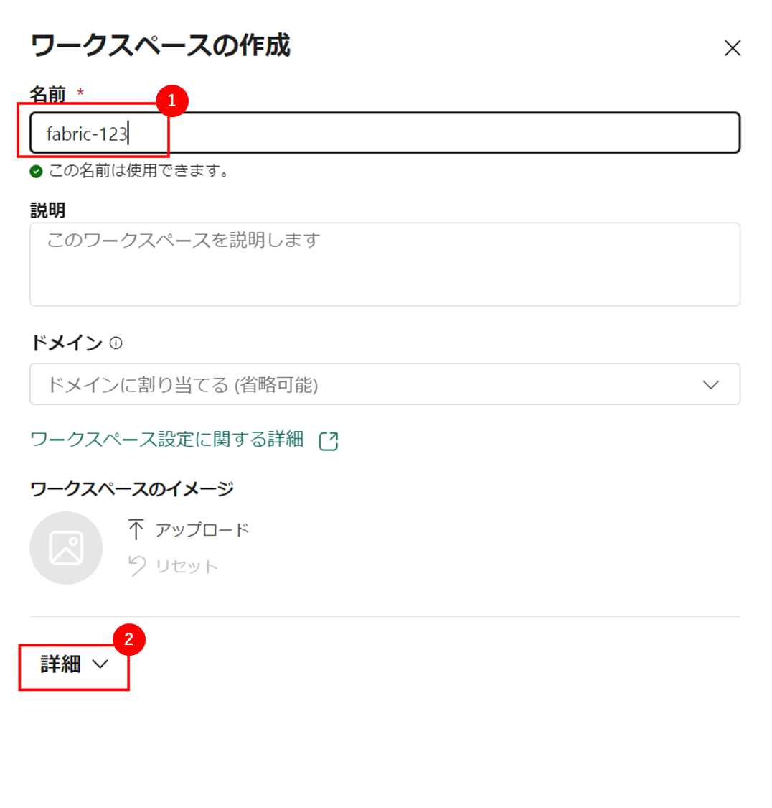

3. **ファブリック容量(1)**、既存の **容量(2)** を選択し、**適用(3)** をクリックしてワークスペースを作成および開きます。

   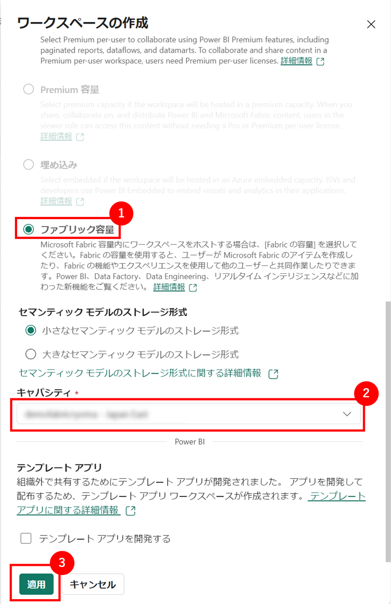

    <validation step="796cb471-1103-4bc8-8e98-9e6dd3e8c025" />

    > **おめでとうございます** タスクを完了しました！次は検証です。手順は以下の通りです:
    > - 対応するタスクの検証ボタンを押します。
    > - 成功メッセージが表示された場合、次のタスクに進むことができます。表示されない場合は、エラーメッセージをよく読み、ラボガイドの指示に従って手順を再試行してください。
    > - サポートが必要な場合は、labs-support@spektrasystems.com までご連絡ください。24時間365日対応しています。

## まとめ

この演習では、Azure ユーザーに Fabric 管理者ロールを割り当て、Microsoft Fabric トライアルにサインアップし、ワークスペースを作成しました。

### ラボを正常に完了しました

</div>
