# Cloud scale analytics with Microsoft Fabric

### Overall Estimated Duration: 8 Hours

## Overview

This lab introduces you to creating a workspace in Microsoft Fabric, a collaborative environment for organizing and managing projects, data, and resources. You will learn how to set up a workspace, create data pipelines for ETL/ELT processes, and use Apache Spark for data processing. Additionally, you will create a notebook to train a machine-learning model to predict customer churn using Scikit-Learn and MLflow. You will also explore dataflows in Microsoft Fabric to connect to various data sources, perform transformations, and define datasets for Power BI reports.

## Objective

By the end of this lab, you will be able to:

- **Create a Fabric workspace:** Learn to create and configure a collaborative workspace in Microsoft Fabric to efficiently manage projects, data, and resources. As part of this exercise, you will successfully assign the Fabric Administrator role, sign up for a Microsoft Fabric trial, and create a workspace. This will enable you to manage your environment and start exploring Fabric's capabilities effectively.
- **Ingest data with a pipeline in Microsoft Fabric:** Implement and manage data ingestion in Microsoft Fabric using ETL/ELT pipelines and Apache Spark for scalable analytics. By completing the tasks in this exercise, users will enable Copilot inside a Codespace, explore shortcuts, create a pipeline and notebook, use SQL to query tables, create a visual query, and generate a report. This exercise builds proficiency in essential Microsoft tools and features.
- **Analyze data in a data warehouse:** Understand how Microsoft Fabric's data warehouse enables full SQL functionality, including insert, update, and delete operations, for large-scale analytics. By completing this exercise, you will have created a data warehouse, populated it with data, defined a model, queried tables, created a view, and visualized your data.
- **Get started with Real-Time Analytics in Microsoft Fabric:** Use Microsoft Fabric’s Kusto Query Language (KQL) for efficient storage and querying of time-series data, including real-time logs and IoT information. Upon completing this exercise, you will have created a KQL database, queried a sales table using KQL, generated a Power BI report from a KQL Queryset, and utilized delta tables for streaming data. This will enhance your skills in data querying, visualization, and real-time data management within Microsoft Fabric.
- **Use notebooks to train a model in Microsoft Fabric:** Discover how to use Microsoft Fabric’s Kusto Query Language (KQL) for efficient storage and querying of time-series data, including real-time logs and IoT information. In this exercise, you'll build a lakehouse, upload files, create a notebook, train a machine learning model, use MLflow to track experiments, and save your work, concluding with ending the Spark session.
- **Data Engineering Ingest Data in Fabric with Fabric Copilot:** Streamline the process of ingesting diverse data sources into Fabric using Fabric Copilot for efficient data management. In this exercise, you completed tasks to connect to data sources, configure ingestion settings, ingest data into Fabric, monitor the ingestion process, validate the ingested data, and document the entire process.
- **Analyze Data in a Warehouse with Fabric Copilot:** Leverage Fabric Copilot to enhance data analysis capabilities in a warehouse, enabling insightful decision-making through advanced analytics. In this exercise, you completed tasks to connect to the data warehouse, explore data sources, run data queries, visualize data insights, generate reports, and collaborate on findings.
- **Analyze data with Apache Spark:** Use Microsoft Fabric to train and track a customer churn prediction model with Scikit-Learn and MLflow. After completing this exercise, you will have set up a lakehouse, uploaded and explored data, used Spark for transformation and visualization, and effectively managed your notebook and Spark session. This will demonstrate your ability to integrate and analyze data through multiple stages using advanced tools and techniques.
- **Create a Dataflow (Gen2) in Microsoft Fabric:** Master Apache Spark for flexible, distributed data processing and analysis across platforms like Azure HDInsight and Databricks. Successfully created a Dataflow (Gen2) to ingest data, configured its destination, and integrated it into a pipeline. This streamlined the data ingestion and processing workflow within your environment.
  
## Pre-requisites

- **Fundamental Knowledge of Data Engineering:** Understanding ETL/ELT and data pipelines
- **Programming Skills:** Familiarity with Python, SQL, or similar languages
- **Basic Understanding of Data Visualization:** Experience with tools like Power BI

## Architecture

In Microsoft Fabric, the workflow begins with creating a Fabric workspace to manage projects, data, and resources collaboratively. Next, ingest data with a pipeline using ETL/ELT processes and Apache Spark for scalable data integration. Once data is ingested, it is stored in the data warehouse, which supports full SQL functionality for extensive analytics. For real-time data processing, get started with Real-Time Analytics using Kusto Query Language (KQL) to handle time-series data like real-time logs and IoT information. Use notebooks to train machine learning models, such as a customer churn prediction model, using Scikit-Learn and MLflow. Finally, create a Dataflow (Gen2) to leverage Apache Spark for distributed data processing and analysis across platforms like Azure HDInsight and Databricks.

## Architecture Diagram

  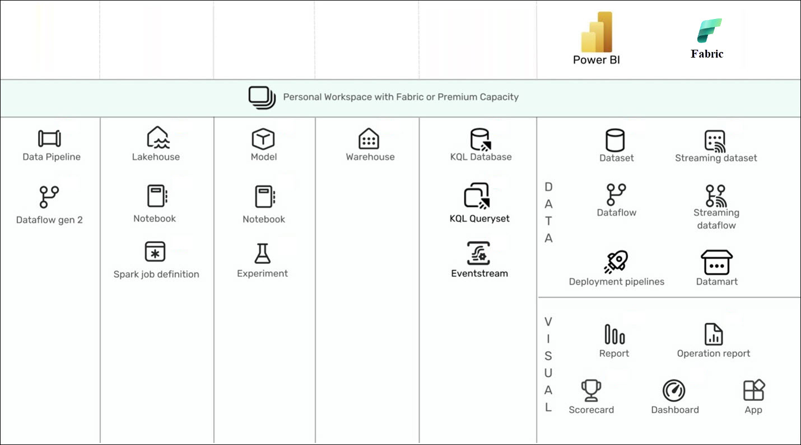

## Explanation of Components

- **Data Pipeline:** Orchestrates and automates data movement and transformation workflows using a visual interface. Ideal for building ETL (Extract, Transform, Load) processes across multiple data sources.
- **Dataflow Gen 2:** A self-service data preparation tool that allows users to create reusable data transformation pipelines, optimized for performance and scalability within the Microsoft Fabric ecosystem.
- **Lakehouse:** Combines the benefits of data lakes and data warehouses by supporting open data formats and structured querying, making it suitable for both analytics and machine learning workloads.
- **Notebook** (under Lakehouse and Model): Interactive development environment that supports languages like PySpark, SQL, and others, enabling data exploration, transformation, and visualization.
- **Spark Job Definition:** Defines distributed data processing tasks using Apache Spark, allowing for scalable data transformations and advanced analytics over large datasets.
- **Model:** Semantic layer that organizes and defines business logic, relationships, and KPIs for your data, used for consistent analysis and reporting across tools.
- **Experiment:** Enables tracking and managing of machine learning experiments, including metrics and model versions, facilitating reproducibility and performance comparison.
- **Warehouse:** Provides scalable, high-performance storage and full SQL functionality for large-scale analytics. It supports complex queries, including insert, update, and delete operations, to efficiently handle extensive data sets.
- **KQL Database:** Optimized for real-time telemetry and log data, it uses the Kusto Query Language (KQL) for fast, scalable analysis of time-series and event data.
- **KQL Queryset:** A collection of saved KQL queries that users can organize and reuse, enabling collaborative analytics and faster insights on streaming or log data.
- **Eventstream:** Captures, transforms, and routes real-time events from multiple sources for real-time processing, analytics, or storage in various destinations.
- **Dataset:** A curated set of data ready for reporting and visualization, often used in Power BI to build interactive dashboards and reports.
- **Report:** Visual representation of data using various charts and graphs, enabling users to interact with and analyze their data.
- **Dashboard:** A single-pane view that aggregates visuals and reports from multiple datasets, offering quick insights and real-time monitoring.

# Getting Started with the Lab

Welcome to your Cloud scale analytics with Microsoft Fabric workshop! We've prepared a seamless environment for you to explore and learn about Fabric services. Let's begin by making the most of this experience:

## Accessing Your Lab Environment
Once you're ready to dive in, your virtual machine and **Guide** will be right at your fingertips within your web browser.

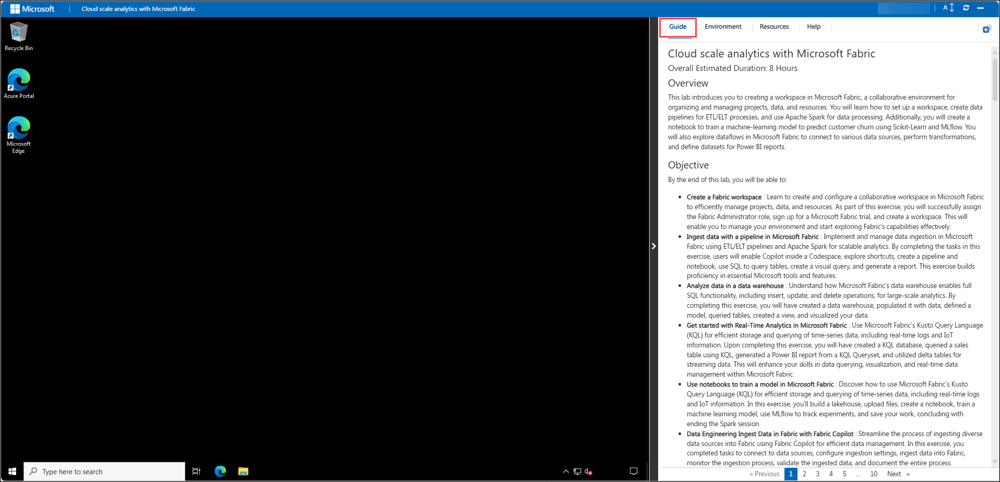

## Virtual Machine & Lab Guide

Your virtual machine is your workhorse throughout the workshop. The lab guide is your roadmap to success.

## Exploring your Lab Resources

To get the lab environment details, you can select the **Environment** tab. Additionally, the credentials will also be emailed to your registered email address.

   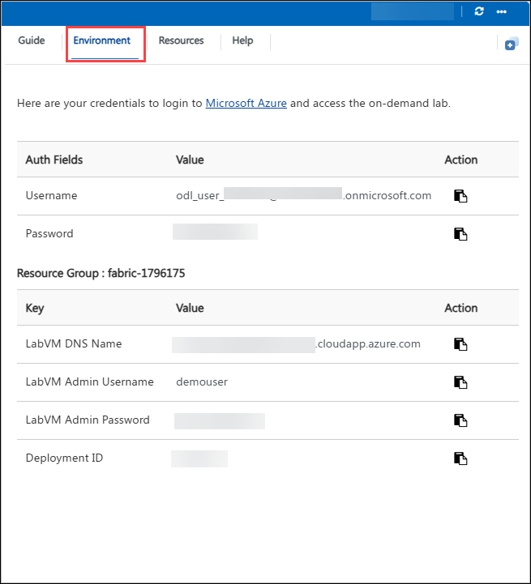

## Utilizing the Split Window Feature

For convenience, you can open the lab guide in a separate window by selecting the **Split Window** button from the top right corner.

   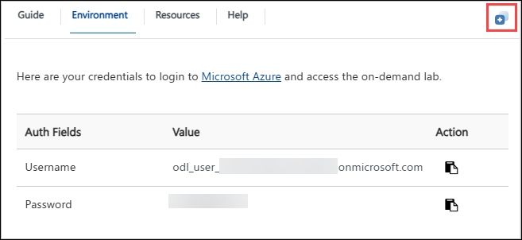

   >**Note:** You will see the DeploymentID value on the **Environment** tab, use it wherever you see SUFFIX or DeploymentID in lab steps.

## Managing Your Virtual Machine
 
Feel free to **Start, Restart, or Stop** your virtual machine as needed from the **Resources** tab. Your experience is in your hands!

   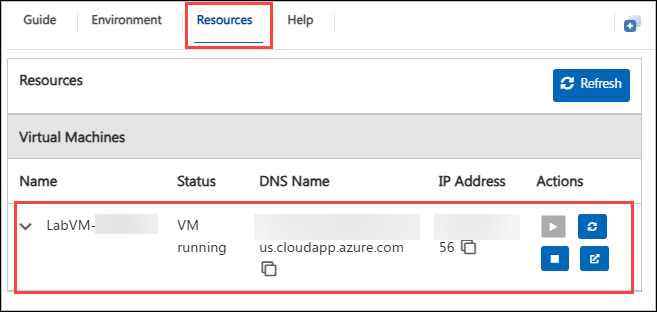

## Lab Guide Zoom In/Zoom Out Options

To adjust the zoom level for the environment page, click the A↕ : 100% icon located next to the timer in the lab environment.

   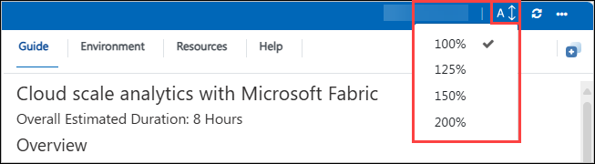

## Let's Get Started with Power BI Portal

1. In the Lab VM, click on the **Microsoft Edge** browser, which is available on the desktop.

   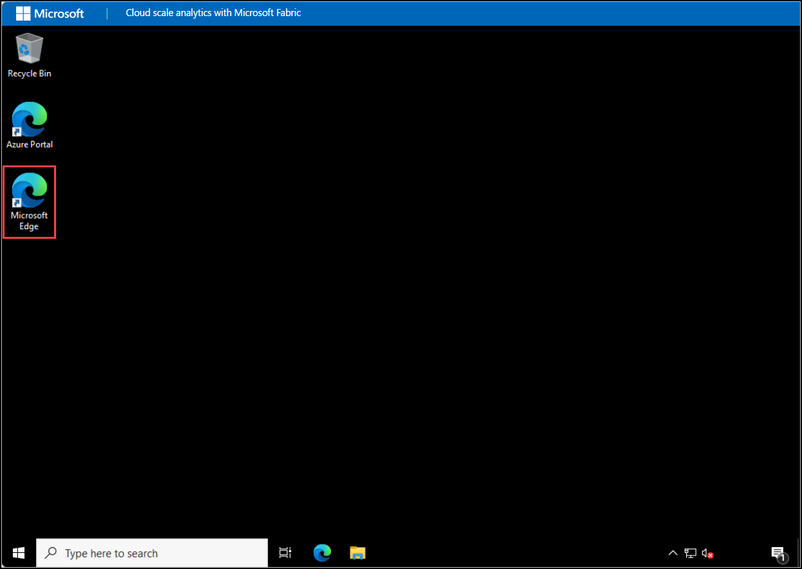

1. Copy the **Power BI link** below and open this link in a new tab on the Microsoft Edge Browser.

   ```
   https://powerbi.com
   ```
   
2. On the **Enter your email, we'll check if you need to create a new account** window, you will see the login screen, in that enter the following email/username, and click on **Submit (2)**.
 
   - **Email/Username:** <inject key="AzureAdUserEmail"></inject> **(1)**

     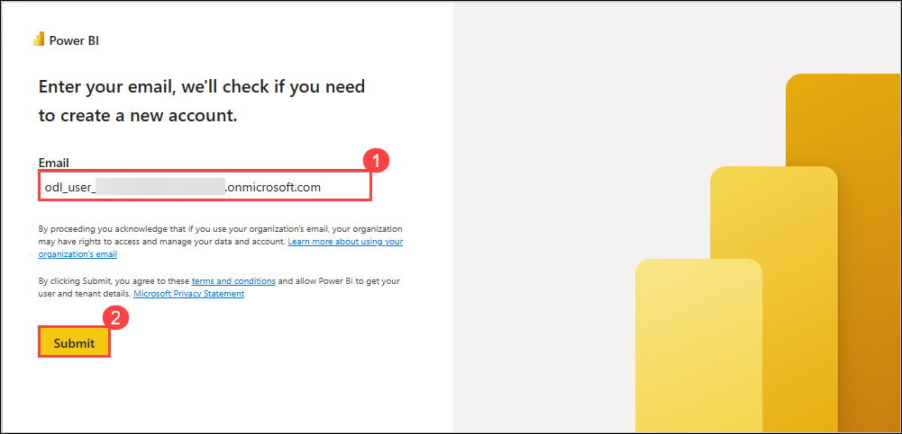
     
3. Now enter the following password and click on **Sign in**.
 
   - **Password:** <inject key="AzureAdUserPassword"></inject> 

      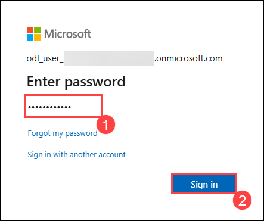
     
1. If you see a pop-up **Stay Signed in?**, click **No**.

   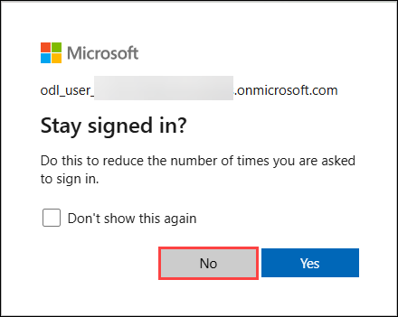

1. You will be navigated to the Power BI Home page.

   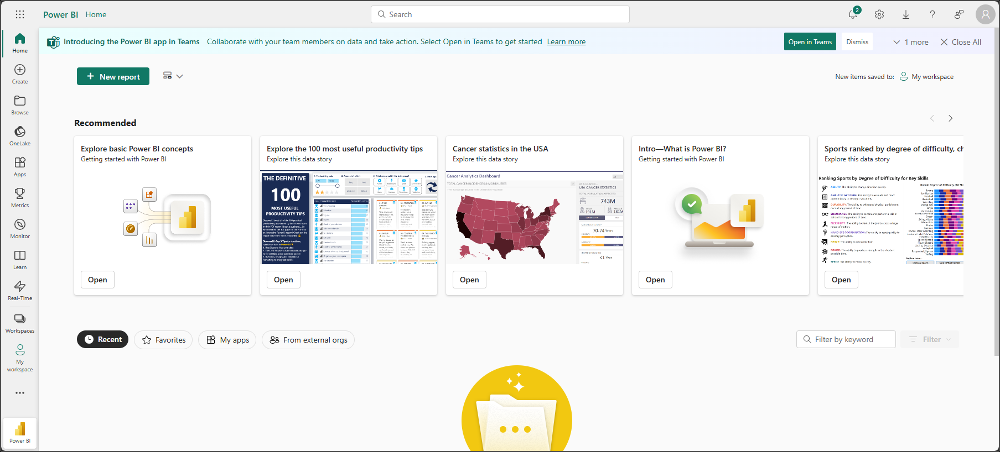

## Support Contact

The CloudLabs support team is available 24/7, 365 days a year, via email and live chat to ensure seamless assistance at any time. We offer dedicated support channels tailored specifically for both learners and instructors, ensuring that all your needs are promptly and efficiently addressed.

Learner Support Contacts:

- Email Support: cloudlabs-support@spektrasystems.com
- Live Chat Support: https://cloudlabs.ai/labs-support

Now, click on **Next** from the lower right corner to move on to the next page.
   
   .png)

## Happy Learning!!
