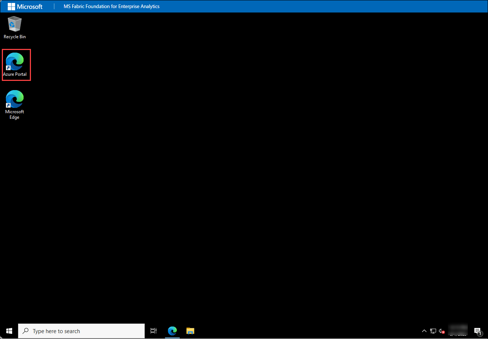

# MS Fabric Foundation for Enterprise Analytics

### Overall Estimated Duration: 8 Hours

## Overview

A global e-commerce company uses Microsoft Fabric for cloud-scale analytics to handle and analyze vast amounts of customer transaction data. They set up data pipelines for continuous ingestion of transactional information, which is stored in a scalable data warehouse. Real-time analytics monitor live data streams for immediate insights, while Apache Spark performs complex analyses and machine learning on the data. Dataflows Gen2 are employed to clean and transform data, and interactive notebooks allow data scientists to explore and model data dynamically. This integrated approach enables the company to make real-time, data-driven decisions and optimize their strategies effectively.

## Objective

This lab is designed to equip participants with hands-on experience in creating a workspace to manage data, ingesting it via pipelines, analyzing it in a data warehouse, performing real-time analytics, training models using notebooks, leveraging Apache Spark for complex analysis, and designing advanced data transformations with Dataflow Gen2.

1. **Create a Fabric workspace:** Set up a centralized environment in Microsoft Fabric to manage and collaborate on data projects. Participants will establish a centralized platform for managing and collaborating on data projects.

1. **Ingest data with a pipeline in Microsoft Fabric:** Use data pipelines to import and prepare data for analysis within Microsoft Fabric. Participants will automate the import and preparation of data for subsequent analysis.

1. **Analyze data in a data warehouse:** Perform complex queries and insights on large datasets stored in a data warehouse within Microsoft Fabric. Participants will execute complex queries to derive insights from large datasets.

1. **Get started with Real-Time Analytics in Microsoft Fabric:** Implement real-time data processing and analytics to gain immediate insights from live data streams. Participants will enable immediate insights and decision-making from live data streams.

1. **Use notebooks to train a model in Microsoft Fabric:** Utilize interactive notebooks for developing, training, and testing machine learning models within Microsoft Fabric. Participants will develop and refine machine learning models interactively.

1. **Analyze data with Apache Spark:** Leverage Apache Spark’s distributed computing capabilities to perform large-scale data analysis in Microsoft Fabric. Participants will perform scalable, high-performance data analysis on large volumes of data.

1. **Create a Dataflow (Gen2) in Microsoft Fabric:** Design and implement advanced data transformation workflows using Dataflow Gen2 for enhanced data integration and processing. Participants will design and execute sophisticated data transformation processes for integration and processing.

## Prerequisites

Participants should have:

- Knowledge of data integration principles and experience with data formats and sources.
- Understanding of SQL and relational database concepts, and familiarity with data warehousing solutions.
- Familiarity with machine learning concepts and experience with programming languages like Python or R
- Understanding of distributed computing principles and experience with data processing frameworks like Apache Spark.

## Architecture

Microsoft Fabric offers a comprehensive suite of services to manage and analyze data at scale. Participants can set up a central workspace for project management, automate data ingestion with pipelines, and perform complex queries using its data warehouse capabilities. Real-time data processing is supported through a dedicated analytics engine, while interactive notebooks facilitate machine learning model development. Apache Spark provides scalable data processing, and advanced data transformations are handled by Dataflow Gen2. Together, these tools enable efficient data management, real-time insights, and scalable analytics across diverse data scenarios.

## Architecture Diagram


## Explanation of Components

The architecture for this lab involves several key components of Microsoft Fabric:

- **Microsoft Fabric Workspace:** The main environment for managing all data-related projects, including resources, permissions, and configuration.
- **Microsoft Fabric Data Factory (or Data Pipelines):** Service for creating, scheduling, and managing data ingestion workflows and ETL (Extract, Transform, Load) processes.
- **Microsoft Fabric Data Warehouse (or Synapse Analytics):** Scalable data storage and querying service for performing complex data analysis and running SQL queries.
- **Real-Time Analytics Engine:** Service for processing and analyzing streaming data to provide real-time insights.
- **Microsoft Fabric Notebooks:** Interactive notebooks for developing, training, and testing machine learning models using languages such as Python or R.
- **Apache Spark on Microsoft Fabric:** A distributed computing service for performing large-scale data processing and analytics using Spark clusters.
- **Dataflow Gen2:** A service for designing and executing advanced data transformation workflows, enabling efficient data integration and processing.

**Fabric trial provides access to most features, but excludes Copilot, private links, and trusted workspace access ([learn more](https://learn.microsoft.com/en-us/fabric/fundamentals/fabric-trial#overview-of-the-trial-capacity)).**


## Getting Started with the Lab
 
Welcome to your MS Fabric Foundation for Enterprise Analytics workshop! We've prepared a seamless environment for you to explore and learn about Azure services. Let's begin by making the most of this experience:
 
## Accessing Your Lab Environment
 
Once you're ready to dive in, your virtual machine and lab guide will be right at your fingertips within your web browser.


## Virtual Machine & Lab Guide

Your virtual machine is your workhorse throughout the workshop. The lab guide is your roadmap to success.

## Exploring your Lab Resources

To get the lab environment details, you can select the **Environment** tab. Additionally, the credentials will also be emailed to your registered email address.


## Utilizing the Split Window Feature

Utilizing the Split Window Feature: For convenience, you can open the lab guide in a separate window by selecting the **Split Window** button from the top right corner.


   >**Note:** You will see the DeploymentID value on the **Environment** tab, use it wherever you see SUFFIX or DeploymentID in lab steps.

## Managing Your Virtual Machine
 
Feel free to **Start, Stop, or Restart** your virtual machine as needed from the **Resources** tab. Your experience is in your hands!


## Lab Guide Zoom In/Zoom Out Options

To adjust the zoom level for the environment page, click the A↕ : 100% icon located next to the timer in the lab environment.


## Let's Get Started with Power BI Portal

1. In the Lab VM, click on the **Microsoft Edge** browser, which is available on the desktop.

   

1. Copy the **Power BI link** below and open this link in a new tab on the Microsoft Edge Browser.

   ```
   https://powerbi.com
   ```
   
2. On the **Enter your email, we'll check if you need to create a new account** tab, you will see the login screen, in that enter the following email/username, and click on **Submit (2)**.
 
   - **Email/Username:** <inject key="AzureAdUserEmail"></inject> **(1)**

     
     
3. Now enter the following password and click on **Sign in**.
 
   - **Password:** <inject key="AzureAdUserPassword"></inject> 

      
     
1. If you see a pop-up **Stay Signed in?**, click **No**.

   

1. You will be navigated to the Power BI Home page.

   

## Support Contact

The CloudLabs support team is available 24/7, 365 days a year, via email and live chat to ensure seamless assistance at any time. We offer dedicated support channels tailored specifically for both learners and instructors, ensuring that all your needs are promptly and efficiently addressed.

Learner Support Contacts:

- Email Support: cloudlabs-support@spektrasystems.com
- Live Chat Support: https://cloudlabs.ai/labs-support

Now, click on **Next** from the lower right corner to move on to the next page.
   
   

## Happy Learning!!
